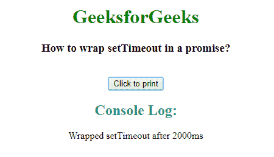

# 如何在承诺中包装 setTimeout()方法？

> 原文:[https://www . geesforgeks . org/how-wrap-settimeout-method-in-a-promise/](https://www.geeksforgeeks.org/how-to-wrap-settimeout-method-in-a-promise/)

用未来返回的承诺来包装 setTimeout。我们可以使用 then()方法返回一个承诺，将 **setTimeout** 包装在一个[承诺](https://www.geeksforgeeks.org/javascript-promises/)中。then()方法包含两个参数，这两个参数是 Promise 成功和失败条件的回调函数。这个函数返回一个承诺。如果名为**的函数“完成”**可以有两个不同的值，这意味着承诺实现了。如果函数**被调用，则意味着承诺被拒绝。**

**语法:**

```html
Promise.then(onFulfilled, onRejected)
```

下面的例子将说明这种方法:

**示例:**

```html
<!DOCTYPE html>
<html>

<head>
    <title>
        How to wrap setTimeout in a promise?
    </title>
</head>

<body style="text-align:center;">

    <h1 style="color:green;">
        GeeksforGeeks
    </h1>

    <h3>
        How to wrap setTimeout in a promise?
    </h3>
    <br>

    <button onclick="change()">
        Click to print
    </button>
</body>

<script>
    function change() {
        return new Promise(function(resolve, reject) {

            // Setting 2000 ms time
            setTimeout(resolve, 2000);
        }).then(function() {
            console.log("Wrapped setTimeout after 2000ms");
        });
    }
</script>

</html>    
```

**输出:**

*   点击按钮前:
    
*   点击按钮后:
    

**参考:** [Promise.prototype.then()方法](https://developer.mozilla.org/en-US/docs/Web/JavaScript/Reference/Global_Objects/Promise/then)