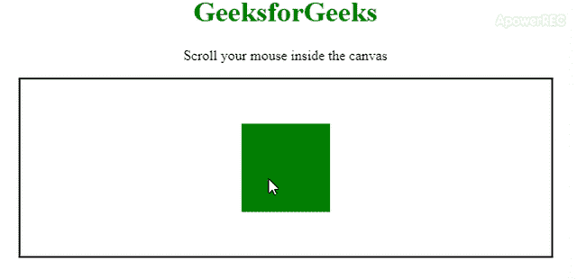

# 如何使用比例放大一个点并平移？

> 原文:[https://www . geeksforgeeks . org/如何使用缩放和翻译来放大一个点/](https://www.geeksforgeeks.org/how-to-zoom-in-on-a-point-using-scale-and-translate/)

通过使用缩放和平移方法，您可以放大特定图像。在这个缩放过程中，一个图像应该是**从图像中心放大**。在矩形的情况下，该图像具有一定的宽度和高度，并且根据图像的形状具有适当的尺寸。在**放大**过程中，图像会根据需要变大。在图像浏览器中，放大过程非常重要。要获得这个过程，您可以使用 [scale()](https://www.geeksforgeeks.org/html-canvas-scale-method/) 和 [translate()](https://www.geeksforgeeks.org/html-canvas-translate-method/) 方法。

**缩放()方法**将当前图形缩放成更小或更大的尺寸。如果缩放画布，所有未来的绘图也将被缩放。该位置也将被缩放。如果您缩放(2，2)，绘图将被定位在画布左侧和顶部的两倍远。 **translate()方法**将(0，0)位置重新映射为画布。如果您有一个图像，并将其缩放 2 倍，右下角将在 x 和 y 方向上加倍，因为(0，0)是图像的左上角。如果您想要缩放中心的图像，解决方案如下:

*   翻译图像。
*   按 x 和 y 因子缩放图像。
*   把图像翻译回来。

以下示例说明了上述方法:
**示例:**

```htmlhtml
<!DOCTYPE html>
<html>

<head>
    <title>
        Zooming process using scale and trsnslate
    </title>
    <style>
        #canvas {
            border: 2px solid black;
        }
        h1{
            color: green;
        }
    </style>
</head>

<body>
    <center>
        <h1>GeeksforGeeks</h1>
        <p>Scroll your mouse inside the canvas</p>
        <canvas id="canvas" width="600" height="200"></canvas>
    </center>
    <script>
        var zoomIntensity = 0.1;

        var canvas = document.getElementById("canvas");
        var context = canvas.getContext("2d");
        var width = 600;
        var height = 200;

        var scale = 1;
        var orgnx = 0;
        var orgny = 0;
        var visibleWidth = width;
        var visibleHeight = height;

        function draw() {
            context.fillStyle = "white";
            context.fillRect(orgnx, orgny, 800 / scale, 800 / scale);
            context.fillStyle = "green";
            context.fillRect(250,50,100,100); 
        }
        setInterval(draw, 800 / 60);

        // Scroll effect function
        canvas.onwheel = function(event) {
            event.preventDefault();
            var x = event.clientX - canvas.offsetLeft;
            var y = event.clientY - canvas.offsetTop;
            var scroll = event.deltaY < 0 ? 1 : -2;

            var zoom = Math.exp(scroll * zoomIntensity);

            context.translate(orgnx, orgny);

            orgnx -= x / (scale * zoom) - x / scale;
            orgny -= y / (scale * zoom) - y / scale;

            context.scale(zoom, zoom);
            context.translate(-orgnx, -orgny);

            // Updating scale and visisble width and height
            scale *= zoom;
            visibleWidth = width / scale;
            visibleHeight = height / scale;
        }
    </script>
</body>

</html>
```

**输出:**
