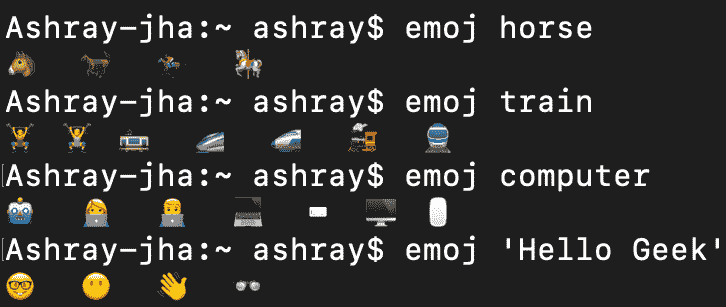

# 如何在命令行上从文本中找到相关的表情符号？

> 原文:[https://www . geesforgeks . org/how-TP-find-relative-emo Ji-from-text-on-the-the-command-line/](https://www.geeksforgeeks.org/how-tp-find-relevant-emoji-from-text-on-the-command-line/)

表情符号可以说是一个小的图像或符号，最常用来代替小的文本或短语来描述一种情况或表达一种想法或情感。因此，在当今时代，在消息传递、文本编辑器应用程序中添加表情符号集成以利用表情符号功能变得非常重要。在命令行上使用表情符号也有一个非常体面的方法，就是用更合适的表情符号替换相关的关键词。因此，我们必须按照一定的步骤在命令行中实现这样的功能。

**第一步:**我们的第一步应该是检查我们的计算机上是否安装了最新版本的 Node.js。要检查是否在计算机上打开终端或命令提示符，请键入以下命令

```html
$ node -v 
```

**控制台输出:**如果在终端显示类似这样的内容，那么您已经安装了 node.js，但是请确保显示的版本号是最新的，如果您在输入命令后没有看到任何输出，那么请从他们的官方网站下载 Node.js 的最新版本。参考[这篇](https://www.geeksforgeeks.org/installation-of-node-js-on-windows/#:~:text=The%20first%20step%20to%20install,%2Fdownload%2F%20and%20download%20the%20.)文章。


**步骤 2 :** 在我们的第二步中，我们将使用下面的命令在我们的机器上下载并安装 emoj 包。

```html
$ npm install --global emoj
```

### 控制台输出:


**第三步:**现在我们已经在机器上安装了我们的包，我们将尝试一些特定关键词的例子，这些关键词可以很容易地被提取并转换成表情符号。因此，要做到这一点，我们必须在“包含关键字或仅包含关键字的实际句子”之前使用**表情符号**关键字。例如**【虎哥马】【虎哥火车】**等，按回车键。

**控制台输出:** 