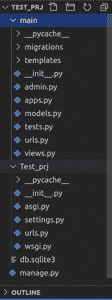
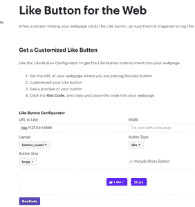
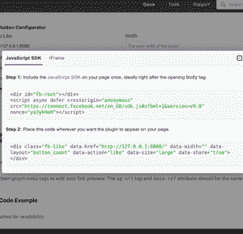

# 使用姜戈

整合脸书 Like &共享插件

> 原文:[https://www . geesforgeks . org/integrating-Facebook-like-share-plugin-use-django/](https://www.geeksforgeeks.org/integrating-facebook-like-share-plugin-using-django/)

Django 是一个基于 Python 的网络框架，允许您快速创建高效的网络应用程序。它也被称为电池内置框架，因为 Django 为一切提供内置功能，包括 Django 管理界面、默认数据库——sqllite 3 等。在本文中，我们将学习在 django 中集成 facebook 评论插件。

**如何像&一样整合脸书在姜戈的分享插件？**

**安装**

```html
pip install django
```

1)创建新项目

```html
django-admin startproject Test_prj
```

2)导航到 Test_prj 目录

```html
cd Test_prj
```

3)创建新应用

```html
python manage.py startapp main
```

**文件夹结构:**



然后在 INSTALLED _ APPS(**settings . py**)中添加应用名称。


**view . py**

## 蟒蛇 3

```html
from django.shortcuts import render

# Create your views here.
def home(request):
    return render(request,"main/index.html")
```

在主目录中创建新文件 **urls.py**

## 蟒蛇 3

```html
from django.urls import path
from .views import *

urlpatterns = [
    path('',home,name="home")
]
```

在**URL . py**中添加**main/URL . py**

## 蟒蛇 3

```html
from django.contrib import admin
from django.urls import path,include

urlpatterns = [
    path('admin/', admin.site.urls),
    path('',include("main.urls")),
]
```

[https://developers.facebook.com/docs/plugins/like-button/](https://developers.facebook.com/docs/plugins/like-button/)

转到此链接获取代码



点击获取代码



在主应用程序内部创建新目录**模板**，即创建**主**目录

**index.html**

## 超文本标记语言

```html
<!DOCTYPE html>
<html>
<head>
    <title>GFG</title>
    <div id="fb-root"></div>
    <script async defer crossorigin="anonymous" 
            src="https://connect.facebook.net/en_GB/sdk.js#xfbml=1&version=v9.0" 
            nonce="8E6OZDVx"></script>
</head>
<body>
    <h1>Welcome To GFG</h1>
    <div class="fb-like" data-href="http://127.0.0.1:8000/8000" data-width=""
         data-layout="button_count" data-action="like" data-size="large" 
         data-share="true"></div>
</body>
</html>
```

打开 cmd 或终端运行此应用程序

```html
python manage.py runserver
```

**输出:-**

