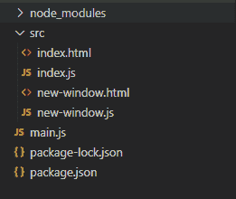
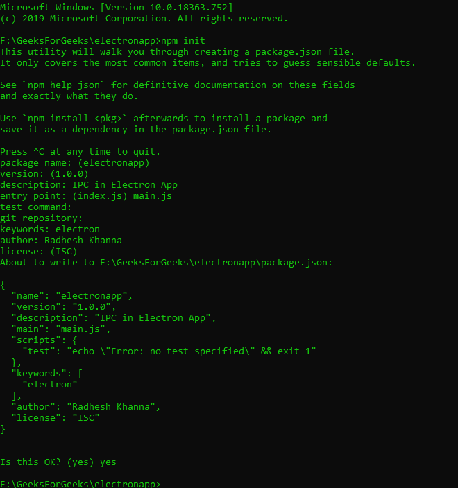
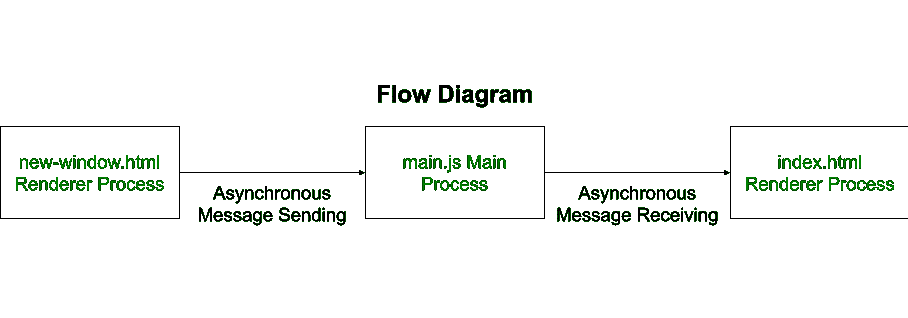

# 电子文档中的进程间通信

> 原文:[https://www . geesforgeks . org/进程间通信-IPC-in-electronijs/](https://www.geeksforgeeks.org/inter-process-communication-ipc-in-electronjs/)

[**electronijs**](https://www.geeksforgeeks.org/introduction-to-electronjs/)用于使用能够在 Windows、macOS 和 Linux 操作系统上运行的[**HTML**](https://www.geeksforgeeks.org/html-tutorials/)[**CSS**](https://www.geeksforgeeks.org/css-tutorials/)和 [**JavaScript**](https://www.geeksforgeeks.org/javascript-tutorial/) 等 web 技术构建跨平台原生桌面应用。它将 Chromium 引擎和 [NodeJS](https://www.geeksforgeeks.org/introduction-to-nodejs/) 结合成一个单一的运行时。几个著名的开源项目，如 Visual Studio Code、Slack、Atom、Postman 和 Brave Browser 都是使用 electronic 开发的。
电子可以分为两个主要过程:-

*   **主流程**
*   **渲染器流程**

**电子中的 IPC:**一个主进程可以有多个渲染器进程。每个渲染器进程都可以看作浏览器中的一个新选项卡。在本教程中，我们将讨论电子如何使用**进程间通信(IPC)** 在这些进程之间进行通信。Electron 为我们提供了两个 IPC 模块来帮助进程之间的通信，

*   **ipcMain:** 该模块用于从主进程到渲染器进程的通信。它在主流程中定义和使用。它处理渲染器进程发送的所有同步和异步消息。
*   **仪表板渲染器:**该模块用于从渲染器进程到主进程的通信。它在渲染器进程中定义和使用。它提供了同步和异步地向主进程发送消息和从主进程接收消息的能力。

强烈建议不要在渲染器进程中执行繁重的计算，以防止应用程序性能下降和资源更加密集。相反，我们应该使用 IPC 将这些任务分配给主进程，并让主进程处理应用程序中的任何繁重计算。IPC 中**同步**数据传输和**异步**数据传输有三大区别，

1.  异步数据传输使用 **ipc.send()** 方法，而同步数据传输使用 **ipc.sendSync()** 方法。
2.  我们需要专门实现一个回调函数来处理异步数据传输中来自主进程的响应。在同步数据传输的情况下，我们不需要实现回调函数，因为 **ipc.sendSync()** 方法将返回数据。
3.  在主进程( **main.js** 文件)中， **win.webContents.send()** 方法用于异步数据传输。这可以用同步数据传输的 **event.returnValue()** 方法代替。

**注意:**本教程还假设您熟悉上述链接中介绍的先决条件。
**项目结构:**先从教程的积木开始，



*   **步骤 1:** 检查是否安装了**节点**和 **npm** 。如果没有，请访问以下文章:
    *   [**在 Windows 上安装 node . js**](https://www.geeksforgeeks.org/installation-of-node-js-on-windows/)
    *   [**在 Linux 上安装 node . js**](https://www.geeksforgeeks.org/installation-of-node-js-on-linux/)
*   **步骤 2:** 导航到空目录设置项目，运行以下命令，

```
npm init
```

*   按照给出的步骤生成**包. json** 文件



*   **第三步:**确保安装**电子**如果没有，那么[T5】现在安装 T7。](https://www.geeksforgeeks.org/introduction-to-electronjs/) 
*   **第四步:**根据项目结构创建 **main.js** 文件。该文件是主进程，并作为应用程序的入口点。

## java 描述语言

```
const { app, BrowserWindow } = require('electron')
let win;

function createWindow() {
  // Create the browser window.
  win = new BrowserWindow({
    width: 800,
    height: 600,
    webPreferences: {
      nodeIntegration: true
    }
  })

  // and load the index.html of the app.
  win.loadFile('src/index.html')

  // Open the DevTools.
  // win.webContents.openDevTools()

  //Quit app when main BrowserWindow Instance is closed
  win.on('closed', function () {
    app.quit();
  });
}

// This method will be called when the Electron has finished
// initialization and is ready to create browser windows.
// Some APIs can only be used after this event occurs.
app.whenReady().then(createWindow)

// Quit when all windows are closed.
app.on('window-all-closed', () => {
  // On macOS it is common for applications and their menu bar
  // to stay active until the user quits explicitly with Cmd + Q
  if (process.platform !== 'darwin') {
    app.quit()
  }
})

app.on('activate', () => {
  // On macOS it's common to re-create a window in the app when the
  // dock icon is clicked and there are no other windows open.
  if (BrowserWindow.getAllWindows().length === 0) {
    createWindow()
  }
})
```

*   **步骤 5:** 在 **src** 目录下创建**index.html**文件。应用程序启动时，**index.html**在其单独的进程中由 **main.js** 文件呈现。每个渲染器进程都可以有自己相关的 CSS 和 JavaScript 文件。
    在**index.html**

## 超文本标记语言

```
<!DOCTYPE html>
<html>

<head>
    <meta charset="UTF-8">
    <title>Hello World!</title>

    <!-- https://electronjs.org/docs/tutorial/security#csp-meta-tag -->
    <meta http-equiv="Content-Security-Policy"
          content="script-src 'self' 'unsafe-inline';" />
</head>

<body>
    <h1>Hello Geeks!</h1>
    <div>
        We are using node
        <script>
            document.write(process.versions.node)
        </script>, Chrome
        <script>
            document.write(process.versions.chrome)
        </script>, and Electron
        <script>
            document.write(process.versions.electron)
        </script>.
    </div>
    <script src="index.js"></script>
</body>

</html>
```

*   **步骤 6:** 要启动电子应用程序，运行命令，**“开始”**是我们在**包. json** 文件中定义的脚本。

```
npm start
```

*   **输出:**


**异步数据传输:**既然我们已经设置了基本的电子应用程序，让我们定义一个新的浏览器窗口实例，它将呈现一个新的网页。这个新网页将成为**new-window.html**文件。然后我们将实现异步 IPC 来在**new-window.html**文件和**index.html**文件之间传递数据。



*   **新窗口. html:**

## 超文本标记语言

```
<!DOCTYPE html>
<html lang="en">
<head>
    <meta charset="UTF-8">
    <title>New Window</title>
    <meta http-equiv="Content-Security-Policy"
          content="script-src 'self' 'unsafe-inline';" />
</head>
<body>
    <div>New Window Opened !</div>

    <br>
    <input type="text">
    <button id="submit">Pass Value to Main Window</button>

    <script src="new-window.js"></script>
</body>
</html>
```

*   **index.html:** 到目前为止，这个网页还没有在应用程序中的任何地方被调用。要进行更改，请将以下代码插入脚本标签正上方的**index.html**文件。

## 超文本标记语言

```
<h3>Aynschronous Message Sending</h3>
<div>
    Value Received From Renderer Process -
  <span id="value"></span>
</div>
<br>
<button id="new">
  Click Me to Open New Window
</button>
```