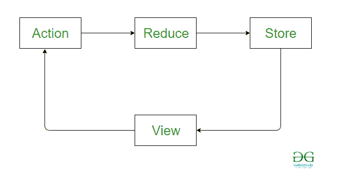

# Redux 介绍(动作、减速器和存储)

> 原文:[https://www . geesforgeks . org/introduction-to-redux-action-reducers-and-store/](https://www.geeksforgeeks.org/introduction-to-redux-action-reducers-and-store/)

Redux 是一个用于 JavaScript 应用程序的状态管理库。它只是管理应用程序的状态，或者换句话说，它用于管理应用程序的数据。它与像 React 这样的库一起使用。
**用途:**更容易管理状态和数据。随着我们应用程序的复杂性增加。一开始，这很难理解，但它确实有助于构建复杂的应用程序。开始的时候，感觉工作量很大，但是真的很有帮助。
在深入研究 redux 之前，我们应该了解 Redux 的一些重要原理。Redux 有三个原则，它们是:

*   **单一真理来源:**它有助于创建通用应用。应用程序的状态存储在一个名为**存储区**的对象树中。意思是一个应用，一个商店。
*   **状态为只读(不变性):**表示我们不直接改变状态对象及其属性。与其这样做，不如创建一个新的对象，重新计算新的应用程序状态，并用我们新创建的对象更新它。这一点很重要，因为所有的变化都发生在同一个地方，所以所有的事情都需要严格有序地逐一完成。
*   **使用纯函数(reducers)进行更改:** Reducers 是采用先前状态和动作(稍后讨论)并返回新状态的纯函数。

**redux 的建筑部分:**

1.  行动
2.  还原剂
3.  商店



Redux 数据流

**动作:**动作是一个包含信息的普通 JavaScript 对象。行动是商店唯一的信息来源。操作有一个类型字段，它告诉您要执行哪种操作，所有其他字段都包含信息或数据。还有一个术语叫做**动作创造者**，这些是创造动作的功能。因此，动作是信息(对象)，动作创建者是返回这些动作的函数。
**示例:**我们可以尝试的最简单的示例是待办事项。因此，我们将创建两个动作创建器，一个用于在待办事项中添加任务，另一个用于删除任务。

## java 描述语言

```
function addTask(task) {

  return {

    type: 'ADD_TODO',
    task: task
  }
}

function removeTask(task) {

  return {
    type: 'REMOVE_TODO',
    task: task
  }
}
```