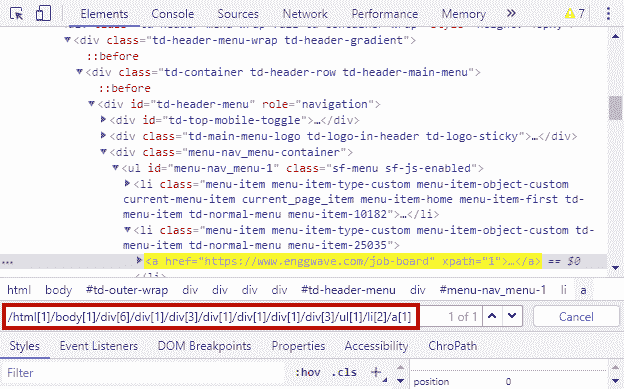
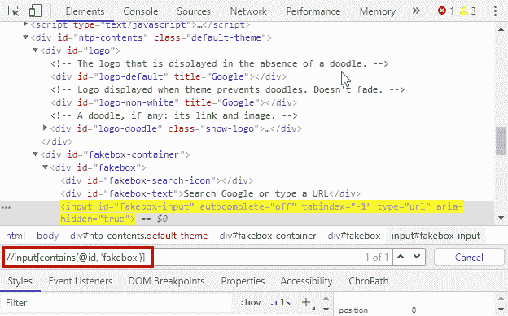
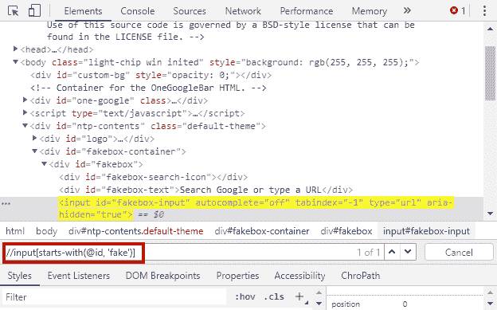
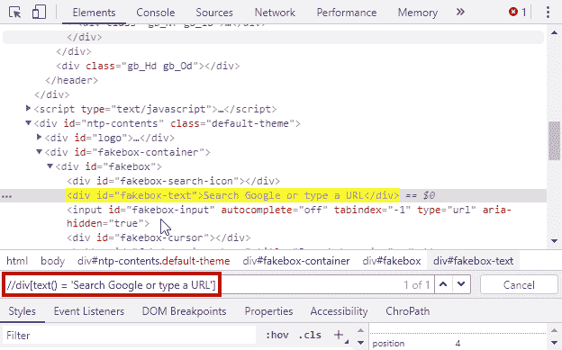
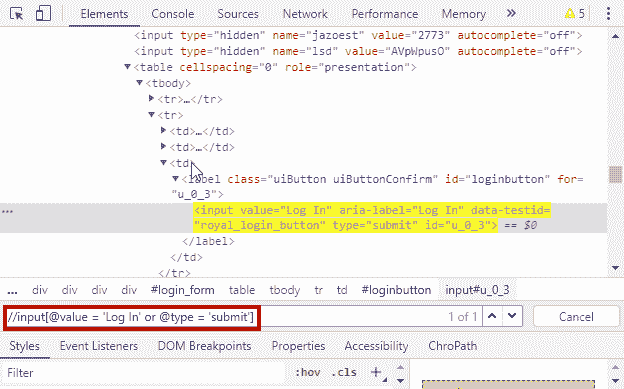

# XPath 介绍

> 原文:[https://www.geeksforgeeks.org/introduction-to-xpath/](https://www.geeksforgeeks.org/introduction-to-xpath/)

**XPath(XML 路径)**是一个表达式，用于在 XML 文档中查找元素或节点。在 Selenium 中，它通常用于查找网络元素。

**示例:**

```html
//input[@id = 'fakebox-input']
```

在本例中，我们正在定位**“输入”**元素，其**“id”**等于**“fake box-input”**


**XML 代码:**

```html
<?xml version="1.0" encoding="UTF-8"?> 
<bookstore>

  <book category = "Math">
    <title lang="en">IIT Mathematics</title>
    <author>A Das Gupta</author>
  </book>

  <book category = "Chemistry">
    <title lang="en"> Inorganic chemistry for JEE</title>
    <author>V K Jaiswal</author>
  </book>

</bookstore>
```

XML Code 是一个树状结构，正如我们在上面的 XML 中看到的，代码从**书店节点**开始，它有一个子节点**图书**，后面是一个属性**类别**，其值为*“数学”*。**书**节点有 2 个子节点，即**书名**和**作者**。

要选择化学书籍的作者元素，将使用以下 XPath:

```html
/bookstore/book[@category='Chemistry']/author
```

**XPath 的语法:**

```html
//tagname[@attribute = ‘value’]
```

**XPath 表达式:**

| 标志 | 描述 |
| --- | --- |
| // | 从当前节点中选择文档中与所选内容匹配的节点，无论它们在哪里 |
| / | 选择根节点 |
| tagname | 当前节点的标记名 |
| @ | 选择属性 |
| 属性 | 节点的属性名 |
| 价值 | 属性的值 |

**XPath 的类型:**

*   绝对 XPath
*   相对 Xpath

**绝对 XPath:**
绝对 XPath 使用 HTML/XML 代码的根元素，后跟到达所需元素所需的所有元素。它以正斜杠**/**开始。一般来说，不建议使用绝对 XPath，因为将来添加或删除任何 web 元素时，绝对 XPath 都会改变。

*   **Example:**

    ```html
    /html[1]/body[1]/div[6]/div[1]/div[3]/div[1]/div[1]/div[1]/div[3]/ul[1]/li[2]/a[1]
    ```

    

**相对 XPath**
在这里，XPath 以双正斜杠 **'//'** 开头，这意味着它可以在网页的任何地方搜索元素。通常相对 Xpath 是首选的，因为它们不是从根节点开始的完整路径。

*   **Example:**

    ```html
    //input[@id = 'fakebox-input']
    ```

    

如果你想学习如何让 XPath 识别网络元素，那么在 chrome 浏览器中打开网页，右键点击网页检查元素，然后按**‘ctrl+f’**使用 XPath 找到网络元素。你也可以使用像**【chropath】**这样的 chrome 扩展来为 **webelement** 找到 **xpath** 。

**常用 XPath 函数:**

*   包含()
*   开始于()
*   文本()

**contains():** 此函数用于选择其指定属性值包含函数参数中提供的指定字符串的节点。
T3】例:

```html
//input[contains(@id, 'fakebox')]
```



**start-with():**此函数用于选择其指定属性值以函数参数中提供的指定字符串值开始的节点。
T3】例:

```html
//input[starts-with(@id, 'fakebox')]
```



**text():** 此函数用于查找与函数中指定字符串值完全匹配的节点。
T3】例:

```html
//div
```



**在 XPath**
中 and 和 OR 的使用 AND 和 OR 用于组合两个或多个条件来查找节点。
**例:**

```html
//input[@value = 'Log In' or @type = 'submit']
```


同样，我们可以在 XPath 中应用 AND 运算符。