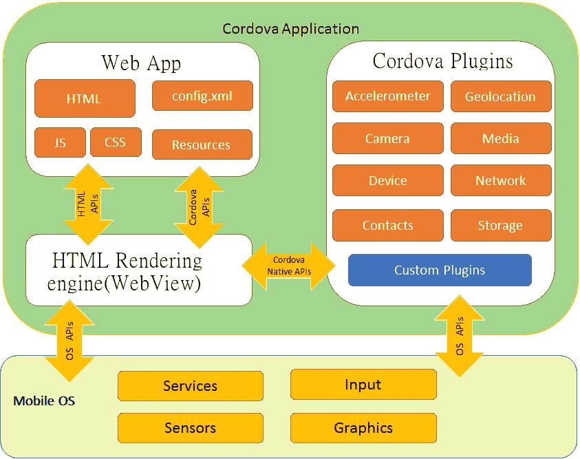
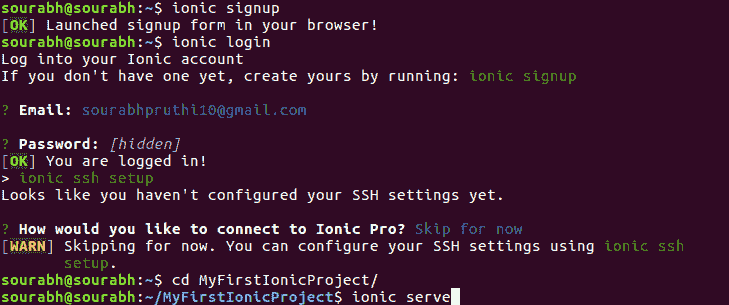
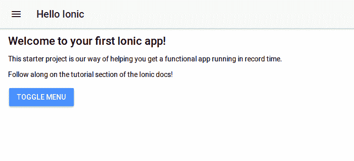

# 离子框架:现代网络应用背后的力量

> 原文:[https://www . geesforgeks . org/ion-framework-现代网络应用背后的力量/](https://www.geeksforgeeks.org/ionic-framework-the-power-behind-modern-web-apps/)

在这篇文章中，我们将接触到离子框架。正如标题中所建议的，很明显，它将用于创建强大的网络应用程序，并部署到作为安卓或 iOS 的本地环境中。

没有必要学习任何安卓、swift 或 objective C(早期用于创建 iOS 应用程序)来创建应用程序，也就是说，如果你不知道这些技术中的任何一项，但仍然想创建令人惊叹的应用程序，并希望你的名字发布在 play store 或 iStore 上，那么这是一个很好的方法。这样做的前提是，如果你熟悉 HTML、CSS 和 JavaScript，那么你就可以开始了。如果你知道 Angular，那当然是一个加分点。

现在，一些人可能会想到的基本问题是，一个用网络技术设计的应用程序如何能够在安卓或 iOS 等本地环境中运行。这个问题由 Apache Cordova(也称为 PhoneGap)回答。它是移动应用程序开发框架，或者简单地说，它用于部署网络应用程序，使它们适合我们希望作为最终产品的本地环境。

下图示例清晰显示了科尔多瓦的工作情况

更多详情请阅读[这里](https://cordova.apache.org/)

<palign>**Steps to create your first ionic application**
1.  **Download and Install Iconic :** The first step is to download and install the ionic on your system. Be clear here that since is ionic is npm module so therefore it can only be installed through npm i.e node package manager. In other words, you must have already nodejs installed on your system. Download nodejs from [here.](https://nodejs.org/en/download/). I would recommend to install the LTS version since it is stable.A fter installing nodejs your can install ionic since npm will be installed automatically. Here I will show the installation process.
    I have used ubuntu but if you are on Windows then don’t worry I will guide the windows fans as well :). For only linux users, write the below the command on your terminal to update the repositories below installing ionic.Windows users do not need to do anything.

    ```html
    sudo apt-get update
    ```

    然后使用不同于 linux 或 windows 的命令安装 ion。对于 linux 用户

    ```html
    sudo apt-get -g install ionic
    ```

    由于是全局安装，所以需要编写-g 和 sudo
    对于 Windows 用户，请按照下面的命令操作。您可能需要以管理员身份运行命令提示符

    ```html
    npm install ionic
    ```

2.  **After installation run the following command :**

    ```html
    ionic --version
    ```

    这基本上是为了测试 ion 是否已经成功安装在你的系统上
    下一步是使用以下命令制作你的 ionic app

    ```html
    ionic start name_of_project template_name
    ```

    该命令是要遵循的基本语法。对于 windows 和 linux 用户来说都是一样的。下图清晰地描绘了这个过程:
    
    下面我来解释一下上面的命令。从这里开始，基本上告诉创建一个新的 ionic app，接下来是 app 的名称，然后是 starter 模板。根据需要，ion 还提供各种其他模板，如标签、侧菜单、空白等。这是应用程序的基本布局，将被进一步构建。运行该命令后，它还会询问您是否想要将该应用程序与 cordova 集成，您只需键入 yes 即可

3.  **Project Directory :** The last step is to move through the project directory by typing the following command

    ```html
    cd project_name
    ```

    
    你也可以通过注册进入 ion 官网安装 ionic pro sdk 享受酷炫的环境。您也可以设置 SSH，或者如果您不想使用
    现在可以跳过。接下来键入以下命令

    ```html
    ionic serve
    ```

    瞧啊。！您已经创建了第一个应用程序。
    

    **离子骨架**的优缺点

    **优点**简述如下:

    *   **开发一次部署到任何地方**
    *   ****由于它是在之上构建的，所以在创建强大和健壮的应用程序时非常有用。****
    *   ******开发快，维护成本低******

    ******也不要忽视**的劣势**。这些是:******

    *   ******与原生应用相比，性能较差。(不要误解这里是比较)******
    *   ********复杂应用的高技能要求********
    *   ********内置导航可复杂********</palign>