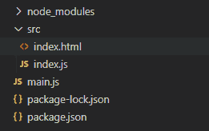
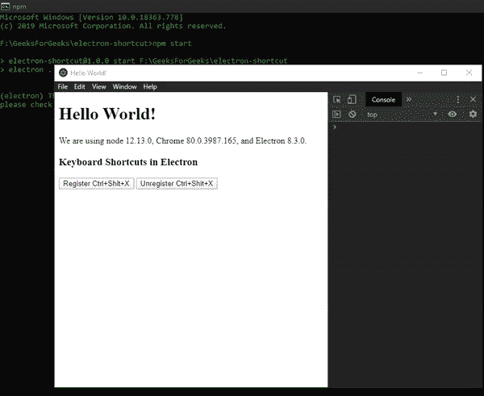

# 电子表格中的键盘快捷键

> 原文:[https://www . geesforgeks . org/键盘快捷键-in-electronijs/](https://www.geeksforgeeks.org/keyboard-shortcuts-in-electronjs/)

[**electronijs**](https://www.geeksforgeeks.org/introduction-to-electronjs/)是一个开源框架，用于使用能够在 Windows、macOS 和 Linux 操作系统上运行的 HTML、CSS 和 JavaScript 等网络技术构建跨平台的本机桌面应用程序。它将铬引擎和[T5 节点 T7】结合成一个单一的运行时。
使用键盘快捷键是一项高效省时的活动。习惯于使用键盘快捷键的用户比不习惯使用键盘快捷键的用户工作效率更高，处理多项任务的效率更高。键盘快捷键让你事半功倍。它们在同时管理电脑上的大量任务时非常有用。Electron 为我们提供了一种方法，通过这种方法，我们可以使用内置**全局快捷方式**模块的实例方法在整个应用程序中定义全局快捷方式。本教程将演示如何在整个电子应用程序中注册全局键盘快捷键。
我们假设您熟悉上述链接中介绍的先决条件。电子工作需要在系统中预装](https://www.geeksforgeeks.org/introduction-to-nodejs/) [**节点**](https://www.geeksforgeeks.org/introduction-to-nodejs/) 和 [**npm**](https://www.geeksforgeeks.org/node-js-npm-node-package-manager/) 。

*   **项目结构:**



**电子中的全局快捷键:****全局快捷键**模块用于在应用程序没有键盘焦点时检测键盘事件，因为注册的事件是全局的。该模块是**主流程**的一部分。要导入并使用**渲染器流程**中的**全局快捷方式**模块，我们将使用电子**远程**模块。**全局快捷键**模块向本机系统操作系统注册/注销一个**全局**键盘快捷键，我们可以自定义这些快捷键来执行整个应用程序中的各种操作。该模块只能在 **app** 模块的**就绪**事件发出后使用，如 **main.js** 文件所示。**全局快捷方式**模块只支持实例方法。它没有任何关联的实例事件或属性。
**示例:**按照给定的步骤在电子中实现全局快捷键。

*   **第一步:**按照 [**中给出的步骤，在电子表格**](https://www.geeksforgeeks.org/how-to-find-text-on-page-in-electronjs/) 中找到页面上的文本，设置基本的电子应用程序。复制文章中提供的 **main.js** 文件和**index.html**文件的样板代码。还要对**包. json** 文件进行必要的更改，以启动电子应用程序。我们将继续使用相同的代码库构建我们的应用程序。设置电子应用程序所需的基本步骤保持不变。
    **package . JSON:**

```htmlhtml
{
  "name": "electron-shortcut",
  "version": "1.0.0",
  "description": "Register Global Shortcuts in Electron",
  "main": "main.js",
  "scripts": {
    "start": "electron ."
  },
  "keywords": [
    "electron"
  ],
  "author": "Radhesh Khanna",
  "license": "ISC",
  "dependencies": {
    "electron": "^8.3.0"
  }
}

```

*   **输出:**此时，我们的基本电子应用程序设置完毕。启动应用程序后，我们应该会看到以下输出:

[](https://media.geeksforgeeks.org/wp-content/uploads/20200512225834/Output-1105.png)

*   **第二步:**在**index.html**和 **index.js** 文件中添加以下代码片段，用于在电子中实现全局快捷键。
    **index.html:** 在该文件中添加以下代码片段。

## 超文本标记语言

```htmlhtml
<h3>Keyboard Shortcuts in Electron</h3>
  <button id="register">
    Register Ctrl+Shit+X
  </button>
  <button id="unregister">
    Unregister Ctrl+Shit+X
  </button>
```

*   “注册 Ctrl+屎+X”和“取消注册*”Ctrl+屎+X 按钮还没有任何相关功能。要进行更改，请在 **index.js** 文件中添加以下代码，
    T5【index . js:在该文件中添加以下代码片段。*

## *java 描述语言*

```htmlhtml
*const electron = require("electron");
const globalShortcut = electron.remote.globalShortcut;

var register = document.getElementById("register");
var unregister = document.getElementById("unregister");

register.addEventListener("click", (event) => {
    const check = globalShortcut.register("CommandOrControl+Shift+X", () => {
        console.log("CommandOrControl+Shift+X is pressed");
    });

    if (check) {
        console.log("Ctrl+Shit+X Registered Successfully");
    }

    globalShortcut.registerAll(["CommandOrControl+X", 
                                "CommandOrControl+Y"], () => {
        console.log("One Global Shortcut defined " + 
                    "in registerAll() method is Pressed.");
    });
});

unregister.addEventListener("click", (event) => {
    if (globalShortcut.isRegistered("CommandOrControl+Shift+X")) {
        globalShortcut.unregister("CommandOrControl+Shift+X");
        console.log("Ctrl+Shit+X unregistered Successfully");
    }

    globalShortcut.unregisterAll();
});*
```

*   ***全局快捷方式注册(加速器，回调)**该方法为应用程序注册由**加速器**定义的全局快捷方式。该方法返回一个**布尔值**，说明全局快捷方式是否注册成功。它接受以下参数。有关**global 快捷键. register()** 方法的更多详细信息。

    *   **加速器:弦****加速器**弦如上定义。
    *   **回调:函数**当用户按下注册的快捷方式时，调用该函数。
    *   **媒体播放/暂停**
    *   **媒体下一轨道**
    *   **媒体上一个曲目**
    *   **媒体停止*** 
*   ***global 快捷键. registerAll(加速器，回调)**此方法的行为与**global 快捷键. register()** 方法完全相同，只是它采用了**加速器**的**字符串[]** ，而不是单个字符串。此方法不返回任何值，因为我们无法检查**字符串[]** 中的每个**加速器**项目是否注册成功。当用户按下**加速器**阵列中任何一个已注册的快捷键时，将调用**回调**功能。有关**global 快捷键. registereall()**方法的更多详细信息。*
*   ***global 快捷键. isRegistered(加速器)**此方法用于检查应用程序是否注册了**加速器**快捷键。它返回一个**布尔**值。它以加速器**弦**为参数进行检查。当**加速器**已经被同时在系统操作系统上执行的另一个应用程序占用时，该调用将无声地返回 **false** 。这种行为是由原生的系统操作系统定义的，因为它们不希望应用程序争夺全局捷径。*
*   ***全局快捷方式.注销(加速器)**该方法用于注销加速器**字符串**参数定义的全局快捷方式。此方法没有任何返回类型。*
*   ***全局快捷键. unregistereall()**此方法用于注销应用程序的所有全局快捷键。此方法没有任何返回类型。*

***输出:***

*[](https://media.geeksforgeeks.org/wp-content/uploads/20200606204555/Output-1-GIF2.gif)*

*应用程序全局快捷键不同于**浏览器窗口**对象的键盘事件。有关电子支持的**键盘事件**的详细说明，请参考电子支持的**T5 键盘事件 T7 一文。键盘事件使用**浏览器窗口**对象的不同实例事件来读取和注册键盘上的按键。它们可用于在**浏览器窗口**实例中定义快捷方式。输入前事件实例事件在页面中调度**向下键**和**向上键**事件之前发出。可以在**浏览器窗口**实例中捕捉和处理自定义快捷方式，文中也有相关说明。如果我们不想在 ElectronJS 中进行手动快捷方式解析，可以使用像 mousetrap 这样的外部库，在 JavaScript 中进行高级的键检测。Mousetrap 是一个轻量级的简单库，用于处理 JavaScript 中的键盘快捷键，并为 Chromium 浏览器提供了广泛的支持。该库还支持特定组合键和序列的**浏览器窗口**对象的**向上键**和**向下键**实例事件。它也不需要调度输入前事件实例事件，也不需要外部依赖。它还可以与键盘上的数字小键盘配合使用，并且可以直接绑定到特殊字符，例如？和*而不必指定任何附加修饰符，如 Shift 或/因为它们在不同的键盘上不一致。***

***注意:****按键的**实例事件不被电子支持，因为它已经被**键盘事件**网络应用编程接口本身否决了，但是捕鼠器仍然支持它。*