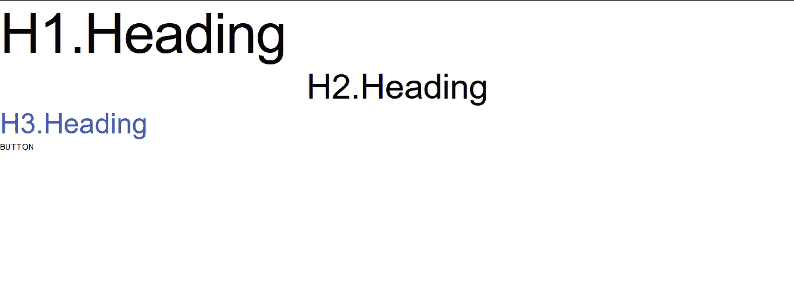

# 材料界面排版

> 原文:[https://www.geeksforgeeks.org/material-ui-typography/](https://www.geeksforgeeks.org/material-ui-typography/)

Material-UI 是一个用户界面库，提供预定义和可定制的 React 组件，以实现更快、更简单的网络开发，这些 Material-UI 组件基于谷歌的 Material Design 之上。在这篇文章中，让我们来讨论一下**材料用户界面库中的**排版**组件。**

**排版:**

排版是一个材料用户界面组件，用于标准化文本及其相关的 CSS 属性，而不用担心浏览器兼容性问题。

**示例:**

```
<Typography variant="h1"> h1 - Heading Variant </Typography>
```

**安装 React App:**

**步骤 1:** 使用以下命令创建一个 React 应用程序。

```
npx create-react-app typography-example
```

**步骤 2:** 现在通过以下命令进入项目目录:

```
cd typography-example
```

**安装材料-界面:**

通过 npm/yarn 安装材料用户界面的源文件，它们负责注入所需的 CSS。

```
npm install @material-ui/core 
// OR
yarn add @material-ui/core
```

**导入排版:**

您可以使用以下代码从***@ material-ui/core***导入<typography>组件。</typography>

```
import { Typography } from '@material-ui/core' 
// OR
import Typography from '@material-ui/core/Typography'
```

**重要道具及其价值:**

*   **对齐:**用于对齐组件上的文字。示例:继承、向左、居中、向右或对齐。
*   **颜色:**用于设置组件的文字颜色。例如:初始、继承、主要、次要、文本主要、文本次要或错误。
*   **变体:**用于设置主题排版样式。示例:h1、h2、h3、h4、h5、h6、副标题 1、副标题 2、body1、body2、标题、按钮、上划线、srOnly 或 inherit。
*   **类:**覆盖样式是自定义 CSS 对象。
*   **段落:**如果这是真的，文本将有一个底部边距。例子:真或假。

**示例:**使用 **App.js** 文件中的<排版/ >实现 H1、H2、H3 造型。

## java 描述语言

```
import { Typography } from '@material-ui/core';

function App() {
  return (
    <div className="App">
      {/* Setting the text styling to H1*/}
      <Typography variant="h1">
        H1.Heading
      </Typography>
      {/* Setting the text to center with align prop */}
      <Typography align="center" variant="h2">
        H2.Heading
      </Typography>
      {/* Setting the text color to primary*/}
      <Typography color="primary" variant="h3">
        H3.Heading
      </Typography>
      {/* Setting the text type styling to be like a button */}
      <Typography variant="button">
        Button
      </Typography>
    </div>
  );
}

export default App;
```

**运行应用程序的步骤:**从项目的根目录使用以下命令运行应用程序:

```
npm start
```

**输出:**

