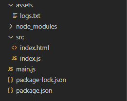

# 网络登录电子 JS

> 原文:[https://www . geesforgeks . org/network-log in-electronijs/](https://www.geeksforgeeks.org/network-logging-in-electronjs/)

**[electronijs](https://www.geeksforgeeks.org/introduction-to-electronjs/)**是一个开源框架，用于使用能够在 Windows、macOS 和 Linux 操作系统上运行的 HTML、CSS 和 JavaScript 等网络技术构建跨平台的本机桌面应用程序。它将 Chromium 引擎和 [NodeJS](https://www.geeksforgeeks.org/introduction-to-nodejs/) 结合成一个单一的运行时。

所有本机桌面应用程序都可以建立互联网连接以动态运行。这些连接对于获取/重定向应用程序的相关信息非常重要，例如通过 RESTful APIs 获取动态内容、重定向用户请求等。通过日志记录监控这些活动的网络连接非常重要，如果出现任何故障，请找出根本原因。为此，Electron 为我们提供了内置的**网络日志**模块。此模块用于记录会话的活动网络连接和事件。

我们假设您熟悉上述链接中介绍的先决条件。电子要工作， **[节点](https://www.geeksforgeeks.org/introduction-to-nodejs/)** 和 **[npm](https://www.geeksforgeeks.org/node-js-npm-node-package-manager/)** 需要预装在系统中。

**网络日志模块:**网络日志模块是**主流程**的一部分。要在**渲染器进程**中导入和使用网络日志模块，我们将使用电子提供的**远程**模块。有关远程模块的更多详细信息，请参考此[链接](https://www.electronjs.org/docs/api/remote)。只有在 app 模块的**就绪**事件发出后，才能使用 netLog 模块的所有方法。参考 **main.js** 文件中高亮显示的代码。

*   **项目结构:**
    

**示例:**我们将按照给定的步骤开始构建基本的电子应用程序。

*   **Step 1:** Navigate to an Empty Directory to setup the project, and run the following command,

    ```
    npm init
    ```

    生成**包. json** 文件。安装 **[电子](https://www.geeksforgeeks.org/introduction-to-electronjs/)** 如果没有安装，使用 npm。

    ```
    npm install electron --save-dev
    ```

    该命令还将创建**包-lock.json** 文件，并安装所需的**节点 _ 模块**依赖项。一旦电子安装成功，打开**包. json** 文件，并在**“脚本”**键下执行必要的更改。使用 npm 安装 **NODE-PING** 。

    ```
    npm install ping --save
    ```

    此包将用于生成网络活动。更多详细信息，请参考此[链接](https://www.npmjs.com/package/ping)。在**资产**文件夹中创建**日志. txt** 文件。

    **package.json:**

    ```
    {
      "name": "electron-netlogging",
      "version": "1.0.0",
      "description": "Network Logging in Electron",
      "main": "main.js",
      "scripts": {
        "start": "electron"
      },
      "keywords": [
        "electron"
      ],
      "author": "Radhesh Khanna",
      "license": "ISC",
      "dependencies": {
        "electron": "^8.2.5"
      }
    }

    ```

*   **Step 2:** Create a **main.js** file according to the project structure. This file is the **Main Process** and acts as an entry point into the application. Copy the Boilerplate code for the **main.js** file as given in the following [link](https://www.electronjs.org/docs/tutorial/first-app#electron-development-in-a-nutshell). We will modify the code to suit our project needs.

    **main.js:**

    ```
    const { app, BrowserWindow } = require('electron')

    function createWindow() {
      // Create the browser window.
      const win = new BrowserWindow({
        width: 800,
        height: 600,
        webPreferences: {
          nodeIntegration: true
        }
      })

      // Load the index.html of the app.
      win.loadFile('src/index.html')

      // Open the DevTools.
      win.webContents.openDevTools()
    }

    // This method will be called when Electron has finished
    // initialization and is ready to create browser windows.
    // Some APIs can only be used after this event occurs.
    app.whenReady().then(createWindow)

    // Quit when all windows are closed.
    app.on('window-all-closed', () => {
      // On macOS it is common for applications and their menu bar
      // To stay active until the user quits explicitly with Cmd + Q
      if (process.platform !== 'darwin') {
        app.quit()
      }
    })

    app.on('activate', () => {
      // On macOS it's common to re-create a window in the 
      // app when the dock icon is clicked and there are no 
      // other windows open.
      if (BrowserWindow.getAllWindows().length === 0) {
        createWindow()
      }
    })

    // In this file, you can include the rest of your 
    // app's specific main process code. You can also 
    // put them in separate files and require them here.
    ```

*   **Step 3:** Create the **index.html** file within the **src** directory. We will also copy the boilerplate code for the **index.html** file from the above-mentioned link. We will modify the code to suit our project needs.

    **index.html:**

    ```
    <!DOCTYPE html>
    <html>

    <head>
        <meta charset="UTF-8">
        <title>Hello World!</title>

        <!-- https://electronjs.org/docs/tutorial
                               /security#csp-meta-tag -->
        <meta http-equiv="Content-Security-Policy"
              content="script-src 'self' 'unsafe-inline';" />
    </head>

    <body>
        <h1>Hello World!</h1> We are using node
        <script>
            document.write(process.versions.node)
        </script>, Chrome
        <script>
            document.write(process.versions.chrome)
        </script>, and Electron
        <script>
            document.write(process.versions.electron)
        </script>.

        <!-- Adding Individual Renderer Process JS File -->
        <script src="index.js"></script>
    </body>

    </html>
    ```

*   **Output:** At this point, our basic Electron Application is set up. To launch the Electron Application, run the Command:

    ```
    npm start
    ```

    

**网络日志**模块支持以下实例方法和实例属性。它不支持任何实例事件。代码中演示了所有的实例方法和实例属性。
**注**–生成的日志文件为 *JSON* 格式。对于本教程，对于每个网络活动，日志文件都将被覆盖。

1.  **netLog.startLogging(路径，选项):**解析给定路径并开始记录活动网络事件和到给定路径的日志文件的连接。它返回一个**承诺**，当网络日志开始记录到日志文件时，它就被解决了。更多详细信息，请参考[链接](https://www.electronjs.org/docs/api/net-log#netlogstartloggingpath-options)。
    *   **路径:字符串**指向自定义日志文件，记录网络事件日志。
    *   **选项:对象(可选)****选项**对象由以下参数组成:
        *   **捕获模式:字符串(可选)**它代表需要从网络事件中捕获的数据类型。默认情况下，它只捕获网络请求的元数据。该设置由**默认**值表示。将该值设置为**将包含敏感的**将包含所捕获的网络请求的 cookies 和身份验证数据(如果有)。将该值设置为**一切**也将包括在套接字上传输的所有字节。在本教程中，使用代码中设置为**的值来演示日志记录。**
2.  **停止所有网络事件记录活动。如果不调用此方法，当应用程序退出时，录制会自动停止。它不接受任何参数。它返回一个带有字符串“T4”数据类型的“T0”。它解析为日志文件的文件路径。**
3.  **网络日志。当前日志记录:**此实例属性返回一个**布尔值**，指示网络事件日志是否正在被记录。这是一个**只读**属性。

**index.html:** 在该文件中添加以下代码片段。

```
<br><br>
  <button id="external">
   Open GeeksForGeeks.org
  </button>

<br><br>
  <button id="check">
   Ping Google.com
  </button>
```

**index.js:** 在该文件中添加以下代码片段。

```
const electron = require('electron');
const path = require('path');

// Importing NODE-PING package
const ping = require('ping');

// Importing netLog module from Main Process 
// into Renderer Process using remote module
const netLog = electron.remote.netLog;
const shell = electron.shell;

var external = document.getElementById('external');
var loggingPath = path.join(__dirname, '../assets/logs.txt');

// Options for the netLog.startLogging() method
var options = {
    captureMode: 'everything',
}

external.addEventListener('click', (event) => {
   // Instance Method - Returns a Promise<void>
   netLog.startLogging(loggingPath, options).then(() => {
        console.log('Starting Network Recording')
    });

    // Open External link in default desktop browser
    shell.openExternal('https://www.geeksforgeeks.org/');

    // Instance Property. Returns Boolean
    console.log('Currently Logging - ', netLog.currentlyLogging);

    // Returns Promise<String> to the log file path.
    netLog.stopLogging().then((path) => {   
        console.log('Network Logs written to Path - ', path);
    });
});

var check = document.getElementById('check');

check.addEventListener('click', (event) => {
    netLog.startLogging(loggingPath, options);

    // Refer: https://www.npmjs.com/package/ping#promise-wrapper
    ping.promise.probe('www.google.com')
    .then(function (res) {
        console.log(res);

        console.log('Currently Logging - ', netLog.currentlyLogging);

        netLog.stopLogging().then((path) => {
            console.log('Network Logs written to Path - ', path);
        });
    });
});
```

**输出:**

<video class="wp-video-shortcode" id="video-409100-1" width="665" height="509" preload="metadata" controls=""><source type="video/mp4" src="https://media.geeksforgeeks.org/wp-content/uploads/20200511112840/Output6.mp4?_=1">[https://media.geeksforgeeks.org/wp-content/uploads/20200511112840/Output6.mp4](https://media.geeksforgeeks.org/wp-content/uploads/20200511112840/Output6.mp4)</video>

**注意:**logs . txt 文件包含网络的大量信息。