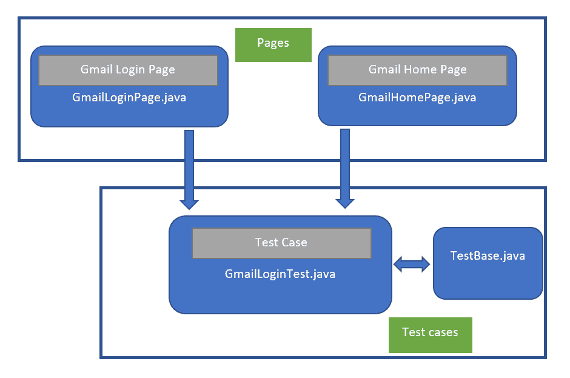
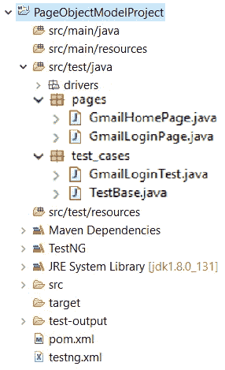

# 页面对象模型(POM)

> 原文:[https://www.geeksforgeeks.org/page-object-model-pom/](https://www.geeksforgeeks.org/page-object-model-pom/)

**什么是 POM？**
POM 是一种设计模式，在 Selenium 中常用于自动化测试用例。这种设计模式可以用于任何类型的框架，如关键字驱动、数据驱动、混合框架等。
Page 对象是一个面向对象的类，它充当被测应用程序页面的接口。Page 类包含 web 元素和与 web 元素交互的方法。在自动化测试用例的同时，我们创建这些页面类的对象，并通过调用这些类的方法与网络元素进行交互。

**页面对象模型设计模式**


**页面对象模型(POM)的使用:**
这种设计模式在 Selenium 中使用，其中网页由相应的类表示，网页元素由类的变量表示，所有交互都可以通过类的方法或比如函数来实现。

**POM 模式优势:**

*   **可重用性:**如果在不同的测试用例中需要，我们可以重用页面类，这意味着我们不需要为每个测试用例编写代码来识别 web 元素和与它们交互的方法。
*   **可维护性:**从上图可以看出，测试用例和页面类互不相同，这意味着如果添加了任何新的 web 元素或更新了现有的 web 元素，我们都可以轻松地更新代码。
*   **可读性:**如上图所示，页面代码与测试代码分离，有助于提高代码可读性。

**页面对象模型的实现:**
这里我以 Gmail 应用为例展示一下 **POM** 的实现。
我的 **Maven 项目**的项目层次如下所示:

**项目层级**


**TestBase 类:**
在这个类中我们创建 **WebDriver** 类的对象，最大化浏览器，启动 Url 等。

```html
package test_cases;

import java.io.IOException;
import java.util.concurrent.TimeUnit;
import org.openqa.selenium.WebDriver;
import org.openqa.selenium.chrome.ChromeDriver;
import org.testng.annotations.AfterSuite;
import org.testng.annotations.BeforeSuite;

public class TestBase {

    public static WebDriver driver = null;

    @BeforeSuite
    public void initialize() throws IOException {

        System.setProperty("webdriver.chrome.driver",
        System.getProperty("user.dir") + 
            "\\src\\test\\java\\drivers\\chromedriver.exe");

        driver = new ChromeDriver();

        // To maximize browser
        driver.manage().window().maximize();

        // Implicit wait
        driver.manage().timeouts().implicitlyWait(
             10, TimeUnit.SECONDS);

        // To open Gmail site
        driver.get("https:// www.gmail.com");
    }

    @AfterSuite
    // Test cleanup
    public void TeardownTest() {
        TestBase.driver.quit();
    }
}
```

**Gmail 登录页面类:**
在这个类中，我们识别 Gmail 登录页面的网页元素以及与这些网页元素交互的方法。

```html
package pages;

import org.openqa.selenium.WebDriver;
import org.openqa.selenium.WebElement;
import org.openqa.selenium.support.FindBy;
import org.openqa.selenium.support.How;

public class GmailLoginPage {

    WebDriver driver;

    public GmailLoginPage(WebDriver driver) {
        this.driver = driver;
    }

    // Using FindBy for locating elements
    @FindBy(how = How.XPATH, using = 
            "// input[@type='email']]")
    WebElement emailTextBox;

    @FindBy(how = How.XPATH, using = 
            "// input[@type='password']")

    WebElement passwordTextBox;
    @FindBy(how = How.XPATH, using =
            "// div[@role = 'button' and @id  =
            'identifierNext']")
    WebElement nextButton;

    // Defining all the user actions (Methods)
    //that can be performed in the Facebook home page

    // This method is to set Email in the email text box
    public void setEmail(String strEmail) {
            emailTextBox.sendKeys(strEmail);
        }
        // This method is to set Password in the password text box
    public void setPassword(String strPassword) {
            passwordTextBox.sendKeys(strPassword);
        }
        // This method is to click on Next Button
    public void clickOnNextButton() {
        nextButton.click();
    }
}
```

同样，我们为 Gmail 主页编写代码。

**Gmail gintest:**
这堂课我们测试的是 Gmail 的登录页面。

```html
package test_cases;

import org.openqa.selenium.support.PageFactory;
import org.testng.annotations.Test;
import pages.GmailHomePage;
import pages.GmailLoginPage;

public class GmailLoginTest extends TestBase {

    @Test
    public void init() throws Exception {

        // driver.get("https:// www.gmail.com");
        GmailLoginPage loginpage = 
           PageFactory.initElements(driver,
           GmailLoginPage.class);

        loginpage.setEmail("abc@gmail.com");
        loginpage.clickOnNextButton();
        loginpage.setPassword("23456@qwe");
        loginpage.clickOnNextButton();
    }
}
```