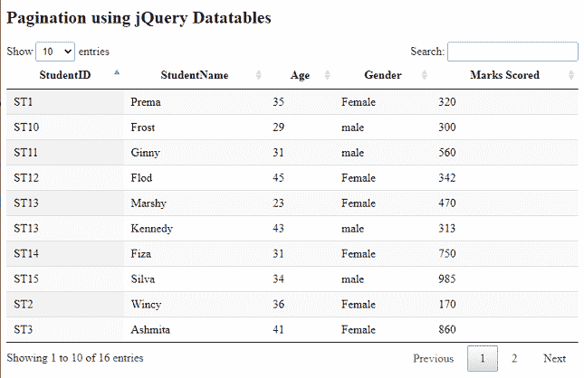
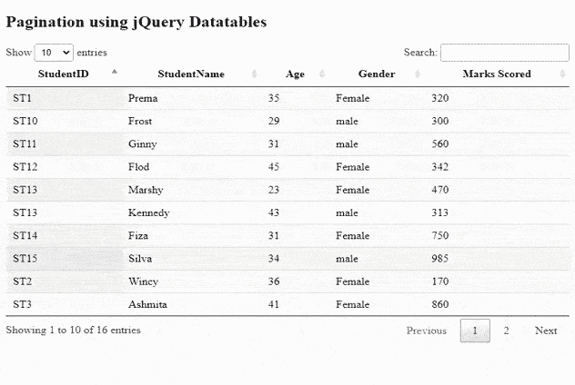
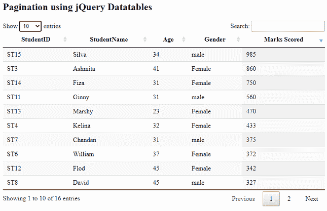
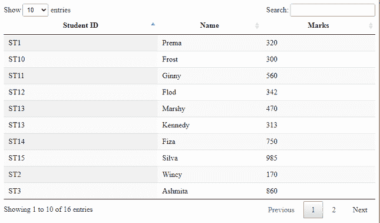

# 使用数据表分页

> 原文:[https://www.geeksforgeeks.org/pagination-using-datatables/](https://www.geeksforgeeks.org/pagination-using-datatables/)

**数据表**是一个现代的 jQuery 插件，用于为网页的 HTML 表格添加交互式和高级控件。在本文中，我们将学习使用数据表实现分页。其他功能包括排序和多列排序。

实现代码所需的预编译文件有

CSS:

> <link rel="”stylesheet”" href="”https://cdn.datatables.net/1.10.22/css/jquery.dataTables.min.css”">

**JavaScript:**

**示例 1:** 以下示例演示了使用数据表进行分页。在 HTML 部分，用学生的数据定义了一个表。JavaScript 处理数据表的初始化。

## 超文本标记语言

```html
<!DOCTYPE html>
<html>
<head>

    <meta content="initial-scale=1, maximum-scale=1,
        user-scalable=0" name="viewport" />
    <meta name="viewport" content="width=device-width" />

    <!-- Datatable plugin CSS file -->
    <link rel="stylesheet" href=
"https://cdn.datatables.net/1.10.22/css/jquery.dataTables.min.css" />

     <!-- jQuery library file -->
     <script type="text/javascript" 
     src="https://code.jquery.com/jquery-3.5.1.js">
     </script>

      <!-- Datatable plugin JS library file -->
     <script type="text/javascript" src=
"https://cdn.datatables.net/1.10.22/js/jquery.dataTables.min.js">
     </script>
</head>

<body>
    <h2>Pagination using jQuery Datatables </h2>

    <!--HTML table with student data-->
    <table id="tableID" class="display" style="width:100%">
        <thead>
            <tr>
                <th>StudentID</th>
                <th>StudentName</th>
                <th>Age</th>
                <th>Gender</th>
                <th>Marks Scored</th>
            </tr>
        </thead>
        <tbody>
            <tr>
                <td>ST1</td>
                <td>Prema</td>
                <td>35</td>
                <td>Female</td>
                <td>320</td>
            </tr>
            <tr>
                <td>ST2</td>
                <td>Wincy</td>
                <td>36</td>
                 <td>Female</td>
                <td>170</td>
            </tr>
            <tr>
                 <td>ST3</td>
                <td>Ashmita</td>
                <td>41</td>
                <td>Female</td>
                <td>860</td>
            </tr>
            <tr>
                <td>ST4</td>
                <td>Kelina</td>
                <td>32</td>
                 <td>Female</td>
                <td>433</td>
            </tr>
            <tr>
                <td>ST5</td>
                <td>Satvik</td>
                <td>41</td>
                 <td>male</td>
                <td>162</td>
            </tr>
            <tr>
                <td>ST6</td>
                <td>William</td>
                <td>37</td>
                 <td>Female</td>
                <td>372</td>
            </tr>
            <tr>
                <td>ST7</td>
                <td>Chandan</td>
                <td>31</td>
                <td>male</td>
                <td>375</td>
            </tr>
            <tr>
                <td>ST8</td>
                <td>David</td>
                <td>45</td>
                 <td>male</td>
                <td>327</td>
            </tr>
            <tr>
                <td>ST9</td>
                <td>Harry</td>
                <td>29</td>
                 <td>male</td>
                <td>205</td>
            </tr>
            <tr>
                <td>ST10</td>
                <td>Frost</td>
                <td>29</td>
                 <td>male</td>
                <td>300</td>
            </tr>
            <tr>
                <td>ST11</td>
                <td>Ginny</td>
                <td>31</td>
                 <td>male</td>
                <td>560</td>
            </tr>
            <tr>
                <td>ST12</td>
                <td>Flod</td>
                <td>45</td>
                <td>Female</td>
                <td>342</td>
            </tr>
            <tr>
                <td>ST13</td>
                <td>Marshy</td>
                <td>23</td>
                <td>Female</td>
                <td>470</td>
            </tr>
            <tr>
                <td>ST13</td>
                <td>Kennedy</td>
                <td>43</td>
                <td>male</td>
                <td>313</td>
            </tr>
            <tr>
                <td>ST14</td>
                <td>Fiza</td>
                <td>31</td>
                <td>Female</td>
                <td>750</td>
            </tr>
            <tr>
                <td>ST15</td>
                <td>Silva</td>
                <td>34</td>
                 <td>male</td>
                <td>985</td>
            </tr>
        </tbody>
    </table>

    <script>

        /* Initialization of datatable */
        $(document).ready(function() {
            $('#tableID').DataTable({ });
        });
    </script>
</body>

</html>
```

**输出:**

*   **执行前:**



*   **执行后:**



**示例 2:** 下面的代码片段应该在上述 HTML 代码的 JavaScript 部分实现。它演示了插件选项的设置，以降序显示学生的分数。

## java 描述语言

```html
$(document).ready(function() {

    /* marksscored is sorted in descending */
    $('#tableID').DataTable({
        order: [[ 4, 'desc' ]]
    });  
});
```

**输出:**



**示例 3:** 下面的代码片段演示了隐藏上述学生表的一些选定列。在第一个 HTML 示例代码的 JavaScript 部分包含下面的代码片段。

## java 描述语言

```html
$(document).ready(function() {

    /* To hide column 2 and 3 */
    $('#tableID').DataTable( {
        "columnDefs": [
            {
                "targets": [ 2 ],
                "visible": false,
                "searchable": false
            },
            {
                "targets": [ 3 ],
                "visible": false
            }
        ]
    } );
} );
```

**输出:**

