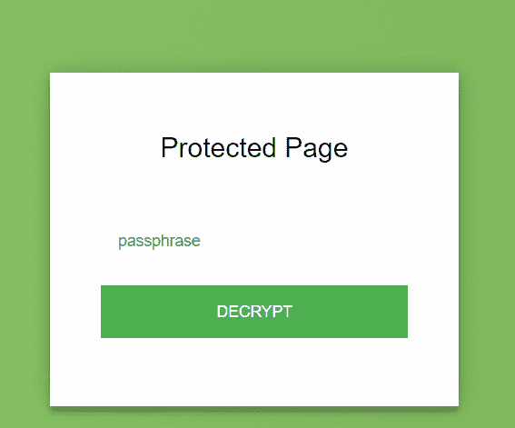
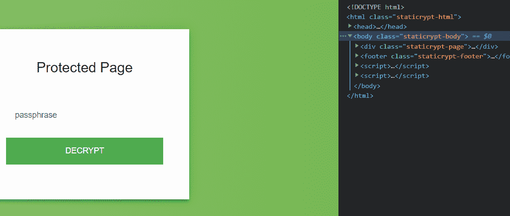
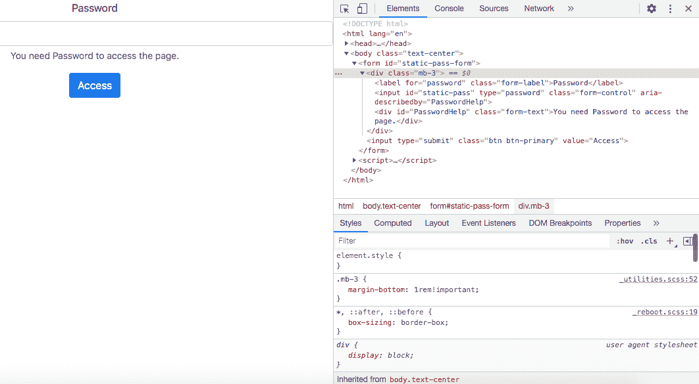

# 密码保护静态网站

> 原文:[https://www . geesforgeks . org/password-protect-a-static-网站/](https://www.geeksforgeeks.org/password-protect-a-static-website/)

静态网站再次兴起，在互联网的早期，HTML、CSS 和一些 JavaScript 是网站的全部，从那以后，像 Django、Larvel、Ruby on Ralis 这样的后端框架和现在为三分之一的网站提供动力的 WordPress 这样的外观一起被开发出来，也受到了欢迎。网站建设者也爆炸了，所以任何人都可以拥有网页，无论他们是否有技术技能。

所有这些新技术的发展也带来了新的安全挑战。编码不当的身份验证后端、密码重用、过时的 WordPress 插件对多因素身份验证的有限使用、易受攻击的 JavaScript 库以及不可靠的主机提供商使安全性成为网络的一个主要方面。由于开发人员总是倾向于解决现有的问题，以创建新的问题来解决未来的问题，大多数开发人员回到了旧的好的静态网站，但方式不同。

#### JAMstack:

JAM 代表 JavaScript 应用编程接口和标记。这个词是由 Netlify(一个受欢迎的 JAMstack 主持人，也是 JAMstack 的先驱)的创始人马蒂亚斯·比尔曼创造的。用这个词来说，*“JAM 栈是基于客户端 JavaScript、可重用 API 和预构建标记的现代网站架构”*。

*   JavaScript 为网站提供了交互性和动态性
*   应用编程接口有助于安全地添加一些服务器端功能
*   标记有助于使用静态站点生成器(如杰基尔、盖茨比、雨果等)从源文件(如标记文件、HTML 模板和 CSS)生成网站

开发人员改编 JAMstack 最常见的原因是

*   更快的性能因为没有服务器端的渲染，而且大部分的 HTML 已经预先构建好了，所以使用 CDN 网页加载速度更快
*   由于没有服务器来处理，它本身使网页更加安全
*   比普通网站更便宜的是，大多数静态主机提供商，如 Netlify、Vercel、Render、GitHub Pages、GitLab Pages、Cloudflare Pages 都有一个免费计划，这对大多数开发人员来说已经足够了
*   可扩展性很容易，因为它只需要升级我们支付的带宽

但是在使用静态网站时，我们通常错过的最有用的功能之一是密码保护，虽然许多提供商提供密码保护，但这通常是有代价的，但同样，我们是开发人员，我们总是试图找到出路。静态网站包括 JavaScript 我们还将使用一个由 Robinmoisson 编写的 JavaScript 库 [Staticrypt 来保护我们的静态网站。](https://github.com/robinmoisson/staticrypt)

本文要求在你的电脑上安装 nodejs 和 npm，你可以从[在 Linux 上安装 node . js](https://www.geeksforgeeks.org/installation-of-node-js-on-linux/)和[在 Windows 上安装 node . js](https://www.geeksforgeeks.org/installation-of-node-js-on-windows/)了解更多

**安装静态密码:**

StatiCrypt 使用 AES -256 通过利用可在浏览器中解密的 crypto-js 库生成一个静态的、受密码保护的页面。您可以将加密的页面作为普通文件上传到您的网站中，当请求该文件时，JavaScript 将提示用户输入密码，解密该页面并加载您的 HTML。

打开您的 PowerShell 或终端，并使用 npm 安装 staticrypt

```
npm -g install staticrypt
```

对于这篇文章，我采取了一个 HTML 模板，一般来说，没有密码保护的网站通常如下所示加载

## index.html

```
<!DOCTYPE html>
<html lang="en">

<head>
    <meta charset="utf-8">
    <meta name="viewport" 
          content="width=device-width,
                   initial-scale=1.0">
    <link href=
"https://cdn.jsdelivr.net/npm/bootstrap@5.0.0-beta2/dist/css/bootstrap.min.css" 
          rel="stylesheet" 
          integrity=
"sha384-BmbxuPwQa2lc/FVzBcNJ7UAyJxM6wuqIj61tLrc4wSX0szH/Ev+nYRRuWlolflfl" 
          crossorigin="anonymous">
    <title>Password Protect Site using staticrypt</title>
</head>

<body class="text-center">
    <div class="jumbotron text-center">
        <h1>Welcome to GeeksForGeeks</h1>
    </div>
    <div class="card-body">
        <h4 class="h4 card-title">
            This article explains a simple technique
             to password protect static websites
        </h4>

    </div>
    <div class="jumbotron text-center">
        <h6 class="h6 card-text">Thank You for Reading</h6>
    </div>
</body>

</html>
```


没有密码保护

现在进入您的项目目录，从目录中打开终端，并输入下面的命令

```
staticrypt index.html geeksforgeeks -o index.html
```

命令如下

*   **staticrypt** 是库的名称
*   **index.html**是我们网站的索引文件，我们需要加密的文件
*   **geeksforgeeks** 是网站的密码，你可以使用任何你想要的密码
*   **-o index.html**是将输出文件命名为 index.html 的一种方式

只要我们运行上述命令，我们就会在访问网站时被要求输入密码



密码提示

只要我们给出正确的密码，我们就可以访问该页面



如果您不想让默认密码模板创建您自己的 HTML 表单，请添加以下 JavaScript。

## java 描述语言

```
var keySize = 256;
var iterations = 1000;
function access(protectedText, pass) {
    var salt = CryptoJS.enc.Hex.parse(protectedText.substr(0, 32));
    var iv = CryptoJS.enc.Hex.parse(protectedText.substr(32, 32));
    var protected = protectedText.substring(64);

    var key = CryptoJS.PBKDF2(pass, salt, {
        keySize: keySize / 32,
        iterations: iterations,
    });

    var decrypted = CryptoJS.AES.decrypt(protected, key, {
        iv: iv,
        padding: CryptoJS.pad.Pkcs7,
        mode: CryptoJS.mode.CBC,
    }).toString(CryptoJS.enc.Utf8);
    return decrypted;
}

document.getElementById(
  "static-pass-form").addEventListener("submit", function (e) {
    e.preventDefault();

    var passphrase = document.getElementById("static-pass").value,
        // Add encrypt string of the Passphrase
        protectedText ="Encrypt Passphrase",
        protectedHMAC = protectedText.substring(0, 64),
        protectedHTML = protectedText.substring(64),
        decryptedHMAC = CryptoJS.HmacSHA256(
          protectedHTML, CryptoJS.SHA256(
            passphrase).toString()).toString();
    // If passphrase is wrong
    if (decryptedHMAC !== protectedHMAC) {
        alert("Bad passphrase!");
        return;
    }

    var plainHTML = access(protectedHTML, passphrase);

    document.write(plainHTML);
    document.close();
});
```

将 **protectedText 值**替换为你的**HTML**的值，你可以使用这个[**在线工具**](https://robinmoisson.github.io/staticrypt/) **获取 HTML 值。**完整的自定义 HTML 模板代码如下****

## ****index.html****

```
**<!DOCTYPE html>
<html lang="en">

<head>
    <meta charset="utf-8">
    <meta name="viewport" 
          content="width=device-width, initial-scale=1.0">
    <link href=
"https://cdn.jsdelivr.net/npm/bootstrap@5.0.0-beta2/dist/css/bootstrap.min.css" 
          rel="stylesheet" 
          integrity=
"sha384-BmbxuPwQa2lc/FVzBcNJ7UAyJxM6wuqIj61tLrc4wSX0szH/Ev+nYRRuWlolflfl" 
          crossorigin="anonymous">
    <title>Password Protect Site using staticrypt</title>
    <script src=
"https://cdnjs.cloudflare.com/ajax/libs/crypto-js/3.1.9-1/crypto-js.min.js" 
            integrity=
"sha384-lp4k1VRKPU9eBnPePjnJ9M2RF3i7PC30gXs70+elCVfgwLwx1tv5+ctxdtwxqZa7" 
            crossorigin="anonymous"></script>
</head>

<body class="text-center">
    <form id="static-pass-form">
        <div class="mb-3">
            <label for="password" 
                   class="form-label">Password</label>
            <input id="static-pass"
                   type="password" 
                   class="form-control"
                   id="Password"
                   aria-describedby="PasswordHelp">
            <div id="PasswordHelp" 
                 class="form-text">
                 You need Password to access the page.
                </div>
        </div>
        <input type="submit" 
               class="btn btn-primary"
               value="Access" />
    </form>
    <script>
        var keySize = 256;
        var iterations = 1000;

        function access(protectedText, pass) {
            var salt = CryptoJS.enc.Hex.parse(protectedText.substr(0, 32));
            var iv = CryptoJS.enc.Hex.parse(protectedText.substr(32, 32))
            var protected = protectedText.substring(64);

            var key = CryptoJS.PBKDF2(pass, salt, {
                keySize: keySize / 32,
                iterations: iterations
            });

            var decrypted = CryptoJS.AES.decrypt(protected, key, {
                iv: iv,
                padding: CryptoJS.pad.Pkcs7,
                mode: CryptoJS.mode.CBC
            }).toString(CryptoJS.enc.Utf8);
            return decrypted;
        }

        document.getElementById(
            'static-pass-form').addEventListener('submit', function(e) {
            e.preventDefault();

            var passphrase = document.getElementById('static-pass').value,
                protectedText = "Encrypt Passphrase",
                protectedHMAC = protectedText.substring(0, 64),
                protectedHTML = protectedText.substring(64),
                decryptedHMAC = CryptoJS.HmacSHA256(
                    protectedHTML, CryptoJS.SHA256(
                        passphrase).toString()).toString();

            if (decryptedHMAC !== protectedHMAC) {
                alert('Bad passphrase!');
                return;
            }

            var plainHTML = access(protectedHTML, passphrase);

            document.write(plainHTML);
            document.close();
        });
    </script>
</body>

</html>**
```

****

自定义模板**** 

****如果您使用默认模板或自定义模板，如果您输入正确的密码，您将获得原始的 HTML****

****

解密页面****