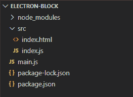
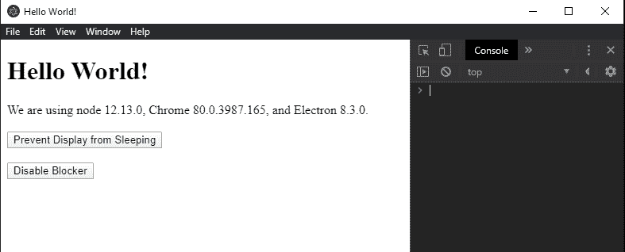
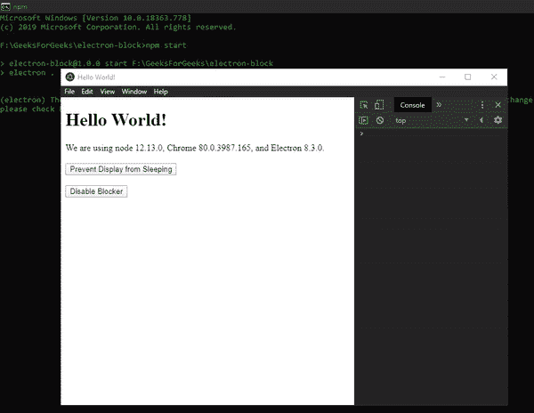

# 在 ElectronJS

中防止系统进入睡眠模式

> Original: [https://www.geeksforgeeks.org/prevent-system-from-entering-sleep-mode-in-electronjs/](https://www.geeksforgeeks.org/prevent-system-from-entering-sleep-mode-in-electronjs/)

**[ElectronJS](https://www.geeksforgeeks.org/introduction-to-electronjs/)**是一个开源框架，用于使用能够在**Windows**、**MacOS**和**Linux**操作系统上运行的 Web 技术(如**HTML**、**CSS**和**JavaScript**)构建跨平台本机桌面应用程序。 它将 Chromium 引擎和**[NodeJS](https://www.geeksforgeeks.org/introduction-to-nodejs/)**合并到一个运行时中。

在某些桌面应用程序中，需要使系统保持更长时间的活动状态。 例如在文件下载或流式传输音频/视频期间。 在这种情况下，我们需要防止系统进入**低功耗**模式。 否则，应用程序可能会暂停进一步执行。 电子为我们提供了内置的**powerSaveBlocker**模块来实现这一目的。 使用此模块，我们可以控制系统行为并阻止系统进入**休眠**模式。 我们还可以通过禁用此电源阻止程序将系统恢复到其原始设置。 本教程将演示 Electron 中的**powerSaveBlocker**模块。

我们假设您熟悉上述链接中包含的前提条件。 要使 Electron 正常工作，需要在系统中预先安装**[节点](https://www.geeksforgeeks.org/introduction-to-nodejs/)**和**[NPM](https://www.geeksforgeeks.org/node-js-npm-node-package-manager/)**。

**powerSaveBlocker：****powerSaveBlocker**模块是**主进程**的一部分。 要在**渲染器进程**中导入和使用此模块，我们将使用电子**远程**模块。 有关远程模块的更多详细信息，请参阅此[链接](https://www.electronjs.org/docs/api/remote)。

*   **项目结构：**
    

**示例：**我们将按照给定的步骤为**powerSaveBlocker**模块的实现构建电子应用程序。

*   **Step 1:** Navigate to an Empty Directory to setup the project, and run the following command,

    ```
    npm init
    ```

    生成**Package.json**文件。 如果未安装，请使用 NPM 安装**[Electron](https://www.geeksforgeeks.org/introduction-to-electronjs/)**。

    ```
    npm install electron --save
    ```

    该命令还将创建**package-lock.json**文件，并安装所需的**node_module**依赖项。 成功安装 Electron 后，打开**Package.json**文件，然后在**脚本**键下执行必要的更改。
    **Package.json：**

    ```
    {
      "name": "electron-block",
      "version": "1.0.0",
      "description": "Prevent System from Sleep in Electron",
      "main": "main.js",
      "scripts": {
        "start": "electron ."
      },
      "keywords": [
        "electron"
      ],
      "author": "Radhesh Khanna",
      "license": "ISC",
      "dependencies": {
        "electron": "^8.3.0"
      }
    }

    ```

*   **Step 2:** Create a **main.js** file according to the project structure. This file is the **Main Process** and acts as an entry point into the application. Copy the Boilerplate code for the **main.js** file as given in the following [link](https://www.electronjs.org/docs/tutorial/first-app#electron-development-in-a-nutshell). We have modified the code to suit our project needs.

    {T0}Main.js:{T1}*

    ```
    const { app, BrowserWindow } = require('electron')

    function createWindow () {
      // Create the browser window.
      const win = new BrowserWindow({
        width: 800,
        height: 600,
        webPreferences: {
          nodeIntegration: true
        }
      })

      // Load the index.html of the app.
      win.loadFile('src/index.html')

      // Open the DevTools.
      win.webContents.openDevTools()
    }

    // This method will be called when Electron has finished
    // initialization and is ready to create browser windows.
    // Some APIs can only be used after this event occurs.
    // This method is equivalent to 'app.on('ready', function())'
    app.whenReady().then(createWindow)

    // Quit when all windows are closed.
    app.on('window-all-closed', () => {
      // On macOS it is common for applications and their menu bar
      // to stay active until the user quits explicitly with Cmd + Q
      if (process.platform !== 'darwin') {
        app.quit()
      }
    })

    app.on('activate', () => {
        // On macOS it's common to re-create a window in the 
        // app when the dock icon is clicked and there are no 
        // other windows open.
      if (BrowserWindow.getAllWindows().length === 0) {
        createWindow()
      }
    })

    // In this file, you can include the rest of your 
    // app's specific main process code. You can also 
    // put them in separate files and require them here.
    ```

*   **Step 3:** Create the **index.html** file within the **src** directory. We will also copy the boilerplate code for the **index.html** file from the above-mentioned link. We have modified the code to suit our project needs.

    **index.html：**

    ```
    <!DOCTYPE html>
    <html>
      <head>
        <meta charset="UTF-8">
        <title>Hello World!</title>
        <!-- https://electronjs.org/docs/tutorial
                               /security#csp-meta-tag -->
        <meta http-equiv="Content-Security-Policy" 
              content="script-src 'self' 'unsafe-inline';" />
      </head>
      <body>
        <h1>Hello World!</h1>
        We are using node 
        <script>
            document.write(process.versions.node)
        </script>, Chrome 
        <script>
            document.write(process.versions.chrome)
        </script>, and Electron 
        <script>
            document.write(process.versions.electron)
        </script>.

        <br><br>
        <button id="enter">Prevent Display from Sleeping</button>

        <br><br>
        <button id="disable">Disable Blocker</button>

        <!-- Adding Individual Renderer Process JS File -->
        <script src="index.js"></script>
      </body>
    </html>
    ```

    **输出：**此时，我们的应用程序已经设置好，我们可以启动该应用程序来检查 GUI 输出。 要启动电子应用程序，请运行命令。

    ```
    npm start
    ```

    

*   **Step 4:** The **Prevent Display from Sleeping** button does not have any functionality associated with it yet.

    **powerSaveBlocker.start(Type)**阻止系统进入低功耗模式。 它接受以下参数。

    *   **type: String** This value cannot be empty. It represents the type of Blocker that you want to implement. It can assume any of the following two values:
        *   **防止应用程序挂起：**此值防止应用程序被挂起。 它使系统保持活动状态，但可以关闭屏幕，如*Windows*中的**注销**操作。 此值可在流式传输音频或下载文件等时使用。
        *   **防止-显示-休眠：**此值阻止显示器进入休眠状态。 使系统和屏幕保持活动状态。 该值可以在流传输视频等时使用。

        **注**-**防止显示睡眠**始终优先于**防止应用程序挂起**。 如果多个渲染器进程实现不同的拦截器，则优先级较高的拦截器将始终有效，直到请求得到解决。

        此方法返回一个整数，该整数表示已分配给功率拦截器的拦截器 ID。 **powerSaveBlocker**模块的其他实例方法利用此 ID 执行操作。

    **注意：****powerSaveBlocker**不监控系统的电源状态变化，不要与**powerMonitor**模块混淆。

    **index.js：**在该文件中添加以下代码段。

    ```
    const electron = require('electron')

    // Importing powerSaveBlocker Module from remote module
    const powerSaveBlocker = electron.remote.powerSaveBlocker;

    var enter = document.getElementById('enter');
    var id = undefined

    enter.addEventListener('click', () => {
        id = powerSaveBlocker.start('prevent-display-sleep');
        console.log('Request ID generated - ', id);
        console.log('Prevent Display Sleep is Enabled')
    });
    ```

*   **Step 5:** The **Disable Blocker** button does not have any functionality associated with it yet. The **powerSaveBlocker.isStarted(id)** and the **`powerSaveBlocker.stop(id)`** both take in the blocker ID integer value that was returned by the **powerSaveBlocker.start()** method. The **powerSaveBlocker.isStarted()** method returns a **Boolean** value signifying whether the corresponding **powerSaveBlocker** is started and in effect. For more detailed Information, Refer this [link](https://www.electronjs.org/docs/api/power-save-blocker#powersaveblockerisstartedid). The **powerSaveBlocker.stop()** method does not have a Return value. It simply stops the specified **powerSaveBlocker** in effect which is represented by the blocker ID.
    **index.js:** Add the following snippet in that file.

    ```
    var disable = document.getElementById('disable');

    disable.addEventListener('click', () => {
        // Checking if ID is undefined or not
        if (id && powerSaveBlocker.isStarted(id)) {
            console.log('Prevent Display Sleep is Active');
            powerSaveBlocker.stop(id);
            console.log('Prevent Display Sleep is successfully disabled');
        } else {
            console.log('Prevent Display Sleep is not Active')
        }
    });
    ```

    **输出：**
    