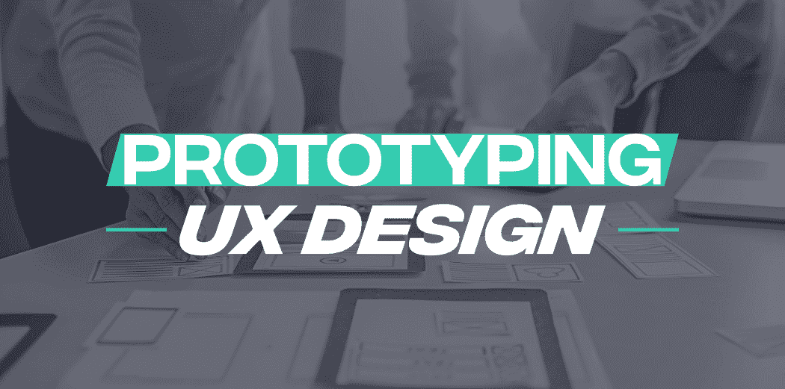

# UX 设计中的原型-优点&类型

> Original: [https://www.geeksforgeeks.org/prototyping-in-ux-design-benefits-types/](https://www.geeksforgeeks.org/prototyping-in-ux-design-benefits-types/)

如果您是一名 UX 设计师或自由职业者，可以做任何事情来构建应用程序，例如设计、编码、与客户交互(*一个人的军队…。 .lolz*)那么有一件事可能会让你很困扰，…

***“如果我为用户或客户设计应用程序，不管他/她是否喜欢？”***

假设您构建了一个应用程序并将其呈现给客户端。 现在客户告诉我，他/她不喜欢图片的背景蓝色，他/她希望您将其更改为绿色。 你做了这些改变(*对你来说没什么大不了的，…。 是吗？*)，然后您再次将其呈现给客户。 现在，客户端请求您将按钮的形状从矩形更改为圆形。 您再次进行了更改(*OK…。 这对你来说也不是什么大事*。 客户再次要求您从上到下或从左到右移动一些内容(*感到沮丧吗？ 但是您移动了内容*)。 现在客户端告诉我们，前一个版本比当前版本更好，所以请更改它…。 (*现在太多了，你只想杀了那个家伙*)

客户端频繁地请求更改网页中的内容，这让开发人员/用户体验设计者非常沮丧。 为网页的每一个元素编写代码需要花费大量的时间和精力，但您的客户并不了解这一点。

这些微小的改变不仅会在设计中产生许多问题或错误，而且还会成为开发人员/设计人员的噩梦。

*那么，上述所有问题的解决方案是什么？*

*行业或大公司部门如何处理这类问题？*

答案是**原型**。 在这个博客中，我们将讨论原型的概念，大多数 UX 设计师在一些大公司工作时都遵循这个概念。

### **什么是原型制作？**

如果你认为在 Facebook、Twitter、Pinterest、Zomato、Netflix 等大公司工作的开发人员或设计师立即开始编写代码来构建某些功能，那么你就大错特错了。 这不是行业的运作方式。 设计人员在进入实际的编码部分之前，必须先经过原型制作的步骤。

基本上，原型是最终产品的反映。 这不是一个确切的应用程序，但它更像是应用程序的照片，可以使用 Photoshop，Illustrator，或者草图等工具进行设计。 这些照片被放到手机或网站上，用户可以点击想要点击的地方。

你可能已经在你的计算机科学学位上学到了一些关于原型的知识，但你知道它在工业规模上是如何工作的吗？在大型工业中，每个人都使用原型的概念。 用于测试产品的流动情况，是否顺畅。

原型设计通过交互式和引人入胜的产品向用户展示产品的样本版本。 *设计师可以在投入时间和金钱开发最终产品之前测试他们的想法和设计。*

作为一名用户体验设计师，您可以使用一些在线工具来构建原型并向用户展示，以便更好地理解产品。

### 原型制作的好处

让我们来看看构建…原型的一些主要好处

**1.**原型有助于在软件设计阶段的早期阶段识别设计缺陷、可用性问题或不合适的方法。 这节省了大量的时间和金钱，也减少了在产品开发阶段可能出现的客户和设计师之间的冲突。

**2.***我应该把这个按钮放在右上角吗？ 我应该使用黄色背景色吗？**我应该使用旋转木马来展示图像吗？ 可以使用手风琴吗？或者可以使用网格系统来显示标题的内容吗？*这些混淆可以通过原型来解决。 设计师可以创建不同版本的网站，测试哪个版本运行得更好，然后他们就可以最终完成产品的设计。

**3.***我的软件设计是否完全按照计划解决了用户的问题？ 用户可以在我的网站上完成特定任务吗？ 用户的流程是顺畅的还是不顺畅的？ 我需要对用户流做一些改进吗？*原型有助于回答所有这些与用户流和界面相关的问题。 它代表了屏幕的顺序，用户可以很容易地理解执行特定任务所需的步骤。

### 原型的类型

在工业中，设计师在设计阶段就开始尽可能早地创建原型。 现在您可能会问自己一个问题*原型是如何创建的？ 它有哪些不同的类型？*原型*可以在纸上创建，也可以使用一些在线工具点击创建。*

*通常，原型分为低保真、中保真和高保真。 这里的术语“保真度”描述的是你的原型有多逼真？ 它只是一种基本的视觉表现，还是对最终产品的准确表现？ 让我们把它们都详细地讨论一下。*

***1.低保真(纸张)***

*创建原型的最好和最便宜的资源是使用铅笔和纸(*是的！ 你童年最好的学习伙伴*)。 用最小的成本，你可以画出你的软件的草图。 手绘原型在软件设计的初始阶段用来向用户展示各种屏幕状态。*

*低保真的原型是快速、廉价和高度协作的。 快速测试软件设计中的广泛概念是有好处的。 此外，你也不需要在设计技巧上有更高的水平来创造低保真的原型。 您只需要表示基本的关键元素，而不需要涉及太多细节。*

*它用最少的内容和视觉效果表示软件的基本布局。 这个原型互动性较差。 此外，我们还需要避免低保真原型中的动画和过渡。 原型帮助用户理解软件的初始设计思想和基本设计元素。*

***2.****中等保真度(可点击)***

*一旦你完成了手绘原型，你就可以把它们变成交互式的可点击原型。 可点击的原型比低保真的原型提供了更多的细节，它更接近于产品的最终设计。 您可以在可点击原型中找到一定程度的交互性。*

*用户应该能感受到产品的最终设计，但不能有太多的细节。 在这个阶段，流程应该是清晰且易于理解的。 可点击的原型包括超链接按钮，使用户旅程顺畅。 该样机可以很容易地进行修改。*

*大多数 UX 设计者使用在线软件 Invision(本文不是由 Invision 赞助，这是我们自己的研究)来进行这一阶段的原型设计。 这个工具解决了很多问题，很多公司都在使用它。*

*在 Invision 中，你可以创建你的账户，你可以上传图片，你可以标记出你想要发生什么事情的地方。 InVision 为用户创建了一个从一个屏幕移动到另一个屏幕的流程。 用户可以在屏幕上单击，然后移动到下一页或下一屏幕。*

*您可以在手机上使用 Invision。 它给了用户更多的控制权和自由感。 您可以直接上传所有在纸上创建的草图，Invision 将从您的草图中提取所有屏幕、图标和其他元素。*

***3.高保真(高级交互&转换)***

*一旦您完成了原型的可点击阶段的创建，就可以创建软件的最终表示了。 高保真原型可以更真实、更准确地呈现软件。 在这个阶段，设计师需要更多的控制，而不是简单的过渡。*

*高保真原型以最终产品的各种组件、交互元素和内容为特色。 高保真的原型看起来像真正的 APP。 创建这个原型的成本很高，但是使用这个原型，用户会有一种与活动应用程序交互的感觉。 设计人员可以在进入产品的实际开发之前测试软件的每一个元素。*

### *最后的想法*

*当您开始创建原型时，从粗略的想法开始。 最初，它可能是糟糕和肮脏的，但它会进行测试，获得反馈，并改进缺陷。 再次创建它。 解决更多的问题，并继续这样做，直到或除非你没有达到产品最终设计的想法。*