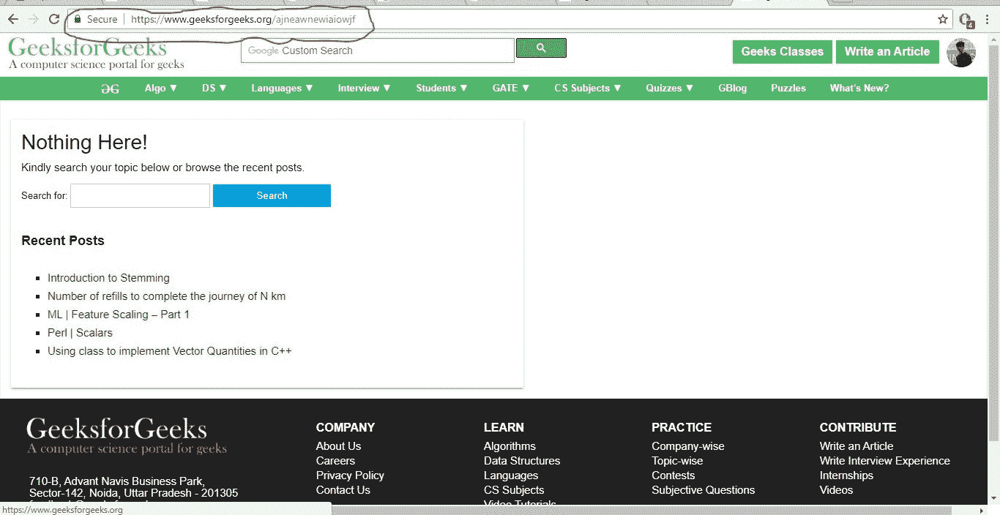
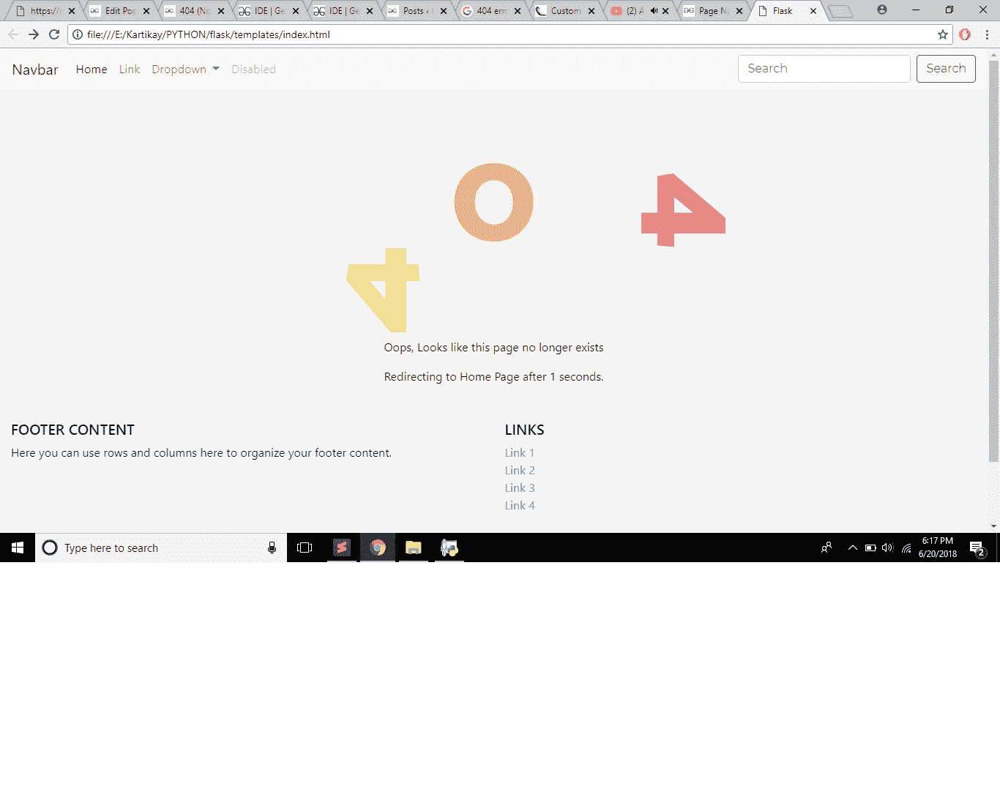

# 处理烧瓶

中的 404 错误

> Original: [https://www.geeksforgeeks.org/python-404-error-handling-in-flask/](https://www.geeksforgeeks.org/python-404-error-handling-in-flask/)

先决条件：[在 Flask 中创建简单应用程序](https://www.geeksforgeeks.org/flask-creating-first-simple-application/)

每当找不到页面时，都会显示 404 错误。 可能是所有者更改了 URL，但忘记了更改链接，也可能是他们删除了页面本身。 每个站点都需要一个自定义错误页面，以避免用户看到默认的丑陋错误页面。

GeeksforGeek 也有一个定制的错误页面。 如果我们键入类似
www.geeksforgeeks.org/ajneawnewiaiowjf 这样的 URL

加入时间：清华大学 2007 年 01 月 25 日下午 3：33

**GeeksForGeek 自定义错误页**


它将显示错误 404 页面，因为此 URL 不存在。 但错误页面提供了漂亮的布局，帮助用户返回，甚至在特定的时间间隔后将他们带到主页。 这就是为什么每个网站都需要自定义错误页面。

Flask 为我们提供了一种处理错误并返回自定义错误页面的方法。

为此，我们需要下载并导入 Fask。 通过 CMD 上的以下命令下载烧瓶。

```html
pip install flask

```

使用 app.py 作为管理模板的 Python 文件，404.html 是我们在出现 404 错误时返回的文件，header.html 是带有网站标题和导航栏的文件。

**app.py**
Flask 允许我们创建一个 python 文件来定义所有路由和函数。 在 app.py 中，我们定义了到主页的路由(‘/’)和错误处理函数，这是一个 flask 函数，我们将 404error 作为参数传递。

```html
from flask import Flask, render_template

app = Flask(__name__)

# app name
@app.errorhandler(404)

# inbuilt function which takes error as parameter
def not_found(e):

# defining function
  return render_template("404.html")
```

当用户打开断开的链接时，上述 python 程序将返回 404.html 文件。

**404.html**
下面的代码从 header.html 中导出标题和导航栏。
这两个文件都应根据烧瓶存放在 Templates 文件夹中。

```html

<!-- Exports header and navbar from header.html
     or any file you want-->
Page Not Found


  <h1>Oops! Looks like the page doesn't exist anymore</h1>
  <a href="{{ url_for('index') }}"><p>Click Here</a>To go to the Home Page</p>

<!-- {{ url_for('index') }} is a var which returns url of index.html-->

```

### 5 秒后自动重定向到主页

此示例的 app.py 代码与上面相同。
下面的代码显示了 Custom 404 错误页，并开始了 5 秒的倒计时。
完成 5 秒后，它会将用户重定向回主页。
**404.html**
下面的代码从 header.html 中导出标题和导航栏。
这两个文件都应根据烧瓶存放在 Templates 文件夹中。
5 秒后，用户将自动重定向到主页。

```html
<html>
<head>
<title>Page Not Found</title>
<script language="JavaScript" type="text/javascript">

var seconds =6;
// countdown timer. took 6 because page takes approx 1 sec to load

var url="{{url_for(index)}}";
// variable for index.html url

function redirect(){
 if (seconds <=0){

 // redirect to new url after counter  down.
  window.location = url;
 } else {
  seconds--;
  document.getElementById("pageInfo").innerHTML="Redirecting to Home Page after "
+seconds+" seconds."
  setTimeout("redirect()", 1000)
 }
}
</script>
</head>


//exporting navbar and header from header.html


 <body onload="redirect()">
<p id="pageInfo"></p>


</html>
```

**sample header.html**
这是一个示例 header.html，其中包含如图所示的导航栏。
它由引导程序组成。 你也可以自己做一个。
关于这一点，请参阅 bootstrap[文档。](https://getbootstrap.com/docs/4.0/components/navs/)

```html
<!DOCTYPE html>
<html>
<head>

<!-- LINKING ALL SCRIPTS/CSS REQUIRED FOR NAVBAR -->

    <link rel="stylesheet" href="https://maxcdn.bootstrapcdn.com/bootstrap/4.0.0/
css/bootstrap.min.css"
 integrity="sha384-Gn5384xqQ1aoWXA+058RXPxPg6fy4IWvTNh0E26 
3XmFcJlSAwiGgFAW/dAiS6JXm" crossorigin="anonymous">

    <title>Flask</title>
</head>
<body>
<script src="https://code.jquery.com/jquery-3.2.1.slim.min.js" integrity=
"sha384-KJ3o2DKtIkvYIK3UENzmM7KCkRr/rE9/Qpg6aAZGJwFDMVNA/GpGFF93hXpG5KkN" 
crossorigin="anonymous"></script>

<script src="https://cdnjs.cloudflare.com/ajax/libs/popper.js/1.12.9/umd
/popper.min.js" integrity="sha384-ApNbgh9B+Y1QKtv3Rn7W3mgPxhU9K
/ScQsAP7hUibX39j7fakFPskvXusvfa0b4Q" crossorigin="anonymous"></script>

<script src="https://maxcdn.bootstrapcdn.com/bootstrap/4.0.0/js/bootstrap.min.js"
 integrity="sha384-JZR6Spejh4U02d8jOt6vLEHfe/JQGiRRSQQxSfFWpi1MquVdAyjUar5+76PVCmYl"
 crossorigin="anonymous"></script>

<header>
    <!-- Starting header -->

    <nav class="navbar navbar-expand-lg navbar-light bg-light">
  <a class="navbar-brand" href="#">Navbar</a>
  <!-- bootstrap classes for navbar -->
  <button class="navbar-toggler" type="button" data-toggle="collapse" data-target=
"#navbarSupportedContent" aria-controls="navbarSupportedContent"
 aria-expanded="false"  aria-label="Toggle navigation">
    <span class="navbar-toggler-icon"></span>
  </button>

  <div class="collapse navbar-collapse" id="navbarSupportedContent">
    <ul class="navbar-nav mr-auto">
      <li class="nav-item active">
        <a class="nav-link" href="#">Home <span class="sr-only">(current)</span></a>
      </li>
      <li class="nav-item">
        <a class="nav-link" href="#">Link</a>
      </li>
      <li class="nav-item dropdown">
        <a class="nav-link dropdown-toggle" href="#" id="navbarDropdown"
 role="button data-toggle="dropdown" aria-haspopup="true" aria-expanded="false">
          Dropdown
        </a>
        <div class="dropdown-menu" aria-labelledby="navbarDropdown">
          <a class="dropdown-item" href="#">Action</a>
          <a class="dropdown-item" href="#">Another action</a>
          <div class="dropdown-divider"></div>
          <a class="dropdown-item" href="#">Something else here</a>
        </div>
      </li>
      <li class="nav-item">
        <a class="nav-link disabled" href="#">Disabled</a>
      </li>
    </ul>
    <form class="form-inline my-2 my-lg-0">
      <input class="form-control mr-sm-2" type="search"
       placeholder="Search" aria-label="Search">
      <button class="btn btn-outline-success my-2 my-sm-0" 
      type="submit">Search</button>
    </form>
  </div>
</nav>
</head>

 <body >

  

  

</body>
</html>
```

**输出：**
输出将是用户导出的带有 header.html 的自定义错误页面。
下面是我的自定义页眉、页脚和 404.html 文件的输出示例。

