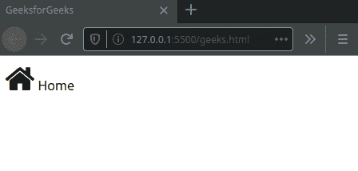

# 在动画期间缩小图标尺寸

> 原文:[https://www . geeksforgeeks . org/动画期间缩小图标尺寸/](https://www.geeksforgeeks.org/reduce-the-size-of-an-icon-during-the-animation/)

图标和图像都是我们想要描述的事物的图形表示，但是图标的目标不同于普通的图像。图标是一个想法的一般表示，而图像更具体。在 CSS 中，图标是用一组不同于普通图像的属性定义的。我们不像定义图像那样使用[](https://www.geeksforgeeks.org/css-height-and-width/)**和 [**宽度**](https://www.geeksforgeeks.org/css-height-and-width/) 属性来定义图标的大小。因此，我们需要使用不同的 CSS 属性来为图标添加动画。本教程将演示如何在 CSS 动画中减小图标的大小。**

**在本文中，我们将使用 [**字体-令人敬畏的**](https://fontawesome.com/) 图标库来演示动画期间其大小的变化。我们假设您熟悉 [**HTML**](https://www.geeksforgeeks.org/html-tutorials/) 和 [**CSS**](https://www.geeksforgeeks.org/css-tutorials/) ，并且对 CSS 动画有基本的了解。** 

****步骤 1:** 使用 [npm](https://www.geeksforgeeks.org/node-js-npm-node-package-manager/) 安装 [**浏览器同步**](https://www.browsersync.io/) 。我们将使用浏览器同步启动一个服务器，并提供一个网址来查看 HTML 网站和 CSS 动画，并使用 CDN(内容交付网络)加载**字体-棒极了**。我们将在全球范围内安装浏览器同步。**

```htmlhtml
npm install -g browser-sync 
```

****步骤 2:** 在项目根文件夹中创建一个**index.html**文件和一个 **index.css** 文件。**

*   ****index.html:** 在该文件中添加以下代码。**

## **超文本标记语言**

```htmlhtml
<!DOCTYPE html>
<html lang="en">
<head>
    <meta charset="UTF-8">
    <meta name="viewport" 
          content="width=device-width, initial-scale=1.0">
    <title>GeeksforGeeks</title>
    <link rel="stylesheet" href=
"http://cdnjs.cloudflare.com/ajax/libs/font-awesome/4.4.0/css/font-awesome.min.css">
</head>
<body>
    <div id="icon">
        <i class="fa fa-home fa-sm"></i> Home
    </div>
</body>
</html>
```

****第三步:**我们将在**字体牛逼的**图标上添加 CSS 动画，缩小图标尺寸。同样的方法也可以应用于在 CSS 动画中增加图标的大小。CSS 没有修改 DOM 结构的能力。它只能改变 HTML DOM 的呈现方式。因此，当使用字体可怕的图标时，我们可以使用字体可怕的库提供的预定义类来设置图标的初始大小，如代码所示，但是我们不能在使用这些类的 CSS 动画中更改图标的大小。要改变图标的大小，我们必须对 HTML 元素应用 CSS 样式，如上面的代码中所做的那样。可以用来设置字体初始大小的预定义类的例子有 fa-xs、fa-lg、fa-2x 等。**

*   ****index.css:** 在该文件中添加以下代码片段。**

## **半铸钢ˌ钢性铸铁(Cast Semi-Steel)**

```htmlhtml
#icon i {
            font-size: 128px;
            animation: size 4s infinite 1s;
        }
@keyframes size {   
    0% {
        font-size: 128px;
    }
    20% {
        font-size: 100px;
    }
    40% {
        font-size: 80px;
    }
    60% {
        font-size: 60px;
    }
    80% {
        font-size: 40px;
    }
    100% {
        font-size: 20px;
    }
    }
```

****第 4 步:**要使用 Browsersync 启动应用程序，请在项目目录中运行以下命令，或者可以将 HTML 文件直接运行到浏览器中。**

```htmlhtml
browser-sync start --server --files "*" 
```

****输出:**这将在**服务器**模式下启动浏览器同步，并按照 ***** 通配符的指定监视目录中所有文件的更改。默认情况下，应用程序将在 **http://localhost:3000/** 启动。** 

****