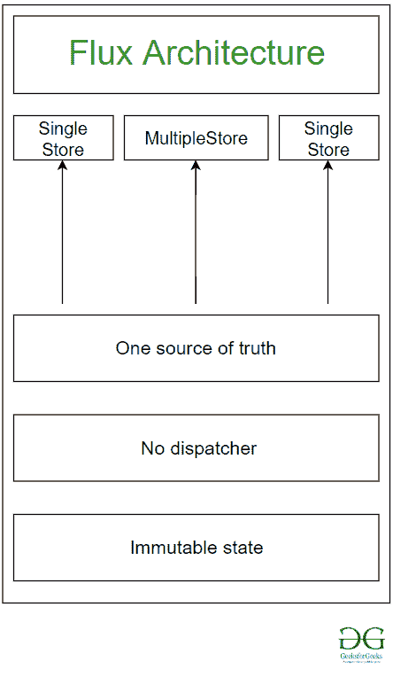
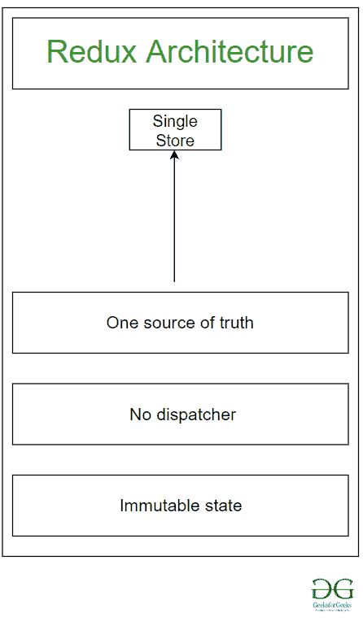

# Redux 和通量架构

> 原文:[https://www . geesforgeks . org/redux-and-the-flux-architecture/](https://www.geeksforgeeks.org/redux-and-the-flux-architecture/)

**Flux 架构:**
Flux 是脸书在使用 React 操作时内部使用的 AN 架构。
不是框架，也不是库。
它只是一个替代物，一个增强 React 和单向数据流的架构。

Redux 是 JavaScript 应用程序的可预测状态容器。Redux 是一个状态管理工具，主要用于 React。现在就 React 而言，简单的应用程序有一些组件，而主要组件是我们应用程序状态的领导者。所做的任何更改都会反映到主组件，然后主组件会修改状态。
但在现实中，当创建一个 web 应用程序来解决一个现实世界的问题时，我们会遇到数百个组件被组织成多个组，而不是一个组有一个主要组件。因此，它们被组织成多个组，其中每个组都有一个管理该组状态的主要组件。

现在，如果您对其中一个组件进行更改，那么另一个组件可能需要重新呈现，但是如果它们不共享一个公共的主要组件，那么它们之间的信息传递可能会很困难。
这就是我们需要应用程序的 MVC(模型、视图、控制器)模型的地方。

*   **MVC 模型:**MVC 模型基本上捕获了应用程序的整个状态，您想要从视图中对模型进行的任何更改都必须通过控制器到达模型。
    T3】

**通量架构需求:**


MVC 面临着某些问题，由于这些问题，它不能按照我们希望的方式管理应用程序。这就是为什么设计了一种新的方法，叫做源自 MVC 模型的 Flux 架构。这种方法基本上是为了在一个更简单的网络中组织代码。MVC 遇到的问题是，更新会导致模型内的级联更新流，这变成了一个复杂的网络，这使得应用程序变得非常复杂。
然而，flux 架构提供了单向流，其中整个应用程序的中央单元称为存储。在 Flux 架构中，您可以拥有多个商店。存储基本上充当了应用程序状态的仓库。因此，您只能通过请求存储来修改应用程序的状态。
调度程序成为一个控制单元，用于序列化任何请求更改存储的操作。商店可以通过视图订阅，无论是反应视图还是控制器视图。

状态库是从流量架构的存储中获取其状态的主要组件。现在，无论何时进行更改，控制器视图都可以返回到更新后的状态。
反过来，这可能会导致在应用程序中重新呈现视图的某些部分或组件的某些部分。这就是单向数据流的含义，它构成了 Flux 架构的基础。

**Redux 架构:**


Redux 是 JavaScript 应用程序的可预测状态容器。Redux 的想法来自 Flux 架构。它基本上是一种类似于 React 应用程序的流量方法。
Redux 不一定只能和 React 一起使用，也可以用于 AngularJS 或者 JS。但是 Redux 和 React 配合使用非常好。Redux 基本上提供了一种管理存储、单向数据流等的方法。
Flux 架构有多个商店，由调度员协调在一起，当发生变化时，所有商店都需要自我更新。但是在 Redux，我们只有一家商店。处理整个应用程序的单一存储。对商店的任何更改都是通过操作完成的。

现在，在 Redux 中，我们有一些被称为 reducer 函数的函数。这些函数基本上采用应用程序的前一个状态和指定的操作，并为应用程序生成下一个状态。在 Redux 中，只能使用这些 reducer 函数来更改状态。先前的状态仍然保持不变，并且从先前的状态产生新的状态。

**Redux 的使用:**

*   **时间旅行调试:**在 Redux 中，您可以随时返回并检查您对状态所做的更改。轻松记录状态。
*   **撤销&重做:**往回走的时候，你可以随时根据需要更新/修改状态。
*   **单源:** Redux 只有一个单店，理解起来真的很简单。
*   **reductor 函数:**这些函数生成一个新的状态，该状态源自之前的状态，因此有助于将所有状态链接在一起
*   **JS 的使用:**在减速器功能中连同之前的状态一起，指定动作。动作由一个基本的 JavaScript 对象组成，称为负载。
*   **不变性:**生成新状态时，之前的状态保持原样，不做任何修改。

Redux 使用名为 **react-redux** 的模型与 React 集成在一起。现在对于这个集成，我们使用 **react-redux 包**。但是这里我们将只讨论 Redux。因此，作为第一步，您需要将 redux 安装到 React 应用程序中:

```
npm install redux --save
```

运筹学

```
yarn add redux
```

**示例:**

```
import {
    createStore
}
from 'redux'

function count(state = 0, action) {
    switch (action.type) {
        case 'INCR':
            return state + 1
        case 'DECR':
            return state - 1
        default:
            return state
    }
}
let sample_store = createStore(count)
sample_store.subscribe(() => console.log(sample_store.getState()))
sample_store.dispatch({
        type: 'INCR'
    }) //Output:1
sample_store.dispatch({
        type: 'INCR'
    }) //Output:2
sample_store.dispatch({
        type: 'DECR'
    }) //Output:1
```