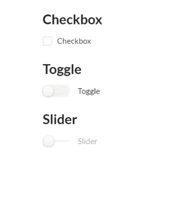
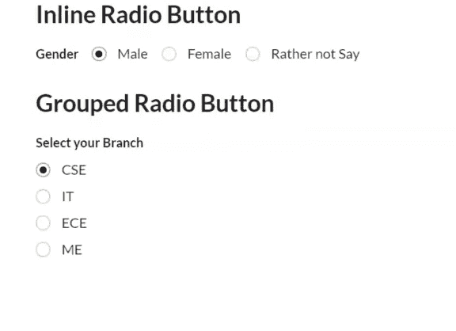
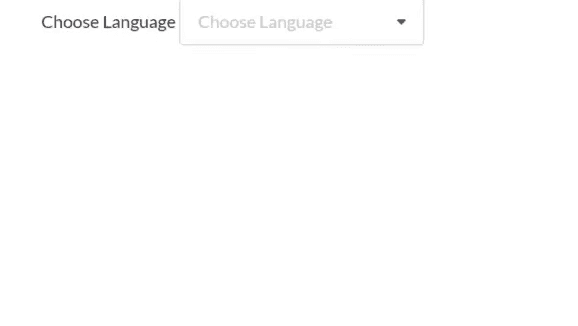
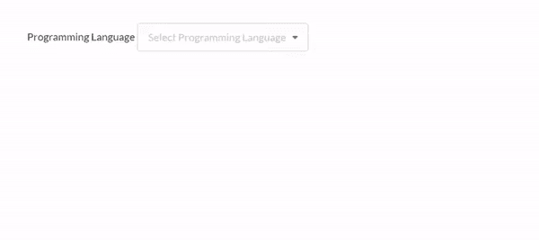

# 语义-用户界面|表单

> 原文:[https://www.geeksforgeeks.org/semantic-ui-forms/](https://www.geeksforgeeks.org/semantic-ui-forms/)

语义 UI 是一个开源框架，它使用 CSS 和 jQuery 来构建出色的用户界面。它和引导程序一样使用，有很大的不同元素来使你的网站看起来更令人惊讶。它使用一个类向元素添加 CSS。
表单是文档中包含多个输入字段的部分，如文本字段、密码和复选框等。
**示例 1:** 本示例创建一个简单的登录表单。

## 超文本标记语言

```
<!DOCTYPE html>
<html>

<head>
    <title>Semantic UI</title>
    <link href=
"https://cdnjs.cloudflare.com/ajax/libs/semantic-ui/2.4.1/semantic.min.css"
        rel="stylesheet" />

    <script src=
"https://cdnjs.cloudflare.com/ajax/libs/semantic-ui/2.4.1/semantic.min.js">
    </script>

    <script src="https://code.jquery.com/jquery-3.1.1.min.js"
        integrity=
"sha256-hVVnYaiADRTO2PzUGmuLJr8BLUSjGIZsDYGmIJLv2b8="
        crossorigin="anonymous">
    </script>

    <script src=
"https://cdnjs.cloudflare.com/ajax/libs/semantic-ui/2.4.1/semantic.min.js">
    </script>
</head>

<body>
    <div class="ui container">
        <h2>Log In</h2>
        <form class="ui form">
            <div class="field">
                <label>Username</label>
                <input type="text" name="Username"
                        placeholder="Username">
            </div>
            <div class="field">
                <label>Password</label>
                <input type="password" name="password"
                        placeholder="Password">
            </div>
            <div class="field">
                <div class="ui checkbox">
                    <input type="checkbox" tabindex="0"
                            class="hidden">
                    <label>Remember Me</label>
                </div>
            </div>
            <button class="ui button" type="submit">
                Log In
            </button>
        </form>
    </div>

    <script>
        $('.ui.checkbox').checkbox(); 
    </script>
</body>

</html>
```

**输出:**


**示例 2:** 本示例创建一个包含平行放置的输入字段的表单。

## 超文本标记语言

```
<!DOCTYPE html>
<html>

<head>
    <title>Semantic UI</title>
    <link href=
"https://cdnjs.cloudflare.com/ajax/libs/semantic-ui/2.4.1/semantic.min.css"
        rel="stylesheet" />

    <script src=
"https://cdnjs.cloudflare.com/ajax/libs/semantic-ui/2.4.1/semantic.min.js">
    </script>
</head>

<body>
    <div class="ui container">
        <div class="ui form">
            <div class="fields">
                <div class="field">
                    <label>Name</label>
                    <input type="text"
                        placeholder="Name">
                </div>
                <div class="field">
                    <label>E-mail</label>
                    <input type="email"
                        placeholder="E-mail">
                </div>
                <div class="field">
                    <label>Password</label>
                    <input type="password"
                        placeholder="Password">
                </div>
            </div>
        </div>
    </div>
</body>

</html>
```

**输出:**


**示例 3:** 本示例创建文本区域。

## 超文本标记语言

```
<!DOCTYPE html>
<html>

<head>
    <title>Semantic UI</title>
    <link href=
"https://cdnjs.cloudflare.com/ajax/libs/semantic-ui/2.4.1/semantic.min.css"
        rel="stylesheet" />

    <script src=
"https://cdnjs.cloudflare.com/ajax/libs/semantic-ui/2.4.1/semantic.min.js">
    </script>
</head>

<body>
    <div class="ui container">
        <div class="ui form">
            <div class="field">
                <label>Enter Text</label>
                <textarea rows="6"></textarea>
            </div>
        </div>
    </div>
</body>

</html>
```

**注意:**可以跳过 row 属性，获得标准大小的 textarea。
T3】输出:


**示例 4:** 本示例创建复选框。语义用户界面中有各种各样的复选框样式，比如标准的复选框、切换和滑动。
为此，您需要导入 jQuery 库。

```
$('.ui.checkbox').checkbox();
```

## 超文本标记语言

```
<!DOCTYPE html>
<html>

<head>
    <title>Semantic UI</title>
    <link href=
"https://cdnjs.cloudflare.com/ajax/libs/semantic-ui/2.4.1/semantic.min.css"
        rel="stylesheet" />

    <script src="https://code.jquery.com/jquery-3.1.1.min.js"
        integrity=
"sha256-hVVnYaiADRTO2PzUGmuLJr8BLUSjGIZsDYGmIJLv2b8=" crossorigin="anonymous">
    </script>

    <script src=
"https://cdnjs.cloudflare.com/ajax/libs/semantic-ui/2.4.1/semantic.min.js">
    </script>
</head>

<body>
    <div class="ui container">
        <div class="ui form">
            <h2>Checkbox</h2>
            <div class="inline field">
                <div class="ui checkbox">
                    <input type="checkbox"
                        tabindex="0" class="hidden">
                    <label>Checkbox</label>
                </div>
            </div>
            <h2>Toggle</h2>
            <div class="inline field">
                <div class="ui toggle checkbox">
                    <input type="checkbox"
                        tabindex="0" class="hidden">
                    <label>Toggle</label>
                </div>
            </div>
            <h2>Slider</h2>
            <div class="inline field">
                <div class="ui slider checkbox">
                    <input type="checkbox"
                        tabindex="0" class="hidden">
                    <label>Slider</label>
                </div>
                <label></label>
            </div>
        </div>
    </div>

    <script>
        $('.ui.checkbox').checkbox();
    </script>
</body>

</html>
```

**输出:**



**示例 5:** 本示例创建单选按钮。为此，您需要导入一个 jQuery 库。

```
$('.ui.radio.checkbox').checkbox();
```

**完整代码:**

## 超文本标记语言

```
<!DOCTYPE html>
<html>
    <head>
        <title>Semantic UI</title>
        <link href=
"https://cdnjs.cloudflare.com/ajax/libs/semantic-ui/2.4.1/semantic.min.css"
              rel="stylesheet" />      
    </head>
    <body>
        <div style="margin-top: 20px;" class="ui container">
          <div class="ui form">
            <h2>Inline Radio Button</h2>
            <div class="inline fields">
              <label for="gender">Gender</label>
              <div class="field">
                <div class="ui radio checkbox">
                  <input type="radio" name="gender"
                         checked="" tabindex="0"
                         class="hidden">
                  <label>Male</label>
                </div>
              </div>
              <div class="field">
                <div class="ui radio checkbox">
                  <input type="radio" name="gender"
                         tabindex="0" class="hidden">
                  <label>Female</label>
                </div>
              </div>
              <div class="field">
                <div class="ui radio checkbox">
                  <input type="radio" name="gender"
                         tabindex="0" class="hidden">
                  <label>Rather not Say</label>
                </div>
              </div>
            </div>
            <h2>Grouped Radio Button </h2>
            <div class="grouped fields">
              <label for="branch">Select your Branch</label>
              <div class="field">
                <div class="ui radio checkbox">
                  <input type="radio" name="branch"
                         checked="" tabindex="0" class="hidden">
                  <label>CSE</label>
                </div>
              </div>
              <div class="field">
                <div class="ui radio checkbox">
                  <input type="radio" name="branch"
                         tabindex="0" class="hidden">
                  <label>IT</label>
                </div>
              </div>
              <div class="field">
                <div class="ui radio checkbox">
                  <input type="radio" name="branch"
                         tabindex="0" class="hidden">
                  <label>ECE</label>
                </div>
              </div>
              <div class="field">
                <div class="ui radio checkbox">
                  <input type="radio" name="branch"
                         tabindex="0" class="hidden">
                  <label>ME</label>
                </div>
              </div>
            </div>
          </div>
        </div>
        <script src=
"https://code.jquery.com/jquery-3.1.1.min.js"
                integrity=
"sha256-hVVnYaiADRTO2PzUGmuLJr8BLUSjGIZsDYGmIJLv2b8="
                crossorigin="anonymous">
        </script>

        <script src=
"https://cdnjs.cloudflare.com/ajax/libs/semantic-ui/2.4.1/semantic.min.js">
        </script>
        <script>
          $('.ui.radio.checkbox').checkbox();
        </script>
    </body>
</html>
```

**输出:**



**示例 6:** 本示例创建下拉列表。为此，您需要导入 jQuery 库。

```
$(function() {
   $('.ui.dropdown').dropdown();
}); 
```

**完整代码:**

## 超文本标记语言

```
<!DOCTYPE html>
<html>
    <head>
        <title>Semantic UI</title>
        <link href=
"https://cdnjs.cloudflare.com/ajax/libs/semantic-ui/2.4.1/semantic.min.css"
              rel="stylesheet" />
    </head>
    <body>
        <div style="margin-top: 20px;" class="ui container">
          <label>Choose Language</label>
          <div class="ui selection dropdown">
            <input type="hidden" name="language">
            <i class="dropdown icon"></i>
            <div class="default text">Choose Language</div>
            <div class="menu">
                <div class="item" data-value="0">C++</div>
                <div class="item" data-value="1">Java</div>
                <div class="item" data-value="2">Python3</div>
            </div>
        </div>
        </div>
        <script src=
"https://code.jquery.com/jquery-3.1.1.min.js"
               integrity=
"sha256-hVVnYaiADRTO2PzUGmuLJr8BLUSjGIZsDYGmIJLv2b8="
                crossorigin="anonymous">
         </script>
        <script src=
 "https://cdnjs.cloudflare.com/ajax/libs/semantic-ui/2.4.1/semantic.min.js">
        </script>
        <script>
          $(function() {
              $('.ui.dropdown').dropdown();
          });       
        </script>
    </body>
</html>
```

**输出:**



**示例 7:** 本示例创建多选下拉菜单。为此，您需要导入 jQuery 库。

```
$(function() {
   $('.ui.dropdown').dropdown();
}); 
```

**完整代码:**

## 超文本标记语言

```
<!DOCTYPE html>
<html>
    <head>
        <title>Semantic UI</title>
        <link href=
"https://cdnjs.cloudflare.com/ajax/libs/semantic-ui/2.4.1/semantic.min.css"
              rel="stylesheet" /> 
    </head>

    <body>
        <div style="margin-top: 50px;" class="ui container">
            <div class="field">
              <label>Programming Language</label>
              <select multiple="" class="ui dropdown">
                <option value="">Select Programming Language</option>
                <option value="cpp">C++</option>
                <option value="java">Java</option>
                <option value="py3">Python3</option>
                <option value="php">PHP</option>
                <option value="ruby">Ruby</option>
                <option value="js">JavaScript</option>
              </select>
            </div>
          </div>
        <script src=
"https://code.jquery.com/jquery-3.1.1.min.js"
                integrity=
"sha256-hVVnYaiADRTO2PzUGmuLJr8BLUSjGIZsDYGmIJLv2b8="
                crossorigin="anonymous">
        </script>
        <script src=
"https://cdnjs.cloudflare.com/ajax/libs/semantic-ui/2.4.1/semantic.min.js">
        </script>
        <script>
          $(function() {
              $('.ui.dropdown').dropdown();
          });       
        </script>
    </body>
</html>
```

**输出:**



**示例 8:** 本示例创建语句的状态。状态可以是任何类似成功、错误、警告。

## 超文本标记语言

```
<!DOCTYPE html>
<html>
    <head>
        <title>Semantic UI</title>
        <link href=
"https://cdnjs.cloudflare.com/ajax/libs/semantic-ui/2.4.1/semantic.min.css"
              rel="stylesheet" />   
    </head>

    <body>
        <div style="margin-top: 20px;" class="ui container">
          <h2>State</h2>
          <div class="ui form success">
            <div class="field">
              <label>Enter email to get latest news</label>
              <input type="email" placeholder="joe@schmoe.com">
            </div>
            <div class="ui success message">
              <div class="header">Success</div>

<p>You're all signed up for the newsletter.</p>

            </div>
            <div class="ui submit button">Submit</div>
          </div>
          </div>
        <script src=
"https://cdnjs.cloudflare.com/ajax/libs/semantic-ui/2.4.1/semantic.min.js">
        </script>
    </body>
</html>
```

**输出:**


**注:**

*   您可以用错误或警告代替成功来显示该状态。
*   您可以使用小、小、大、中、大类来更改表单的大小。