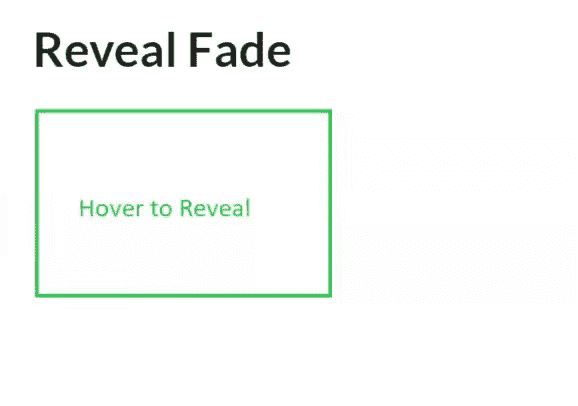
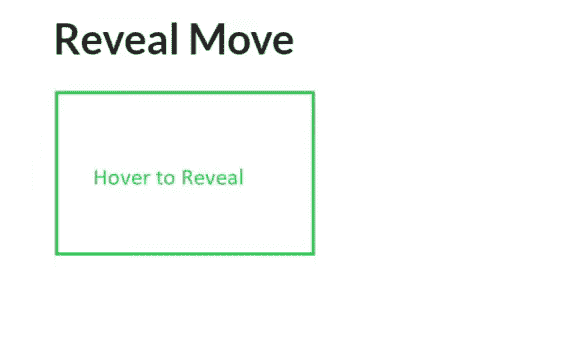
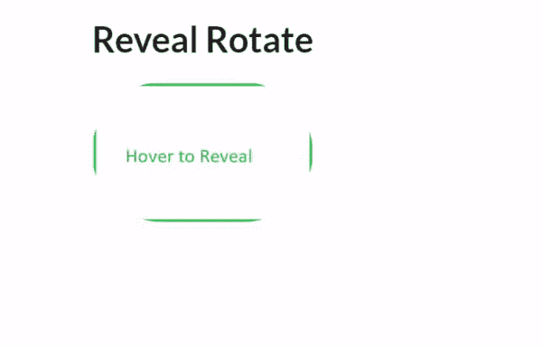

# 语义-界面|显示

> 原文:[https://www.geeksforgeeks.org/semantic-ui-reveal/](https://www.geeksforgeeks.org/semantic-ui-reveal/)

语义 UI 是一个开源框架，它使用 CSS 和 jQuery 来构建出色的用户界面。它和引导程序一样，有很大的不同元素，可以让你的网站看起来更加惊艳。它使用一个类向元素添加 CSS。

激活或悬停时，显示显示内容来代替先前的内容。

**例 1:** 褪色显现。

```html
<!DOCTYPE html>
<html>

<head>
    <title>Semantic UI</title>
    <link href=
"https://cdnjs.cloudflare.com/ajax/libs/semantic-ui/2.4.1/semantic.min.css"
        rel="stylesheet" />

    <script src=
"https://cdnjs.cloudflare.com/ajax/libs/semantic-ui/2.4.1/semantic.min.js">
    </script>
</head>

<body>
    <div class="ui container">
        <h2>Reveal Fade</h2>
        <div class="ui small fade reveal image">
            

            
        </div>
    </div>
</body>

</html>
```

在可见内容类中，我们必须添加我们想要默认显示的内容，在隐藏内容中，我们想要放入我们想要显示的内容。
**输出:**


**例 2:** 显示移动。

```html
<!DOCTYPE html>
<html>

<head>
    <title>Semantic UI</title>
    <link href=
"https://cdnjs.cloudflare.com/ajax/libs/semantic-ui/2.4.1/semantic.min.css"
        rel="stylesheet" />

    <script src=
"https://cdnjs.cloudflare.com/ajax/libs/semantic-ui/2.4.1/semantic.min.js">
    </script>
</head>

<body>
    <div class="ui container">
        <h2>Reveal Move</h2>
        <div class="ui move reveal">
            <div class="visible content">
                
            </div>

            <div class="hidden content">
                
            </div>
        </div>
    </div>
</body>

</html>
```

您可以添加向上类、向下类和向右类来向上、向下和向右移动。例如，对于向上类='ui 上移以显示'。

**输出:**


**示例 3:** 旋转显示

```html
<!DOCTYPE html>
<html>

<head>
    <title>Semantic UI</title>
    <link href=
"https://cdnjs.cloudflare.com/ajax/libs/semantic-ui/2.4.1/semantic.min.css"
        rel="stylesheet" />

    <script src=
"https://cdnjs.cloudflare.com/ajax/libs/semantic-ui/2.4.1/semantic.min.js">
    </script>
</head>

<body>
    <div class="ui container">
        <h2>Reveal Rotate</h2>

        <div class="ui small circular rotate reveal image">
            

            
        </div>
    </div>
</body>

</html>
```

将类别更改为“用户界面小圆形向左旋转显示图像”以将其向左旋转。

**输出:**

你可以给任意一个启示添加即时类来毫不延迟地揭示。

**注意:**隐藏图像和可见图像的长宽比应该相同。