# Spring MVC 采用基于 Java 的配置

> 原文:[https://www . geesforgeks . org/spring-MVC-using-基于 Java-configuration/](https://www.geeksforgeeks.org/spring-mvc-using-java-based-configuration/)

**先决条件:** [MVC 设计模式](https://www.geeksforgeeks.org/mvc-design-pattern/)[带 JSP 视图的 Spring MVC](https://www.geeksforgeeks.org/spring-mvc-with-jsp-view/)

**Spring MVC 框架**支持模块分离，即**模型**、**视图**和**控制器**，无缝处理应用集成。这使得开发人员也可以使用普通的 java 类创建复杂的应用程序。模型对象可以使用地图在视图和控制器之间传递。在本文中，我们将看到如何在 Eclipse IDE 中设置一个 Spring MVC 应用程序，并了解如何制作应用程序。

Spring MVC 框架由以下组件组成:

*   **模型:**模型可以是基本包含应用程序数据的对象或对象集合。
*   **视图:**视图用于以特定的格式向用户显示信息。Spring 支持各种技术，如 **freemarker** 、 **velocity** 和**百里香叶**。
*   **控制器:**包含应用的逻辑部分。 *@Controller* 注释用于将该类标记为 Controller。
*   **前端控制器**:仍然负责管理 web 应用的流程。DispatcherServelet 在 spring MVC 中充当前端控制器。

**要求:**

*   Eclipse (EE 版本)。
*   Tomcat Apache 最新版本。

<u>**在 eclipse IDE 中设置 Spring MVC 应用程序的步骤:**</u>

*   **第一步:**进入**文件**菜单，点击**新建** - > **Maven 项目。**
    [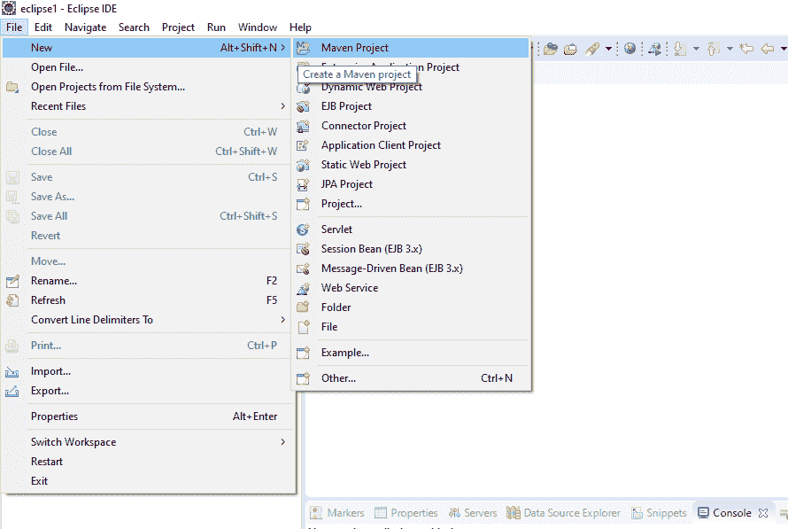](https://media.geeksforgeeks.org/wp-content/uploads/20200514190722/image1.PNG)
*   **第二步:**然后在搜索栏中，输入 **maven** 。点击 **Maven 项目**，点击**下一步**。
    [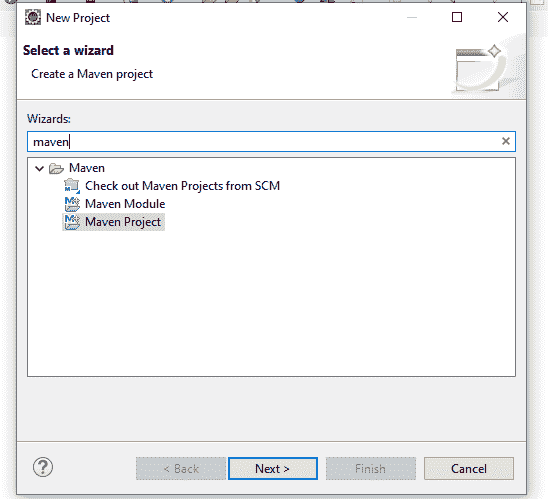](https://media.geeksforgeeks.org/wp-content/uploads/20200514191153/image2.PNG)
*   **步骤 3:** 默认设置应保持原样。点击**下一步。**
    [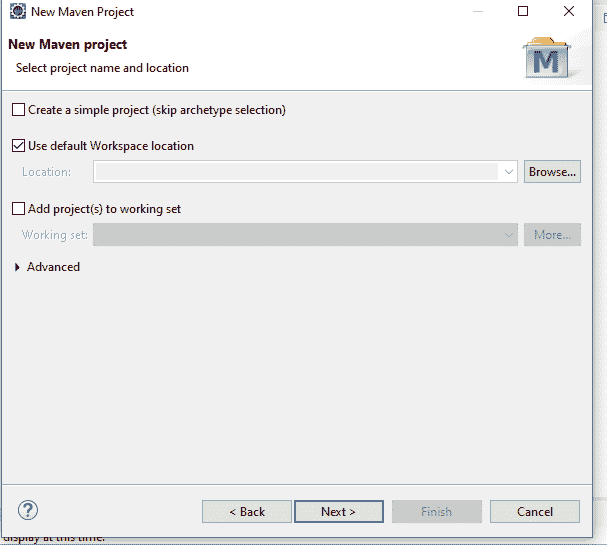](https://media.geeksforgeeks.org/wp-content/uploads/20200514191441/image3.PNG)
*   **第四步:**选择**maven-原型-webapp** 进行 web 应用，点击**下一步**。
    [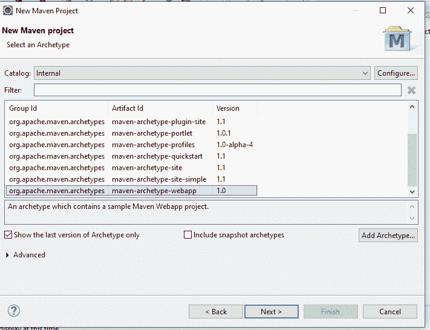](https://media.geeksforgeeks.org/wp-content/uploads/20200514192351/image4.PNG)
*   **第五步:**给点**组 id** 以及**神器 id** 。
    [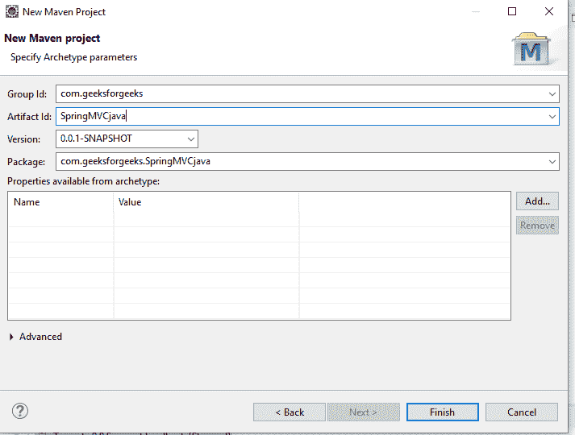](https://media.geeksforgeeks.org/wp-content/uploads/20200514192541/image5.PNG)
*   **第六步:**右键点击项目，进入**属性**。
    [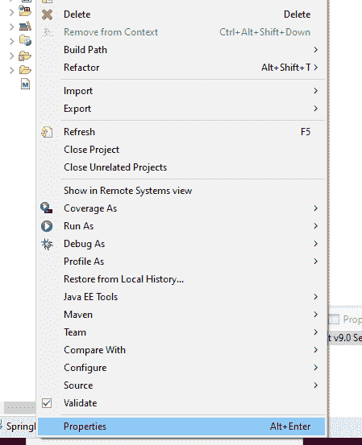](https://media.geeksforgeeks.org/wp-content/uploads/20200514193111/image6.PNG)
*   **第 7 步:**点击**目标运行时。**选择系统中安装的**阿帕奇雄猫**。点击**应用** - > **应用并关闭。**
    [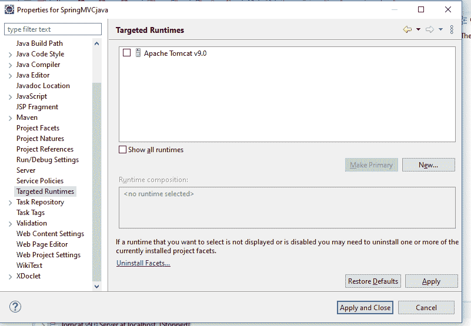](https://media.geeksforgeeks.org/wp-content/uploads/20200514193306/image7.PNG)
*   **第八步:**Java 文件应该在 **src/main/java** 文件夹中构建 spring MVC 项目。转到项目中的 **src** 文件夹。右键点击**主**，点击**新建** - > **文件夹。**
    [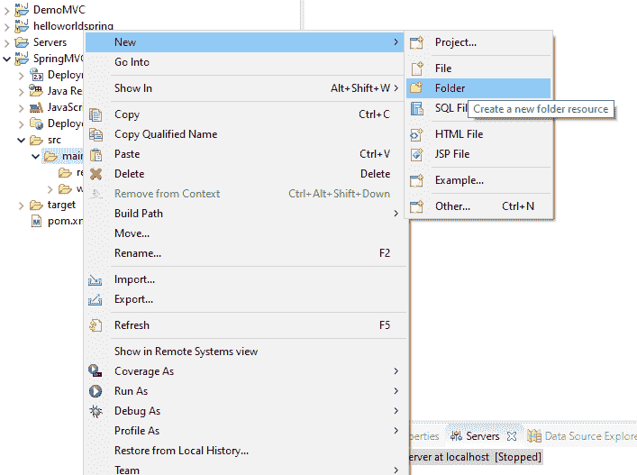](https://media.geeksforgeeks.org/wp-content/uploads/20200514194605/image8.PNG)
*   **第九步:**将 **java** 写成文件夹名。
    [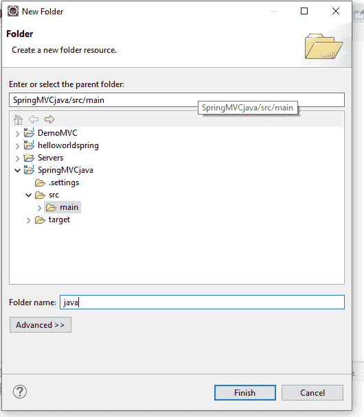](https://media.geeksforgeeks.org/wp-content/uploads/20200514195142/image9.PNG)
*   **Step 10:** Create a java class inside **com.geesforgeeks.springmvc** under **src/main/java** folder. The directory structure should look as follows.
    [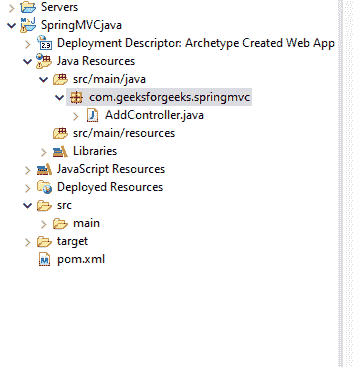](https://media.geeksforgeeks.org/wp-content/uploads/20200514195757/image11.PNG)

    <u>**使用基于 java 的配置实现 Spring web MVC 应用程序的步骤:**</u>

    *   **第一步:**最初，我们需要创建一个 **POM。XML** 文件。这个文件包含 spring 框架的 maven 依赖项，以便在项目中使用它们。

        ## 可扩展标记语言

        ```html
        <project
          xmlns="http://maven.apache.org/POM/4.0.0" 
          xmlns:xsi="http://www.w3.org/2001/XMLSchema-instance"
          xsi:schemaLocation="http://maven.apache.org/POM/4.0.0 
                              http://maven.apache.org/maven-v4_0_0.xsd">
          <modelVersion>4.0.0</modelVersion>
          <groupId>com.geeksforgeeks</groupId>
          <artifactId>SpringMVCjava</artifactId>
          <packaging>war</packaging>
          <version>0.0.1-SNAPSHOT</version>
          <name>SpringMVCjava Maven Webapp</name>
          <url>http://maven.apache.org</url>
          <dependencies>

            <dependency>
              <groupId>junit</groupId>
              <artifactId>junit</artifactId>
              <version>3.8.1</version>
              <scope>test</scope>
            </dependency>

            <dependency>
              <groupId>org.springframework</groupId>
              <artifactId>spring-webmvc</artifactId>
              <version>4.3.12.RELEASE</version>
            </dependency>

          </dependencies>
          <build>
            <finalName>SpringMVCjava</finalName>
          </build>
        </project>
        ```

    *   **步骤 2:** 项目包含一个 **web.xml** 文件，该文件接收来自客户端的所有请求。我们将使用**WebInitializer.java**代替 web . XML。**getServletMappings()**函数接收所有对应于**/【URL】**映射的请求。函数**getServletConfigClasses()**配置 dispatcher servlet，并将处理程序转移到 dispatcher servlet java 文件 MVCconfig.class 中。**使用 MVCconfig.class】文件代替 dispatcher servlet 进行基于 java 的配置。这个类应该扩展**抽象注释配置调度器类**来服务于基于 java 的配置中 web.xml 文件的目的。该文件定义为:

        ## Java 语言（一种计算机语言,尤用于创建网站)

        ```html
        package com.geeksforgeeks.web;

        import org.springframework.web
            .servlet.support
            .AbstractAnnotationConfigDispatcherServletInitializer;

        public class WebInitializer
            extends AbstractAnnotationConfigDispatcherServletInitializer {

            @Override
            protected Class<?>[] getRootConfigClasses()
            {
                // TODO Auto-generated method stub
                return null;
            }

            @Override
            protected Class<?>[] getServletConfigClasses()
            {
                // TODO Auto-generated method stub
                return new Class[] { MVCconfig.class };
            }

            @Override
            protected String[] getServletMappings()
            {
                // TODO Auto-generated method stub
                return new String[] { "/" };
            }
        }
        ```** 
    *   ****第三步:**现在，我们需要创建一个 MVCconfig.java 文件。这个文件用来代替 dispatcher servlet 文件。用 **@Configuration** 注释一个类表示该类可以被 Spring IoC 容器用作 bean 定义的来源。要启用带注释控制器的自动检测，需要将组件扫描添加到配置中。它还给出了**基本包(即 com.geeksforgeeks.web)** 的路径，其中需要搜索控制器文件。这个类应该扩展**webmvcconfiguradapter**类来服务于 dispatcher servlet 的目的。

        ## Java 语言（一种计算机语言,尤用于创建网站)

        包。com。极客们。web

        导入组织。弹簧框架。上下文
        。注释。组件扫描；
        导入组织。弹簧框架。上下文
        。注释。配置；
        导入组织。弹簧框架。网络。servlet
        。配置。注释
        。webmvcconfiguradapter

        @配置
        @组件扫描({"com。极客们。web"})

        公开课 mvcconfig
        扩展 web vcconfigured 适配器{
        }** 
    *   ****第四步:**现在，我们需要定义一个控制器。**控制器**解释用户输入，并将其转换为视图向用户表示的模型。 **@RequestMapping** 注释用于将 **"/greet"** 等 URL 映射到整个类或特定的处理程序方法上。我们创建一个**模型和视图**类的对象。 **setViewName()** 表示要调用的视图， **addObject()** 表示要添加到该对象的动态内容。

        ## Java 语言（一种计算机语言,尤用于创建网站)

        ```html
        package com.geeksforgeeks.web;
        import org.springframework
            .stereotype.Controller;
        import org.springframework.web
            .bind.annotation.RequestMapping;
        import org.springframework.web
            .servlet.ModelAndView;

        @Controller
        public class GreetController {

            @RequestMapping("/greet")
            public ModelAndView showview()
            {

                ModelAndView mv = new ModelAndView();
                mv.setViewName("result.jsp");
                mv.addObject("result",
                             "GeeksForGeeks Welcomes "
                                 + "you to Spring!");
                return mv;
            }
        }
        ```** 
    *   ****第五步:**现在，我们需要为应用程序创建一个索引页面。它是当给定的网址被点击时显示的页面。于是，我们创建了**index.jsp**文件如下:

        ## 超文本标记语言

        ```html
        <html>
        <body>
        <h2>Hello World!</h2>
            <form action="greet">
                <input type="submit" value="Press to greet">
            </form>
        </body>
        </html>
        ```** 
    *   ****第六步:**当按下上面定义的 index.jsp 的**问候**按钮时，**Result.jsp**页面打开。所以，我们需要定义 Result.jsp 文件:

        ## 超文本标记语言

        ```html
        <%@ page language="java" contentType="text/html; charset=ISO-8859-1"
            pageEncoding="ISO-8859-1" isELIgnored="false"%>
        <!DOCTYPE html>
        <html>
            <head>
                <meta charset="ISO-8859-1">
                <title>Insert title here</title>
            </head>
            <body>

                <h1>${result}</h1> 

            </body>
        </html>
        ```** 

    **输出:**

    *   When index.jsp is opened:

        [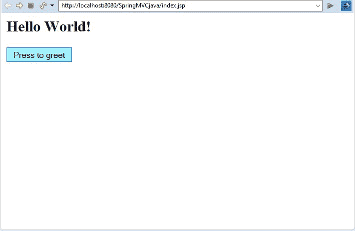](https://media.geeksforgeeks.org/wp-content/uploads/20200515143824/image12.jpg)

    *   When the button is pressed:

        [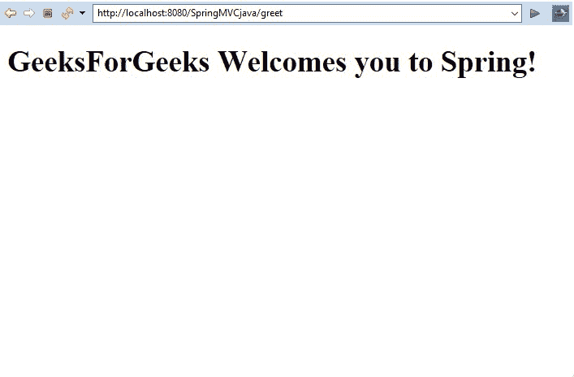](https://media.geeksforgeeks.org/wp-content/uploads/20200515144304/imag13.jpg)