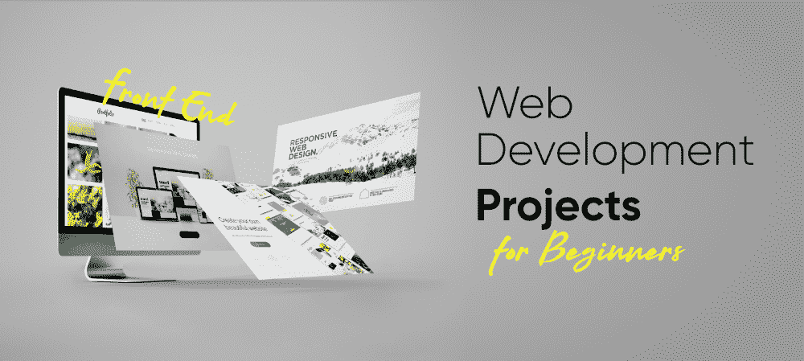

# 面向初学者的十大前端 Web 开发项目

> 原文:[https://www . geesforgeks . org/top-10-前端-web-开发-面向初学者的项目/](https://www.geeksforgeeks.org/top-10-front-end-web-development-projects-for-beginners/)

获得任何技能的最好方法是通过从事项目来将其付诸实践，然而许多人在看了教程后认为他们什么都知道。然而，这是不正确的；他们不会自己创建任何项目。所有这些因素也适用于前端网络开发；如果你想成为一名出色的前端 Web 开发人员，那么自己构建项目不仅会增加你的信心，而且还会通过添加你将制作的项目，逐步让你的投资组合做好工作准备。

因此，这里有一个前端网络开发项目的完整列表，每个有抱负的前端网络开发人员都必须完成。

### 1.构建网站的克隆

构建网站克隆是学习页面结构、颜色、字体、媒体、表格和其他设计元素的基础的极好方法。要复制原件，尽可能深入细节。选择一个你喜欢的网站，并创建它的克隆。为了最大限度地利用源代码，尽可能避免查看它。克隆网站的好处是你可以选择复杂程度。一个简单的网站，只需要 HTML 和 CSS 是一个很好的开始，如果你刚刚开始。选择一个使用 JavaScript 或 React 的网站，如果你更高级的话。

**所需技能:** HTML，CSS & JavaScript

### 2.建立自己的投资组合网站

建立一个个人投资组合网站是最简单却又最困难的前端项目想法之一。你可以从把你的网站作为简历开始。这意味着你可以在网站上添加关于你的经验、才能和专业知识的信息。由于这个原因，许多自由网页设计师和开发人员有可爱的个人投资组合网站。为了保持网站的娱乐性、原创性和互动性，你需要运用你的 HTML、CSS 和 JavaScript 技巧。你应该能够用 HTML 组织一个网页，用 CSS 设计它的元素，用 JS 使网站具有交互性。

**所需技能:** HTML，CSS & JavaScript

### 3.一个 CRUD 操作网络应用

作为前端开发人员，您需要熟悉 CRUD(创建-读取-更新-删除)操作，因为它们是大多数网站(包括博客、电子商务、仪表板等)的常见功能。待办事项列表或笔记网页是 CRUD 应用程序的两个例子。在你的网站上有一个这样的项目证明了你对数据结构的了解。这也是展示你前端框架技能的绝佳机会。推荐的技术:因为 CRUD 应用程序需要使用可重用的组件，所以根据您的经验水平，使用像 React 或 Vue 这样的框架来开发它们是一个好主意。

**所需技能:** JavaScript/React/Vue

### 4.满分登录页

在 Chrome 灯塔的审计报告中，满分网站在所有领域都获得满分。建立一个具有所有基本功能的网站，证明你有能力坚持最佳实践并提供高质量的产品。

**所需技能:**满足 Chrome 灯塔审核报告需求的一切

### 5.JavaScript 音乐播放器

对于前端网络开发，创建一个 JavaScript 音乐播放器可能是一个可行的选择。作为一名新的 JavaScript 开发人员，每个人都应该专注于扩展应用程序的功能，但是如果没有基本的图形和架构，设计和用户体验决策将变得更加困难。因此，这里的架构分为三个主题桶:CSS(为 HTML 文件中定义的每个元素添加样式)JavaScript(为音频、播放器按钮和音乐信息添加元素)(在单击 HTML 元素时添加功能)

**所需技能:** HTML，CSS & JavaScript

### 6.动态登录页

一旦您了解了前端开发的基本要素，例如 HTML、CSS 和 JavaScript，您就可以通过探索 Bootstrap 的功能来更进一步。它简化了你的工作，提高了你的产出。有了这些信息，您可以使用 Bootstrap 为任何产品开发一个极具吸引力的登录页面。您可以通过从本地存储中显示用户的时间和姓名来使它更有趣。您可以使用 Bootstrap 复制一些您最喜欢的登陆点。

**所需技能:** HTML、CSS、JavaScript &自举

### 7.打造自己的二维码阅读器

条形码和二维码彻底改变了我们的购物方式。客户现在可以使用智能手机扫描产品，获取价格或购买地点等信息。它还消除了在网站上输入长代码的需要，如激活码或型号，使他们的购买体验更加方便。你不需要一个本地手机应用来读取二维码，这与普遍的看法相反。在带有摄像头的智能设备上运行的网站可能能够实现这一点。将使用 HTML 和 JavaScript，但最重要的元素将是使用可以解码二维码的 JS 库。好消息是，您不必从头开始构建它，因为有许多优秀的库可用于此目的。

**所需技能:** HTML，CSS & JavaScript

### 8.构建计算器

一个具有基本算术运算功能的计算器项目，如加法、减法、乘法和除法，对于一个掌握 HTML、CSS 和 JavaScript 基本知识的新手来说非常有用。您需要设计一个用户界面，其中包含输入数据的按钮和显示结果的显示屏。在类似网格的格式中，CSS 网格可以用来对齐按钮和屏幕。至少，您应该熟悉 If-else 语句、循环、运算符、JavaScript 函数、事件侦听器等等。

**所需技能:** HTML，CSS & JavaScript

### 9.构建天气应用程序

天气应用程序可以用 HTML、CSS 和 JS 来创建。您可以使用开放天气地图应用编程接口添加天气信息。在这个项目中，你也可以使用 AngularJS。为了让你的网站看起来漂亮，你可以使用面向设计的库。开放天气地图应用编程接口将为您提供各种位置的基本天气信息，以令人愉快的方式呈现这些信息将是您的工作。完成这个项目后，您将熟悉各种 JS、Angular 和 AJAX 组件。

**所需技能:** HTML，CSS & JavaScript

### 10.构建一个 JavaScript 测验

当你第一次开始学习 JavaScript 时，弄清楚如何将你学到的东西付诸实践，并选择一个适合你技能的项目可能会很困难。构建一个小问答游戏是一个很好的开始。你将不得不处理高度抽象的逻辑，由你来控制和/或扩大测验难度的范围。首先用四个选择题创建一个简单的游戏。在编这些问题时，给每个问题分配正确的答案。在编程时，您将学到很多关于数据管理和创建评分系统的知识。

**所需技能:** HTML，CSS & JavaScript