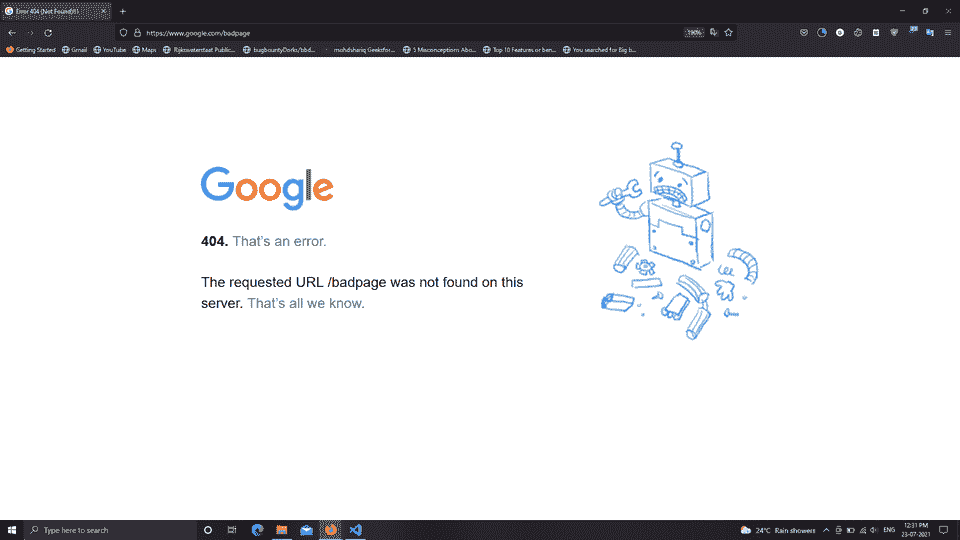
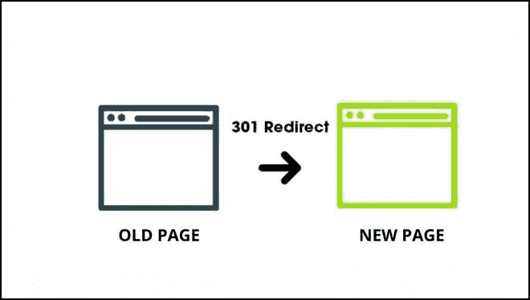
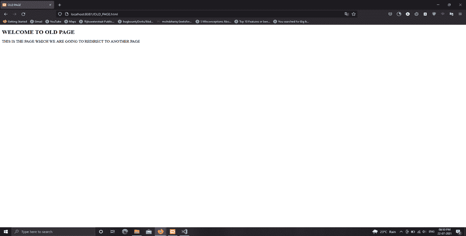
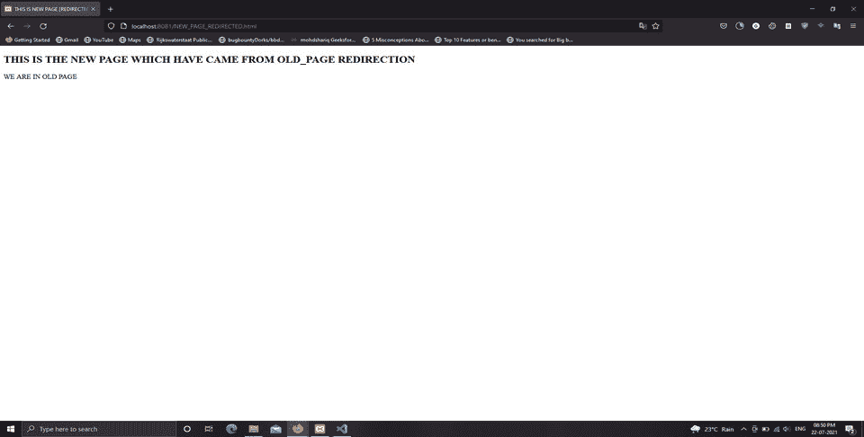
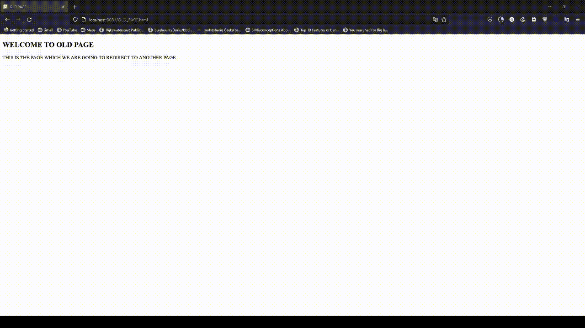

# 理解 301 重定向及其实现

> 原文:[https://www . geesforgeks . org/understanding-301-重定向-with-its-implementation/](https://www.geeksforgeeks.org/understanding-301-redirection-with-its-implementation/)

计算机科学中的重定向是一项必不可少的有益服务，可帮助网站所有者和管理员在需要时将其关联的域和子域指向特定的目标 URL。当特定的基于 web 的应用程序不再使用其原始域来提供数据服务时，就会执行重定向。所有链接到它的用户都需要被自动告知这个不可避免的变化。因此，在这种情况下，重定向成为焦点。此功能有助于域管理员保持传入关系与其域或网站的相关性。因此，在本文中，我们将了解重定向、301 重定向及其持续时间，并对 301 网址重定向进行现场演示。

*   **URL 重定向:**用简单的话来解释重定向，就是建立访问者互联网流量与新创建的 URL 的关系，以取代旧的 URL。网络中著名的协议 HTTP，HTTPS 重定向代码是一种将用户和搜索引擎功能从一个网址转移到另一个网址的方法。如果互联网上的一个基于网络的应用程序的重定向将您以前或旧的地址指向一个新地址，那么这就是重定向。当访问者访问或访问基于网络的应用程序的旧网址时，服务器会将访问者带到新创建的网页，该网页由网站所有者或管理员在配置文件中设置为重定向。有人可能会问，‘为什么我们需要重定向’？所以答案很简单:执行重定向的主要目的或需求是将一些关键或几乎所有内容从旧网页转移或迁移到新网页。我们可以使用重定向来永久删除旧网页，也可以用来更改域名和将网站与另一个公司服务器合并。
*   **状态码:**在网上浏览时，一定遇到过类似 404 这样的错误信息或错误代码。这是一个错误，还有更多的错误，所以这些错误信息被称为状态代码。所以这些状态代码是标准的响应代码，根据用户的请求从 web 应用服务器返回。这些状态代码还提供关于我们请求的查询状态的数据或消息。当 web 应用程序页面对请求做出适当响应时，代码会识别问题的原因。在通信中，每个 HTTP/HTTPS 协议响应消息包的第一行都包含一个状态代码，表示请求查询的结果。



状态代码为 404 的错误消息

在数据通信中，有五组状态代码，根据代码的第一位数字进行划分:

1.  **1xx(信息说明代码):** 100，101，102，103
2.  **2xx(请求成功陈述代码):** 200，201，202，203，204，205 206，207，208，226
3.  **3xx(重定向消息说明代码):** 300，301，302，303，304，305，306，307，308
4.  **4xx(错误消息说明代码):** 400、401、402、403、404、405、406、407、408、409、410、411、412、413、414、415、416、417、418、421、422、423、424、425、426、427、428、429
5.  **5xx(服务器遇到错误说明代码):** 500，501，502，503，504，505，506，507，508，510，511

*   **301(永久移动)状态代码:**如上所述，3xx 状态代码是为重定向警报保留的，因此在这个有影响力的组中，我们有一个代码，即 301，也称为永久移动状态代码。此代码将旧的网址重定向到新创建的或在位置头或消息包中指定的网址。访问者必须使用这个新指定的网址，而不是原来的或旧的。目标或最终资源被分配给一个唯一的或新的永久网址，对该网址的任何未来更新都将在新创建的网址上使用。301 重定向只是一个永久的重定向，将访问者从旧的页面网址转移到重定向的页面。根据重定向方面，301 是在任何网络应用程序上实现重定向的最佳方法和最可靠的方法。为了保留当前搜索引擎的特征或功能，使用了 301 重定向。我们必须在。htaccess 配置文件。

让我们详细了解一下 301 重定向。

**1。301 重定向的持续时间:**很可能永久移动或 301 重定向重定向重定向指定的域或子域大约一年或有时一年以上。您需要经常检查访问者是否被转移到您新创建的网址(一年后)。。htaccess 在方向上起着重要的作用。如果要删除重定向，可以修改。htaccess 文件并删除重定向，因此之后，网站将不再将用户转发到新的 URL。

**通过图表了解 301 重定向:**



**301 从旧页面重定向到新页面**

> 从上图中，由于一些内部应用程序问题，域的旧页面被重定向或永久移动到新页面。

**2。何时执行 301 重定向:** 301 重定向通常用于以下情况:

1.  域所有者想要更改页面的网址。
2.  域所有者希望连接关于相同主题的页面。
3.  域名所有者必须更改子文件夹的网址(例如，将 https://geeksforgeeks.org/old-directory/改为 https://geeksforgeeks . org/new-directory/)。
4.  域名所有者已将一个子域移动到一个子文件夹中(例如，https://demo.geeksforgeeks.org 移动到 https://geeksforgeks . org/demo/)。
5.  域名所有者必须更改域名(例如，将 geeksforgeeks.in 改为 geeksforgeeks.in)。
6.  域名所有者必须从 HTTP 切换到 HTTPS(例如，从 http://geeksforgeeks.org 切换到 https://geeksforgeks . org)。

**3。使用实现 301 重定向的技术。htaccess 配置文件:** htaccess 是在运行 Apache web Server 软件的 Web 服务器上使用的配置文件。这个文件实际上负责重定向。

现在让我们看看实现 301 个重定向需要遵循的步骤:

*   创建一个. htaccess 文件，打开记事本，命名，并将文件另存为。htaccess(没有为文件指定扩展名)。
*   如果。htaccess 已经存在于您的服务器上，请修改它并重新上传。
*   将以下代码放在。htaccess 配置文件。

> 重定向 301/old/old _ page . html http://www.demoexample.com/new_page_redirection.html

*   如果。htaccess 文件中已经有几行代码，跳过一行，然后添加上面的代码。
*   拯救世界。htaccess 文件。
*   将此文件上传到服务器的主文件夹或根文件夹。
*   通过在您更改的页面上键入旧地址来检查它。服务器会立即将您带到新的位置。
*   注意:不要在语句的第一部分添加“http://www”——将路径从站点的顶层放置到页面。此外，请确保在这些元素之间设计一个单独的空间:
*   重定向 301(页面已经移动的指令)
*   /old/old_page.html(原始文件夹路径和文件名)
*   http://www.demoexample.com/new_page_redirection.html(新路径和文件名)

**示例:**在下面的示例中，我们将执行 301 重定向。对于本演示，我们将文件托管在本地主机上，即 XAMPP 服务器。

我们创建了两个名为:

1.  OLD_PAGE.html
2.  NEW_PAGE_REDIRECTED.html

**1。在 OLD_PAGE.html 网页中，我们将通过在。htaccess 文件。。htaccess 文件是基于 web 的应用程序的配置文件。。htaccess 文件可以通过这个文件管理所有的内部结构。OLD_PAGE.html 是网页应用程序将重定向到另一个网页的网页。当任何用户输入旧页面网址时，他们将被自动重定向到新的重定向页面。**

**文件名:OLD_PAGE.html**

## 超文本标记语言

```html
<!DOCTYPE html>
<html>
   <head>
      <title>OLD PAGE</title>
   </head>
   <body>
      <h2>WELCOME TO OLD PAGE</h2>

<p>THIS IS THE PAGE WHICH WE ARE GOING TO REDIRECT TO ANOTHER PAGE</p>

   </body>
</html>
```

**输出:**



图 1。这是旧页面输出

**2。要执行重定向，我们需要将用户从旧页面发送到新页面的目标网页。所以我们的目的页面或者新重定向页面是 NEW _ PAGE _ REDIRECTED.html，如果用户输入 OLD_PAGE.html URL，那么他会自动切换到 NEW _ PAGE _ REDIRECTED.html URL。**

**文件名:NEW_PAGE_REDIRECTED.html**

## 超文本标记语言

```html
<!DOCTYPE html>
<html>
   <head>
      <title>THIS IS NEW PAGE [REDIRECTED PAGE]</title>
   </head>
   <body>
      <h2>THIS IS THE NEW PAGE WHICH HAVE CAME FROM OLD_PAGE REDIRECTION</h2>

<p>WE ARE IN OLD PAGE</p>

   </body>
</html>
```

**输出:**



图 2。这是新的页面重定向输出

**3。。重定向的 htaccess 文件(配置文件):**如上所述。htaccess 是负责任何类型的重定向功能的任何内部结构的文件。所以业主要谨慎处理这个文件。在这个文件中，我们需要添加 301 重定向的代码。代码只是一行代码，其中我们需要指定旧页面和新重定向页面的 URL。这个单行代码负责基于网络的应用程序中的 301 重定向。根据需要，您可以重定向各种页面的数量，只需要添加代码。htaccess 文件。

> 注意:
> 
> 1.确保该文件应保存为。不带扩展名的 htaccess。正如在 Geeksforgeeks 代码嵌入编辑器中，没有空的扩展工具，我已经在 HTML 部分添加了源代码，但是在您这边，您需要保存它，而不需要任何扩展。
> 
> 2.#添加的句子仅供读者理解，在你身边表演的时候不需要添加这句台词。

**。htaccess〔t1〕**

## 超文本标记语言

```html
#.htaccess file content
#OLD_PAGE.html will be Redirected to NEW_PAGE_REDIRECTED.html Page Automatically
redirect 301 /OLD_PAGE.html http://localhost:8081/NEW_PAGE_REDIRECTED.html
```

#### 输出:



视频一。输出视频(现场演示)

**说明:**当我们在地址栏中输入 OLD_PAGE.html URL 时，Web 应用程序会自动将我们带到另一个 URL，而这个其他 URL 属于 NEW_PAGE_REDIRECTED.html 页面。这是由于 301 重定向代码写在。htaccess 文件。尽管复制 http://localhost:8081/OLD _ PAGE . html 链接并将其粘贴到新选项卡将始终将我们重定向到 http://localhost:8081/NEW _ PAGE _ redirected . html 页面，直到我们从中删除重定向代码。htaccess 文件。您可以在上面的输出中看到，我试图打开 http://localhost:8081/OLD _ PAGE . html，但是当我们完成重定向时，我们被重定向到 http://localhost:8081/NEW _ PAGE _ redirected . html。

此重定向将持续到所有者从。htaccess 文件。