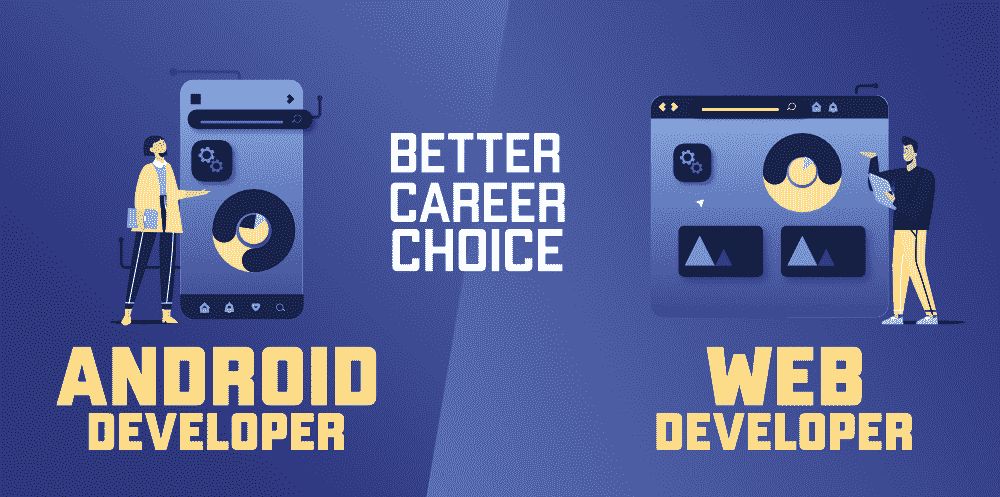

# 网络开发者还是安卓开发者——哪个是更好的职业选择？

> 原文:[https://www . geesforgeks . org/web-developer-or-Android-developer-哪个更好-职业选择/](https://www.geeksforgeeks.org/web-developer-or-android-developer-which-one-is-better-career-choice/)

网页开发和安卓开发是开发者最新兴的两个职业领域。这两个部门需要不同的技能，有不同的市场，最重要的是有多样化的可用性。在做选择的时候，我们需要根据学习 Web Development 和 android 开发的开发步骤所需要的框架，难度等级，职业机会，薪资，以及 Android 和 Web 开发的未来趋势来进行比较。所以，如果你对在 web 和安卓开发中选择什么感到困惑，你已经点击了正确的文章！！

在这篇文章中，我们将讨论和比较网络开发和安卓开发的所有必要参数，这将帮助你选择适合你的职业选择。

### 1.了解网络开发和安卓开发的区别:

网络开发包括编码、设计和操作网络应用程序和网站。一个熟练的网络开发人员应该设计和开发一个易于导航的用户友好的网站。web 开发需要的编程语言有[**【HTML】**](https://www.geeksforgeeks.org/html-tutorials/)[**【CSS】**](https://www.geeksforgeeks.org/css-tutorials/)[**【JavaScript】**](https://www.geeksforgeeks.org/javascript-tutorial/)等。Web 开发可以进一步分为 3 类:

*   **前端 Web 开发:**涉及网页的设计，即网站的外观，插入内容以及指定不同的导航。
*   **后端 Web 开发:**涉及到处理数据库和服务器端编程。它基本上维护正在输入的所有数据，并处理数据以向用户显示输出。
*   **全栈 Web 开发:**是前端开发和后端开发的结合。全栈开发人员负责网站的设计以及维护和处理输入的数据。

安卓开发涉及移动应用的设计。在这里，开发人员需要为 android 设备构建应用程序。一般来说，用于安卓开发的最流行的语言是 Java 和 Kotlin。

### 2.学习步骤:网络开发和安卓开发

**网页开发:**

**步骤 1:** 在前端和后端开发中选择您感兴趣的领域

**第二步:**前端开发人员需要学习所需的技能，例如

*   使用超文本标记语言创建布局
*   在 CSS(层叠样式表)中使用不同的属性设置网页的样式
*   JavaScript 如何获取查询和响应查询，并帮助添加交互功能，如音频、视频和图像。
*   帮助网页适应设备的响应设计(引导)
*   还需要使用版本控制系统，如 Git 和 GitHub，因为它们允许跟踪所做的更改并返回到以前的版本。

如果你对后端开发感兴趣，那么你可以学习

*   Java 或 Python 等编程语言，
*   诸如 Node JS 和
*   SQL 和 NoSQL 数据库系统，如 MYSQL、MongoDB，用于存储、检索和更新数据。

**步骤 3:** 您还需要了解允许在服务器之间移动文件/数据的 HTTP 协议和部署工具。

学习 DevOps 将是一个很好的补充，因为它可以帮助单个团队实现整个应用程序开发生命周期。

**安卓开发:**

一位安卓开发者专门为市场设计应用和安卓应用。

**第一步:**学习安卓开发的基础知识，包括

1.  Java SDK
2.  了解 Java/Kotlin 中的任何编程语言
3.  安卓用户界面设计

**第二步:**学习安卓开发的高级技能，包括

*   精通使用 Git、REST API
*   关于数据库系统的知识
*   能够围绕 UI、云消息 API 和持续集成设计应用。

### 3.难度水平

前端网络开发比后端网络开发稍微容易一些，因为在后端，除了存储和维护数据之外，您还需要跟踪处理的数据。总的来说，网络开发比安卓开发相对容易，然而，这主要取决于你构建的项目。例如，与构建基本的安卓应用程序相比，使用 HTML 和 CSS 开发网页可以被认为是一项更容易的工作。

### 4.职业机会

在预测期间(2016-2022 年)，全球移动应用程序开发市场可能会以 14%的 CAGR 增长率扩张。同样，到 2024 年，网络开发人员的工作机会预计将增长 25-27%。因此，这两种技术的就业市场都在不断增加。但是由于学习 web 开发相对于 android 开发更容易，所以 web 开发人员的竞争是巨大的！另一方面，安卓开发者的数量相对少于网络开发者，所以他们的需求量略大。精通安卓和网络开发的开发人员总体需求最高，因为这将为他们在这两个开发领域开辟更多的职业机会。

### 5.学习曲线

网络开发和安卓开发都提供了令人印象深刻的学习技能。Web 开发给我们提供了不同语言的知识，比如 HTML、CSS、JavaScript，还有像[ReactJS](https://www.geeksforgeeks.org/react-js-introduction-working/)[AngularJS](https://www.geeksforgeeks.org/angularjs-tutorials/)这样的框架，以及像 NodeJS 这样的服务器端框架。在手机应用开发中，你可以学习开发 iOS 应用和安卓应用。在这里，你有机会学习和实现像 [Java](https://www.geeksforgeeks.org/java/) 、 [Kotlin](https://www.geeksforgeeks.org/kotlin-programming-language/) 等编程语言。学习 Git 和 GitHub 以及数据库管理系统是任何一种软件开发过程的共同要求。

### 6.薪资和未来发展

在决定职业选择时，工资是最常见的要求之一。所以对于一个印度的网络开发者来说，工资从 5 LPA 到 27 LPA 不等，这取决于他在开发方面的经验和专业知识。安卓开发者的工资也位于同一地区的某个地方，iOS 开发者的工资略高，因为与安卓开发者相比，熟练的 iOS 开发者的工资较低。

随着技术的日益进步，网络开发者和安卓开发者都有着美好的未来。对好的和用户友好的移动和网络应用程序的需求在未来将持续上升，并且不会很快停止！！

所以，从现在开始，你已经清楚地知道哪种职业选择最适合你了！现在，你还在等什么？拿起一个域名开始学习吧！！