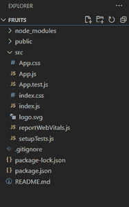
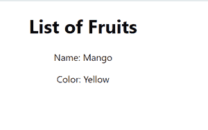
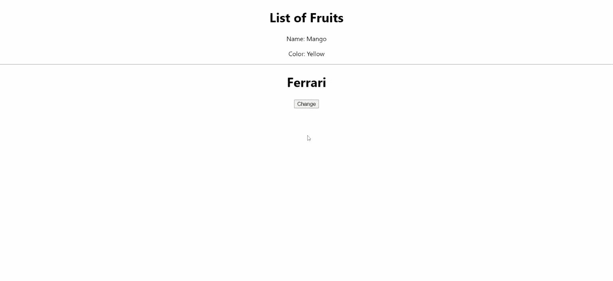

# 道具和状态有什么区别？

> 原文:[https://www . geeksforgeeks . org/道具和状态的区别是什么/](https://www.geeksforgeeks.org/what-are-the-differences-between-props-and-state/)

你有没有想过我们如何在 ReactJS 中的组件之间传递数据？我们可以使用道具和状态在组件之间传递数据。所以，让我们知道如何使用道具和状态传递数据，了解两者的区别。

我们将借助 ReactJS 中的一个示例项目来了解道具和状态。

**创建反应项目的步骤:**

*   **步骤 1:** 使用以下命令创建一个反应应用程序:

    ```
    npx create-react-app foldername
    ```

*   **步骤 2:** 在创建项目文件夹(即文件夹名**)后，使用以下命令将**移动到该文件夹:

    ```
    cd foldername
    ```

**项目结构:**



项目结构

**[道具:](https://www.geeksforgeeks.org/reactjs-props-set-1/)** 道具被称为属性，它可以用来将数据从一个组件传递到另一个组件。道具不能修改、只读和不可变。

**示例:**用下面的代码修改默认代码。

## App.js

```
import Fruit from './Fruit'
function App() {

  const fruits=
    {
    name:"Mango",
    color:"Yellow"
    }

  return (
    <div className="App">
      <Fruit fruits={fruits} />
    </div>
  );
}

export default App;
```

## App.css

```
.App{
  text-align: center;

}
```

创建一个名为水果. js 的组件，并添加以下代码

## 水果. js

```
import React from "react"

const Fruit =(props) =>{

   return(
       <div className="fruit">
           <h1>List of Fruits</h1>
           <p>Name: {props.fruits.name}</p>
           <p>Color: {props.fruits.color}</p>
       </div>  
   )
}

export default Fruit;
```

**运行应用程序的步骤:**从项目的根目录使用以下命令运行应用程序:

```
npm startOutput:
```

下面将是我们执行上述命令时的输出。使用“**道具**”功能，数据将从父组件即 App.js 传递到子组件即水果. js。



**[状态:](https://www.geeksforgeeks.org/reactjs-state-react/)** 状态表示应用程序中可以更改的部分。每个组件都可以有自己的状态。状态是可变的，并且它只对组件是本地的。

**示例:**让我们在同一个项目**“水果”**中创建一个名为 Car.js 的 Class 组件。

在 **Car.js** 组件中添加以下代码。

## Car.js

```
import React, {Component} from "react"

class Car extends Component{
    constructor() {
        super()
        this.state={
            car: 'Ferrari'
        }
    }

    changeMessage() {
        this.setState({
            car: 'Jaguar'
        })
    }

    render() {
        return (
            <div className="App">
                <h1>{this.state.car}</h1>
                <button onClick={() => this.changeMessage()}>
                  Change
                </button>  
            </div>

        )
    }
}

export default Car
```

## App.js

```
import './App.css';
import Fruit from './Fruit'
import Car from './Car';

function App() {

  const fruits=
    {
    name:"Mango",
    color:"Yellow"
    }

  return (
    <div className="App">
      <Fruit fruits={fruits} />
      <hr></hr>
      <Car />
    </div>
  );
}

export default App;
```

**运行应用程序的步骤:**从项目的根目录使用以下命令运行应用程序:

```
npm start
```

**输出:**

下面将是我们执行上述命令时的输出。数据仅在组件**“汽车”**本地，可以使用屏幕上的按钮变化进行更新。



**道具和状态的区别:**

<figure class="table">

| **道具** | **状态** |
| Data is passed from one component to another. | Data is only passed within the component. |
| Is immutable (cannot be modified). | Variable (modifiable). |
| Props can be used with status and function components. | Status can only be used with status component/class component (before 16.0). |
| Props are read-only. | The status is both read and write. |

</figure>

#### 讨论的要点:

1.  道具用于将数据从一个组件传递到另一个组件。
2.  状态是一个本地数据存储，只对组件本地，不能传递给其他组件。
3.  this.setState 属性用于更新组件中的状态值。