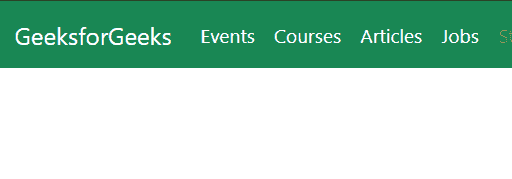

# 什么是基于 CDN 的版本？

> 原文:[https://www.geeksforgeeks.org/what-is-cdn-based-version/](https://www.geeksforgeeks.org/what-is-cdn-based-version/)

**基于 CDN 的版本:**内容交付网络是一个地理位置分散的服务器网络，通过将网络内容的克隆定位在更接近吸毒者的位置或简化动态内容(例如，实况录像带)的交付来实现活跃的网络性能。每个 CDN 服务器都位于比主机 garcon 更靠近网络的所谓“网络边缘”，而主机 garcon 是网站的发源地。由于这个原因，CDN 等待者经常被称为“边缘服务器”每台服务器都存储或缓存来自主机服务器的网页内容子集(HTML 行、图像、音频、录像带、操作)的克隆。通过缩短内容与药品之间的距离，内容交付网络帮助网站发布者提供活跃的表现，减少其网站的装载时间，并控制其自身的带宽消耗和成本。

**它是如何工作的？**

正如初步指出的那样，CDN 的工作原理是，通过从比网站原始服务器更靠近的服务器上愉快地分发，帮助网络发行商为网络提供快速、高质量的性能。举例来说，假设你的网站设在英国。尽管如此，如果有来自美国的人访问您的站点，CDN 还是会从靠近用户的美国边缘服务器为该用户提供服务。结果是轻快快乐的提货单和网页操作性能，以及更好的用户体验。

**网站的 CDN:**并不是每个网站发布者都需要一个 CDN。举例来说，一个原始的学院网站可能不需要 CDN，因为服务器会从近处穿透这个点。但是如果你有一个媒体丰富的网站，需要快速交付的收费关键内容，CDN 可能是你最好的选择。

**示例 1:** 您可以直接从内容交付网络(CDN)将引导库包含到您的 HTML 中。现在让我们使用 Twitter CDN 中的 Bootstrap 库写一个例子。

## 超文本标记语言

```htmlhtml
<!DOCTYPE html>
<html lang="en">

<head>
    <meta charset="UTF-8">
    <meta http-equiv="X-UA-Compatible" 
        content="IE=edge">
    <meta name="viewport" content=
        "width=device-width, initial-scale=1.0">
    <link href=
"https://cdn.jsdelivr.net/npm/bootstrap@5.1.3/dist/css/bootstrap.min.css"
        rel="stylesheet" integrity=
"sha384-1BmE4kWBq78iYhFldvKuhfTAU6auU8tT94WrHftjDbrCEXSU1oBoqyl2QvZ6jIW3"
        crossorigin="anonymous">

    <style>
        .nav-link,
        a {
            color: white;
            text-decoration: none;
        }
    </style>
</head>

<body>
    <nav class="navbar navbar-expand-lg bg-success">
        <div class="container-fluid">
            <a class="navbar-brand" href="#">
                GeeksforGeeks
            </a>

            <button class="navbar-toggler" type="button"
                aria-label="Toggle navigation">
                <span class="navbar-toggler-icon"></span>
            </button>

            <div class="collapse navbar-collapse" 
                id="navbarNav">

                <ul class="navbar-nav">
                    <li class="nav-item">
                        <a class="nav-link active" 
                            aria-current="page" href="#">
                            Events
                        </a>
                    </li>
                    <li class="nav-item">
                        <a class="nav-link" href="#">
                            Courses
                        </a>
                    </li>
                    <li class="nav-item">
                        <a class="nav-link" href="#">
                            Articles
                        </a>
                    </li>
                    <li class="nav-item">
                        <a class="nav-link" href="#">
                            Jobs
                        </a>
                    </li>
                    <li class="nav-item">
                        <a class="nav-link disabled">
                            Student
                        </a>
                    </li>
                </ul>
            </div>
        </div>
    </nav>
</body>

</html>
```

**输出:**



**示例 2:** 在以下示例中，我们使用的是 Bootstrap 4.2 CDN。

## 超文本标记语言

```htmlhtml
<!DOCTYPE html>
<html lang="en">

<head>
    <meta charset="UTF-8">
    <meta http-equiv="X-UA-Compatible" 
        content="IE=edge">
    <meta name="viewport" content=
        "width=device-width,initial-scale=1.0">
    <link rel="stylesheet" href=
"https://stackpath.bootstrapcdn.com/bootstrap/4.2.1/css/bootstrap.min.css"
        integrity=
"sha384-GJzZqFGwb1QTTN6wy59ffF1BuGJpLSa9DkKMp0DgiMDm4iYMj70gZWKYbI706tWS"
        crossorigin="anonymous">

    <script src=
"https://maxcdn.bootstrapcdn.com/bootstrap/4.0.0/js/bootstrap.min.js"
        integrity=
"sha384-JZR6Spejh4U02d8jOt6vLEHfe/JQGiRRSQQxSfFWpi1MquVdAyjUar5+76PVCmYl"
        crossorigin="anonymous">
    </script>

    <style>
        p {
            font-size: 1.8em;
        }

        .lead {
            font-size: 1.8em;
        }

        .fixed-bottom {
            padding: 20px 700px;
            font-size: 2em;
        }
    </style>
</head>

<body>
    <center>
        <div class="body">
            <div class="fixed-bottom bg-success text-white">
                <nav>GeeksforGeeks</nav>
            </div>
            <div class="jumbotron">
                <h1 class="display-4">Hello, Geeks!</h1>
                <p class="lead">GeekforGeeks</p>

                <hr class="my-4">
                <p>
                    A Computer Science portal for geeks.
                    It contains well written, well thought
                    and well explained computer science and
                    programming articles 
                </p>

                <a class="btn btn-primary btn-lg" 
                    href="#" role="button">
                    Learn more
                </a>
            </div>
            <div class="jumbotron">
                <h1 class="display-4">Hello, Geeks!</h1>
                <p class="lead">GeekforGeeks</p>

                <hr class="my-4">
                <p>
                    A Computer Science portal for geeks.
                    It contains well written, well thought
                    and well explained computer science and
                    programming articles
                </p>

                <a class="btn btn-primary btn-lg" href="#" 
                    role="button">Learn more</a>
            </div>

            
        </div>
    </center>
</body>

</html>
```

**输出:**

