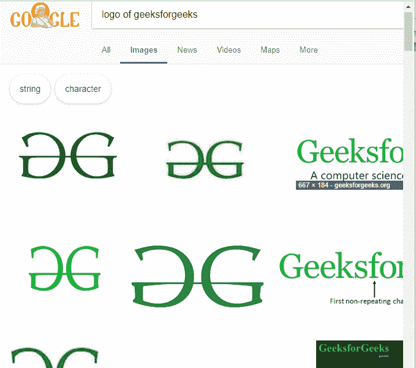

# 什么是懒加载？

> 原文:[https://www.geeksforgeeks.org/what-is-lazy-loading/](https://www.geeksforgeeks.org/what-is-lazy-loading/)

**延迟加载**(也叫按需加载)是一种针对在线内容的优化技术，无论是网站还是 web app。
延迟加载的概念不是像批量加载那样一次性加载整个网页并呈现给用户，而是帮助只加载所需的部分，并延迟剩余的部分，直到用户需要为止。

例如，假设用户向搜索引擎请求极客的徽标。加载用请求的内容填充的整个网页。现在，如果用户打开第一张图片，并对它感到满意，他可能会关闭网页，因此，如此加载的其余图片将保持不可见。这将导致在该页面的大容量加载中所消耗的资源的浪费。因此，解决这个问题的方法是延迟加载。

惰性加载的一种形式是**无限滚动**，其中，当用户向下滚动页面时，网页的内容被加载。这是各种网站正在使用的一种流行技术。

**懒加载的优势:**

*   按需加载减少了时间消耗和内存使用，从而优化了内容交付。由于只需要首先加载网页的一部分，因此所花费的时间更少，并且该部分的其余部分的加载被延迟，这节省了存储空间。所有这些都增强了用户的体验，因为所请求的内容很快就会被提供。
*   避免了不必要的代码执行。
*   从业务人员的角度来看，时间和空间资源的最佳利用使其成为一种具有成本效益的方法。(网站所有者)

**惰性加载的缺点:**

*   首先，要添加到现有代码中以实现惰性加载的额外代码行使代码有点复杂。
*   其次，由于对卸载内容的索引不当，惰性加载有时可能会影响网站在搜索引擎上的排名。

**结论:**虽然延迟加载有一定的缺陷，但也有很大的优势，因为两个主要资源(时间&空间)和更多资源的优化利用使我们忽略了它的缺点。