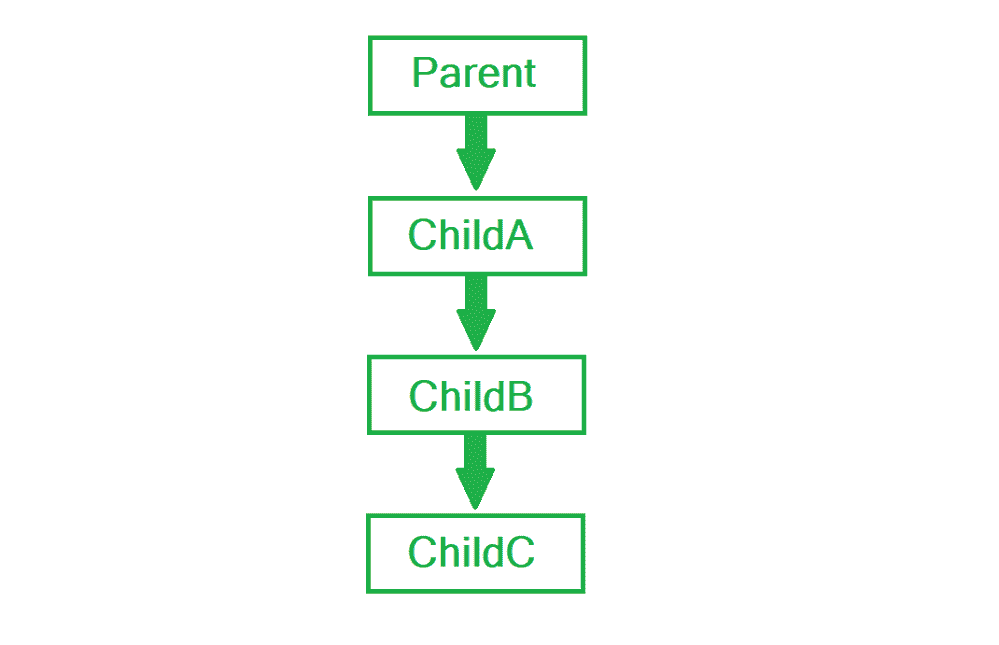
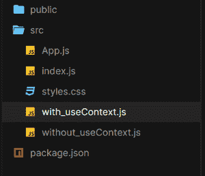

# 什么是道具打钻，如何避免？

> 原文:[https://www . geesforgeks . org/什么是道具钻孔以及如何避免它/](https://www.geeksforgeeks.org/what-is-prop-drilling-and-how-to-avoid-it/)

**什么是道具？**

React 中的组件可以被传递一些参数。这些参数一般被命名为道具。没有硬性规定它们应该作为道具提及，但使用相同的约定很方便。

**什么是道具钻孔？**

任何一个在《反应》工作过的人都会面对这一点，如果没有，那么肯定会面对。道具演练基本上是这样一种情况:由于最终级别的要求，几乎每个级别都在发送相同的数据。这里有一个图表来更好地展示它。数据需要从*父级*发送到*子级。*本文讨论了不同的方法。



**创建反应应用程序:**

*   **步骤 1:** 使用以下命令创建一个反应应用程序:

    ```html
    npx create-react-app useContextReact 
    ```

*   **步骤 2:** 创建项目文件夹后，即*使用 useContextReact，* 使用以下命令移动到该文件夹:

    ```html
    cd useContextReact
    ```

**项目结构:**如下图。



**示例 1:** 使用支柱钻孔

## 不带 _useContext.js

```html
import React, { useState } from "react";

function Parent() {
  const [fName, setfName] = useState("firstName");
  const [lName, setlName] = useState("LastName");
  return (
    <>
      <div>This is a Parent component</div>
      <br />
      <ChildA fName={fName} lName={lName} />
    </>
  );
}

function ChildA({ fName, lName }) {
  return (
    <>
      This is ChildA Component.
      <br />
      <ChildB fName={fName} lName={lName} />
    </>
  );
}

function ChildB({ fName, lName }) {
  return (
    <>
      This is ChildB Component.
      <br />
      <ChildC fName={fName} lName={lName} />
    </>
  );
}

function ChildC({ fName, lName }) {
  return (
    <>
      This is ChildC component.
      <br />
      <h3> Data from Parent component is as follows:</h3>
      <h4>{fName}</h4>
      <h4>{lName}</h4>
    </>
  );
}

export default Parent;
```

## App.js

```html
import "./styles.css";
import Parent from "./without_useContext";

export default function App() {
  return (
    <div className="App">
      <Parent />
    </div>
  );
}
```

**运行应用程序的步骤:**从项目的根目录使用以下命令运行应用程序:

```html
npm start
```

**输出:**现在打开浏览器，转到***http://localhost:3000/***，会看到如下输出:


演示在父组件中初始化的数据，在最后一个组件(子组件)中需要的数据必须向下传递到每一层，称为道具演练。

**例 2:** 无支柱钻孔

Prop Drilling 的问题是，无论何时需要父组件的数据，它都必须来自每个级别，而不管它在那里不需要，只是最后需要。

更好的替代方法是使用*使用上下文*钩子。 *useContext* 钩子基于 Context API，作用于提供者和消费者机制。提供者需要将组件包装在必须消费数据的提供者组件中。然后在这些组件中，使用*使用上下文*挂钩，数据需要被消费。

## with_useContext.js

```html
import React, { useState, useContext } from "react";

let context = React.createContext(null);
function Parent() {
  const [fName, setfName] = useState("firstName");
  const [lName, setlName] = useState("LastName");
  return (
    <context.Provider value={{ fName, lName }}>
      <div>This is a Parent component</div>
      <br />
      <ChildA />
    </context.Provider>
  );
}

function ChildA() {
  return (
    <>
      This is ChildA Component.
      <br />
      <ChildB />
    </>
  );
}

function ChildB() {
  return (
    <>
      This is ChildB Component.
      <br />
      <ChildC />
    </>
  );
}

function ChildC() {
  const { fName, lName } = useContext(context);
  return (
    <>
      This is ChildC component.
      <br />
      <h3> Data from Parent component is as follows:</h3>
      <h4>{fName}</h4>
      <h4>{lName}</h4>
    </>
  );
}

export default Parent;
```

## App.js

```html
import "./styles.css";
import Parent from "./with_useContext";

export default function App() {
  return (
    <div className="App">
      <Parent />
    </div>
  );
}
```

**运行应用程序的步骤:**从项目的根目录使用以下命令运行应用程序:

```html
npm start
```

**输出:**现在打开浏览器，转到***http://localhost:3000/***，会看到如下输出:


相同的输出，但这一次不是通过每个级别传递数据，而是直接在使用 useContext Hook 所需的组件中使用。