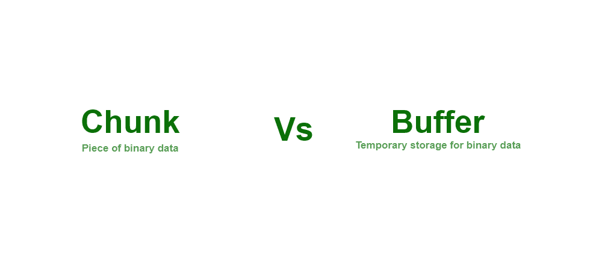

# 区块和缓冲区数据有什么区别？

> 原文:[https://www . geeksforgeeks . org/数据块和缓冲区的区别是什么/](https://www.geeksforgeeks.org/what-is-the-difference-between-chunk-and-the-buffer-data/)

首先，让我们在 JavaScript 的上下文中讨论一下，JavaScript 没有任何机制来处理和操作二进制数据。这就是为什么我们需要一些机制来做到这一点，所以我们在 JavaScript 中有一个称为缓冲区的全局模块，它处理所有的二进制数据。缓冲区通常是内存中的临时内存，用于处理二进制数据，在块的帮助下，块是一小段二进制数据，在流的帮助下从源传输到目的地。

如果你想了解更多关于 [JavaScript 的知识，可以看看这篇文章。](https://www.geeksforgeeks.org/javascript-tutorial/)

**Chunk:** 正是我们想要从源传输到目的地的那一小块二进制数据，所以我们有一种机制叫做 Chunk，它包含较小的二进制数据，并将源传输到目的地，并使用流来传输数据。块包含关于二进制数据的所有信息，例如哪些块需要处理，哪些块不需要处理。如果你想了解更多关于词块的知识，请参考[这篇文章。](https://www.geeksforgeeks.org/what-is-chunk-in-node-js/)

**Buffer:** 它是 RAM 中的一个临时内存，用于管理块数据并将其发送进行处理，Buffer 是一个适用于二进制数据的非常小的块，如果缓冲区已满，则数据将被发送进行处理。有时缓冲区被用作数据处理和传入之间的中间件，因为我们需要一个处理器来处理数据，但有时处理器忙于一些其他任务，所以我们需要将数据传输到某个地方。需要储存。缓冲器满足了这一要求。在 NodeJs 中，缓冲类提供了分配和使用缓冲区的可访问性。缓冲类是一个全局类，所以不需要导入。如果你想了解更多关于缓冲区的信息，请参考[这篇文章。](https://www.geeksforgeeks.org/node-js-buffers/)

### 区块和缓冲区的区别:

<figure class="table">

| 

**组块**

 | 

**缓冲**

 |
| --- | --- |
| 块是一段二进制数据。 | 缓冲区是一个全局类，用于管理 NodeJs 中的二进制数据块。 |
| 区块包含二进制数据。 | Buffer 类以二进制格式管理大多数数据，但是它们也能够以另一种格式管理数据。 |
| 块是八位字节格式，这意味着它只能用于特定的流，或者如果处理不当，它会损坏数据。 | 缓冲区是一个类，因此可以处理处理块数据时发生的所有类型的异常。 |
| 区块是一个独立的二进制数据容器，由缓冲区处理。 | 缓冲区依赖于块或流来传输数据。 |
| 我们还使用组块来检索程序外或通过互联网的数据。 | buffer 类也用于以正常的数据形式检索数据。 |
| 我们不能控制这些块，因为它们是自由流动的。 | 但是我们控制缓冲区和流如何流动和使用数据。 |
| 我们永远无法创建块。 | 但是我们可以创建一个缓冲区，它将包含块。 |
| <buffer><u>48 65 6c 6f</u>>缓冲区的下划线部分是一个组块。</buffer> | **<缓冲器 48 65 6c 6f>**全向角撑是一个缓冲器。 |
| 一个块存储一个字节的二进制数据。 | 缓冲区大小取决于机器的内存和硬件。 |

</figure>