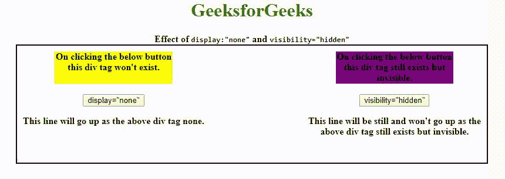

# 可见性:隐藏和显示:无有什么区别？

> 原文:[https://www . geeksforgeeks . org/visibility hidden-and-display none/](https://www.geeksforgeeks.org/what-is-the-difference-between-visibilityhidden-and-displaynone/)

两者的**可见性** & **显示**属性在 CSS 中相当有用。**能见度:“隐”；**属性用于指定一个元素在 web 文档中是否可见，但隐藏的元素会占用 web 文档中的空间。**可见性**是 CSS 中指定元素可见性行为的属性。CSS 中的 **display** 属性定义了组件(如 div、超链接、标题等)将如何放置在网页上。**显示:“无”**属性用于指定网站上是否存在元素。

[**【可见性】属性:**](https://www.geeksforgeeks.org/css-visibility-property/) 该属性用于指定一个元素在 web 文档中是否可见，但隐藏的元素会占用 web 文档中的空间。

**语法:**

```
visibility: visible| hidden | collapse | initial | inherit;
```

**属性值:**

*   **可见:**用于指定元素可见。这是一个默认值。
*   **隐藏:**元素不可见，但影响布局。
*   **折叠:**用于表格行或单元格时隐藏元素。
*   **初始值:**将可见性属性设置为默认值。
*   **inherit:** 该属性从其父元素继承而来。

[**Display 属性:**](https://www.geeksforgeeks.org/css-display-property/)**CSS 中的 Display 属性定义了组件(div、超链接、标题等)将如何放置在网页上。**

****语法:****

```
display: none | inline | block | inline-block;
```

****属性值:****

*   ****无:**不显示任何元素。**
*   ****内联:**为默认值。它将元素呈现为内联元素。**
*   ****块:**它将元素呈现为块级元素。**
*   ****内嵌块:**它将元素呈现为内嵌框内的块框。**

**所以，**显示的区别:“无”；**和**能见度:“隐藏”**；从名字本身我们就可以看出区别为**显示:“无”**；完全摆脱标签，因为它从未存在于 HTML 页面中，而**可见性:“隐藏”**；只是使标签不可见，它仍然会在 HTML 页面上占据它只是不可见的空间。**

****示例:**此示例说明了在 CSS 中使用*可见性*属性& *显示*属性。**

## **超文本标记语言**

```
<!DOCTYPE html>
<html>
<head>
    <title>
        Difference between display:"none"; and visibility: "hidden";
    </title>
</head>

<body>
    <center>
        <h1 style="color:green;">
            GeeksforGeeks
        </h1>
        <h3>
            display:"none"; and
            visibility: "hidden";
        </h3>
        <div class="display">
            <b>
                display:
                <span style="display:none">
                    display:none
                </span> "none";
            </b>
        </div>
        <br>
        <div class="visibility">
            <b>
                visibility:
                <span style="visibility:hidden">
                    visibility:hidden
                </span> "hidden";
            </b>
        </div>
        <p>
            You can see that the display: "none"; 
            don't have any blank space and 
            visibility: "hidden": has the blank space.
        </p>

    </center>
</body>
</html>
```

****输出:**在可见性范围内，标签仍然存在，因为您可以看到它们之间的空间，而当显示去掉标签时。**

****

****JavaScript 中的显示和可见性:****

****语法:****

**[**显示**](https://www.geeksforgeeks.org/html-dom-style-display-property/) **=【无】；****

```
document.getElementById("Id").style.display = "none";
```

**[**能见度**](https://www.geeksforgeeks.org/html-dom-style-visibility-property/) **=【隐藏】；****

```
document.getElementById("Id").style.visibility = "hidden";
```

****示例:**本示例说明了在 Javascript 中显示属性&可见性属性的使用。**

## **超文本标记语言**

```
<!DOCTYPE html>
<html>
<head>
    <style>
    .container {
        width: 800px;
        height: 200px;
        border: 2px solid black;
    }

    .right {
        float: right;
        margin: 10px;
    }

    .left {
        float: left;
        margin: 10px;
    }

    #geek {
        width: 200px;
        height: 55px;
        background-color: yellow;
    }

    #geek1 {
        width: 200px;
        height: 55px;
        background-color: purple;
    }
    </style>
</head>

<body>
    <center>
        <h1 style="color:green">
            GeeksforGeeks
        </h1> 
        <b>
            Effect of <code>display:"none"</code> 
            and <code>visibility="hidden"</code>
        </b>
        <br>
        <div class="container">
            <div class="right">
                <div id="geek1">
                    On clicking the below button this div
                    tag still exists but invisible.
                </div>
                <br>
                <button onclick="visibility()">
                    visibility="hidden"
                </button>
                <p> This line will be still and won't go up as the
                    <br>above div tag still exists but invisible.
                </p>

            </div>
            <div class="left">
                <div id="geek">
                    On clicking the below button this div tag won't exist.
                </div>
                <br>
                <button onclick="display()">display="none"</button>
                <p>This line will go up as the above div tag none.</p>

            </div>
        </div>
    </center>

    <script>
    function display() {
        document.getElementById("geek").style.display = "none";
    }

    function visibility() {
        document.getElementById("geek1").style.visibility = "hidden";
    }
    </script>
</body>
</html>
```

****输出:**从下面的输出来看，当点击*显示*按钮时，整个页面向上移动&占据被删除的< div >标签的空间，而当点击*可见性*按钮时，它不会移动，因为< div >标签仍然以不可见的形式存在。**

****