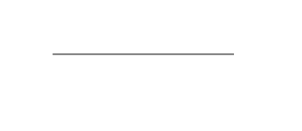

# 使用哪些方法在画布上画直线？

> 原文:[https://www . geeksforgeeks . org/使用哪些方法在画布上画一条直线/](https://www.geeksforgeeks.org/which-methods-are-used-to-draw-a-straight-line-on-a-canvas/)

HTML 提供了一个非常有趣的元素被称为 [*<【画布】>*](https://www.geeksforgeeks.org/html-canvas-basics/) ，它只是一个用来在网页上绘制图形的容器，其余的工作都是用 JavaScript 完成的。

JavaScript 中有几种方法可以在画布上绘制形状。在本文中，我们将看到如何在画布上画线，以及用来画直线的基本方法。

在画布上画一条直线有以下几种方法。

1.  [**beginPath()**](https://www.geeksforgeeks.org/html-canvas-beginpath-method/) **:这个方法是用来开始我们要画的路径的。它不需要任何参数。**

2.  [**moveTo():**](https://www.geeksforgeeks.org/html-canvas-moveto-method/) 该方法采用两个参数，这两个参数将是任何路径的起点。该方法将从该特定点开始形状。我们以后可以通过改变参数的值来改变起点。

    **示例:**

    ```html
     moveTo(10 , 30);
    ```

3.  [**【line to():**](https://www.geeksforgeeks.org/html-canvas-lineto-method/)这个方法也会取两个值，并且会把起点加到它持有的点上。代码表示从一点到另一点的路径。

    **示例:**

    ```html
    moveTo(10 , 30); 
    lineTo(40 , 100);
    ```

4.  [**描边():**](https://www.geeksforgeeks.org/html-canvas-stroke-method/) 这个方法会描边给定的路径并使其可见，这个方法不取任何参数。

上面列出的所有方法都需要在画布上画线。请注意，这些只是一些用于画线的方法，但是在 JavaScript 中还有其他几种方法可以用来处理画布。

**示例:**现在创建一个 HTML 文件，并添加以下代码在画布上画一条直线。

## 超文本标记语言

```html
<!DOCTYPE html>
<html lang="en">

<head>
    <meta charset="UTF-8">
    <meta http-equiv="X-UA-Compatible" content="IE=edge">
    <meta name="viewport" content=
        "width=device-width, initial-scale=1.0">
</head>

<body>

    <!-- Create a canvas giving its size -->
    <canvas id="canvas1" width="500" height="500"></canvas>

    <script>
        var canvas = document.getElementById('canvas1');

        // Use the if condition in case any browser
        // does not support canvas
        if (canvas.getContext) {
            var context = canvas.getContext('2d');

            // Begin the path
            context.beginPath();

            // Starting point
            context.moveTo(5, 52);

            // End point
            context.lineTo(325, 55);

            // Stroke will make the line visible
            context.stroke();
        }
    </script>
</body>

</html>
```

**输出:**



输出

当使用画布时，我们必须给出尺寸，以便在其中绘制形状。请注意，如果形状的值超过画布边界，则形状将被限制在该边界内，无法通过，尽管它不会产生任何错误。这就是我们如何在画布上画线。