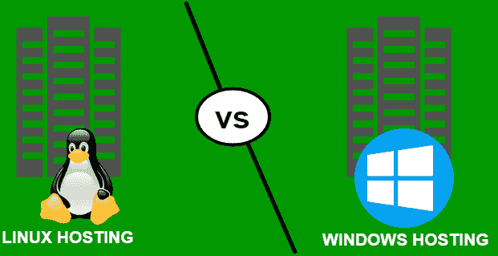

# 为什么 Linux 托管比 Windows 托管便宜？

> 原文:[https://www . geesforgeks . org/why-Linux-hosting-比 windows-hosting-便宜/](https://www.geeksforgeeks.org/why-linux-hosting-is-cheaper-than-windows-hosting/)

我们通过网络、网站、电子邮件服务等获得的大部分数据。基本上存储或托管在服务器上。这些服务器运行在各种平台(操作系统)上。两个主要的操作系统是**基于 Unix 的 Linux** 和**微软视窗**。除此之外，还使用了 **Ubuntu** 和 **Debian OS** ，虽然使用的比较少。大约三分之二的服务器使用 Linux，而剩下的三分之一大部分使用 Windows。

像跨国公司这样的大公司，尤其是信息技术公司，都广泛使用网络托管。对他们来说，这就带来了一个问题，基于操作系统，我们应该选择哪台服务器？因此，根据适合他们使用的操作系统功能以及最重要的托管成本做出选择。在下一节中，将讨论 Linux 和 Windows 服务器的成本因素以及它们的整体功能，这将有助于回答哪个更便宜以及为什么。

现在托管服务器的**成本值取决于很多因素。它是根据操作系统的特性计算的，如**界面、可用性、安全性、坚果壳、**等。我们将看到 Linux 和 Windows 托管服务器的所有这些因素，并得出哪个更便宜的结论。**

**Linux 托管**是 web 开发人员最常用的 web 托管技术之一。 **Linux 服务器**有一个相当**简单的用户界面**，通过 Linux 命令使用功能。这些服务器因其**稳定性**而广为人知和首选，这是对崩溃的抵抗力和不太频繁的重启需求，也是为了它们的安全性。

**Linux 托管服务包含各种工具，比如 cPanel** ，为用户提供安装内容管理系统和数据库的 web 平台。cPanel 允许用户通过简单的界面安装各种软件，但最重要的是，只需简单的点击。phpBB、Joomla、Drupal 等应用。这些工具帮助用户直接进入博客、网站、公告栏等的创建。

除此之外，这些服务器还具有配置 Apache 或 NGINX 网络服务器和**软件包的功能，如帮助开发人员创建数据库的 Perl、PHP、Python 和 MySQL** 。Linux 是一个**开源平台**，在很多情况下可以免费下载。

另一方面， **Windows 操作的服务器**使用更图形化的方式与用户交互，菜单包含各种选项，可根据所需的操作进行选择。公司环境通常使用 Windows 服务器，因为它们预装了许多随时可用的基本应用程序。此外，Windows 服务器可以用作 Sharepoint 和 Exchange 服务器。

Windows 服务器还托管各种独特的工具。**微软 Web 安装程序** (Web 平台安装程序)就是这些伟大的实用程序之一。windows 服务器的其他一些组件有 **MSSQL、ASP、ASP.NET 和 IIS** 等。**网络平台安装程序**帮助用户将组件**简单安装**到他们的服务器中，以获得更好的功能。与面向 Linux 的 cPanel 非常相似，Windows 也包含 Plesk 和 Windows Web 应用程序库，后者包含用于博客和内容管理的应用程序。此外，要使用微软应用程序，Windows 服务器是唯一的选择。

就**稳定性、可靠性和安全性**而言，Windows 服务器落后于 Linux 服务器。在稳定性部门，众所周知，Windows 服务器需要频繁重启，因为它们需要频繁的软件更新，因此与 Linux 相比，其正常运行时间较低。安全性也是 Windows 的一个问题。全球的 BitLocker 黑客攻击主要影响了 Windows，而 Linux 在危机期间表现得相当好。

考虑到以上所有因素，再加上 Linux 是一个开源软件，意味着用户可以根据自己的需求进行修改(合法地在软件中添加和修改组件)，并且有些版本是免费提供的，这对于开发者来说是一个很好的选择。另一方面，Windows 是一个专有的封闭软件，这意味着用户不能改变内核，从而限制表单修改。还有，Windows 也很贵。

这间接暗示了 Linux 托管比 Windows 托管便宜。原因是 **Linux 是一个更基础、更基础的软件**，需要相当先进的技能和知识来管理服务器。另一方面， **Windows 是一个更加人性化的软件**，从而让初学者更容易使用。

**一些要点:**

*   就**用户界面**而言，Linux 提供了一个更基本的、开发者友好的界面。另一方面，Windows 提供了一个更具特色、对初学者友好的用户界面。
*   **Linux 提供像 Perl、PHP 和 MySQL** 这样的功能来创建网页内容，而 Windows 通常提供**ASP.NET 和其他微软特定的应用程序**来创建内容。
*   **Linux** 是一款**开源软件**，部分版本可以免费下载，而 **Windows** 是一款**闭源(高级)软件**，付费订阅。
*   **Linux 托管**一般被**有经验的 web 开发人员**优先选择，而 **Windows 托管**由于各个阶段的开发人员灵活使用，被大多数 **IT 公司优先选择。**

因此，以上所有因素总结了一个事实，即 Linux 托管比 Windows 托管便宜。