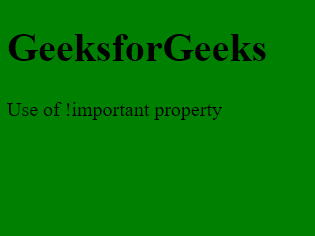
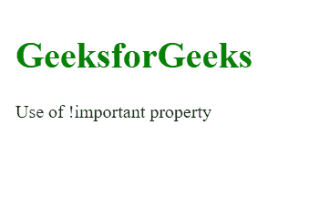

# 为什么要用！重要吗？

> 原文:[https://www.geeksforgeeks.org/why-should-we-use-important/](https://www.geeksforgeeks.org/why-should-we-use-important/)

在这篇文章中，我们将了解一下”！重要”属性及其在 CSS 中的用法。属性来重写同一样式属性上的特定样式属性。造型结束时很重要。

**！重要属性:**

那个！CSS 中重要属性用于提供比正常属性更多的权重(重要性)。在 CSS 中，该！重要意味着**“这很重要”，忽略所有后续规则，并应用！重要规则**和！重要关键字必须放在行尾，分号之前。

*   在正常使用中，外部样式表中定义的规则被文档头中定义的样式否决，而文档头又被元素本身中的内联样式否决(假设选择器具有相同的特性)。
*   此属性用于将特定样式指定为要应用的关键样式。
*   如果用！重要属性，则该特定样式将应用于元素，而不是任何其他同名样式。
*   如果！重要属性添加到任何样式后，应用的样式具有更高的优先级。

**语法:**

```
element-name {
    style-name : styliings !important;
}
```

**示例 1:** 使用重要属性更改背景。

## 超文本标记语言

```
<!DOCTYPE html>
<html>

<head>
    <title>GeeksforGeeks</title>
    <style>
        body {
            background-color: green !important;
            background-color: red;
        }
    </style>
</head>

<body>
    <h1>GeeksforGeeks</h1>
    <p>Use of !important property</p>
</body>

</html>
```

在这里，我们已经使用了！绿色背景下的重要属性，因此其优先级被视为更高的优先级。

**输出:**



**示例 2:** 使用重要属性更改文本颜色。

## 超文本标记语言

```
<html>

<head>
    <title>GeeksforGeeks</title>
    <style>
        h1 {
            color: green !important;
            color: black;
        }
        #text{
            color: yellow;
        }
    </style>
</head>

<body>
    <h1 id="text">GeeksforGeeks</h1>
    <p>Use of !important property</p>
</body>

</html>
```

在这里，我们已经使用了！h1 标签样式上绿色文本颜色处的重要属性，我们还借助 id 属性将文本颜色更改为黄色，但重要的优先级被认为优先级更高，它将文本颜色从黑色更改为绿色，而不是黄色。

**输出:**

